# Part 1: Foundation Concepts
## 🏗️ Understanding AI Agents and Microsoft Ecosystem

**📖 Chapter:** [Analyze Requirements for AI Agents](01a-analyze-requirements-agents-index.md)  
**⏱️ Study Time:** 30 minutes  
**🎯 Learning Focus:** Core concepts, Microsoft ecosystem, agentic loop

---

## 🎯 Learning Objectives

After completing this section, you will be able to:
- ✅ **Define** what AI agents are and their core components
- ✅ **Navigate** the Microsoft Agent Ecosystem (Framework, Copilot Studio, etc.)
- ✅ **Understand** the agentic loop and how components work together
- ✅ **Identify** when to use different Microsoft AI tools

---

## 📚 Table of Contents

1. [Introduction to AI Agents](#-introduction-to-ai-agents)
2. [The Microsoft Agent Ecosystem](#-the-microsoft-agent-ecosystem)
3. [Core Components of an AI Agent](#-core-components-of-an-ai-agent)
4. [The Agentic Loop](#-the-agentic-loop-how-components-work-together)
5. [Key Takeaways](#-key-takeaways)

---

## 🤖 Introduction to AI Agents

### What is an AI Agent?

An AI agent is an intelligent software entity that uses large language models (LLMs) to:
- **Understand** user inputs in natural language
- **Make decisions** based on context and instructions
- **Call tools and APIs** to perform actions
- **Generate responses** that help users accomplish tasks

```mermaid
%%{init: {'theme':'base', 'themeVariables': { 'primaryColor':'#0078d4','primaryTextColor':'#323130','primaryBorderColor':'#005a9e','lineColor':'#0078d4','secondaryColor':'#00bcf2','tertiaryColor':'#50e6ff','fontSize':'14px','fontFamily':'Segoe UI, sans-serif','clusterBkg':'#f3f2f1','clusterBorder':'#0078d4','edgeLabelBackground':'#ffffff'}}}%%
flowchart TD
    UserInput["🗣️ User Input"]
    Agent["🤖 AI Agent"]
    LLM["🧠 LLM<br/>(Azure OpenAI)"]
    Tools["🛠️ Tools & APIs"]
    Memory["🗂️ Memory"]
    Knowledge["📚 Knowledge Sources"]
    Middleware["🔒 Middleware"]
    Response["📨Response"]

    UserInput --> Agent
    Agent --> LLM
    Agent --> Tools
    Agent --> Memory
    Agent --> Knowledge
    Agent --> Middleware
    LLM --> Response
    Tools --> Response
    Memory --> Response
    Knowledge --> Response
    Middleware --> Response

    classDef nodeStyle fill:#fff,stroke:#0078d4,stroke-width:2px,rx:10,ry:10
    class UserInput,Agent,LLM,Tools,Memory,Knowledge,Middleware,Response nodeStyle
```

<figcaption style="text-align: center; font-style: italic; color: #666;">

**Figure 1:** Core architecture of an AI agent showing how user input flows through the agent, LLM, tools, memory, knowledge, and middleware to generate a response.
</figcaption>

> **Key Concept:** Think of an AI agent as a smart assistant that can think, act, and learn, rather than just following fixed rules.
---

### The Five Pillars of AI Agents: LLM, Tools, Memory, Knowledge, and Middleware

Modern AI agents are built on five essential components:

- **LLM (Large Language Model):** The agent’s “brain,” responsible for understanding user intent, reasoning, and generating responses. In the Microsoft ecosystem, this is typically Azure OpenAI (GPT-4, GPT-4o).
- **Tools:** Extend agent capabilities by enabling actions such as calling APIs, running business logic, or integrating with external systems. Tools allow agents to do more than just answer questions—they can automate tasks and interact with real-world data.
- **Memory:** Maintains context across conversations, remembers previous interactions, and stores relevant information to personalize responses and support multi-turn dialogue.
- **Knowledge:** Provides factual grounding by connecting agents to structured (Dataverse) and unstructured (Azure AI Search) data sources, ensuring responses are accurate and up-to-date.
- **Middleware:** Handles governance, security, monitoring, and compliance. Middleware ensures agents operate safely, reliably, and within organizational policies.

Together, these pillars enable AI agents to deliver intelligent, adaptive, and trustworthy solutions for business scenarios.
### Real-World Analogy

- **Traditional automation:** Like a calculator—follows exact instructions, performs fixed operations, and cannot adapt if you ask for something unexpected.
- **AI agent:** Like a personal assistant—understands your intent, adapts to changing needs, asks clarifying questions, and uses various tools to help you accomplish tasks.
- **Further analogy:** Imagine booking travel. A traditional website lets you select flights and hotels from menus (fixed workflow). An AI agent, however, can understand your preferences ("Find me the cheapest flight to Seattle next weekend, and a hotel near the conference center"), search multiple sources, handle changes, and even suggest alternatives if your first choice isn’t available.

### Why AI Agents Matter for Business

**Traditional Software vs. AI Agents:**

| Aspect | Traditional Software | AI Agents |
|--------|---------------------|-----------|
| **Input Method** | Structured forms, clicks | Natural language |
| **Flexibility** | Fixed workflows | Adaptive reasoning |
| **Error Handling** | Breaks on exceptions | Handles variations |
| **Learning** | Manual updates | Learns from interactions |
| **User Training** | Extensive training needed | Intuitive conversation |

**Business Impact:**
- 📈 **Productivity:** Users accomplish tasks faster through natural conversation
- 🎯 **Accessibility:** No technical training required - anyone can interact
- 🔄 **Adaptability:** Handles edge cases and variations automatically
- 📊 **Intelligence:** Makes context-aware decisions and recommendations

---

## 🏢 The Microsoft Agent Ecosystem

Microsoft offers multiple technologies for building AI agents. Understanding which to use when is critical for the AB-100 exam:

### Technology Comparison

| Technology | Purpose | When to Use | Skill Level Required |
|------------|---------|-------------|----------------------|
| **Microsoft Agent Framework** | Open-source SDK for custom agents | Complex workflows, code-based | Developer (Python/.NET) |
| **Copilot Studio** | Low-code agent builder | Business users, conversational bots | Business analyst |
| **Dynamics 365 Copilot** | Pre-built AI for CRM/ERP | Dynamics 365 users | End user |
| **Microsoft 365 Copilot** | AI across Office apps | Knowledge workers | End user |

> **For AB-100 Exam:** Focus on **Copilot Studio** (low-code) and **Agent Framework** (understanding patterns and architecture).

### Complete Microsoft Agent Ecosystem Architecture

```mermaid
%%{init: {'theme':'base', 'themeVariables': { 'primaryColor':'#0078d4','primaryTextColor':'#323130','primaryBorderColor':'#005a9e','lineColor':'#0078d4','secondaryColor':'#00bcf2','tertiaryColor':'#50e6ff','fontSize':'14px','fontFamily':'Segoe UI, sans-serif','clusterBkg':'#f3f2f1','clusterBorder':'#0078d4','edgeLabelBackground':'#ffffff'}}}%%
flowchart TB
    subgraph Users["👥 User Personas"]
        direction LR
        EndUser["👤 End Users<br/><br/>Knowledge workers<br/>No technical skills<br/>Use pre-built agents"]
        BizUser["💼 Business Users<br/><br/>Citizen developers<br/>Low-code skills<br/>Configure agents"]
        Developer["👨‍💻 Developers<br/><br/>Professional devs<br/>Code-first approach<br/>Custom solutions"]
    end
    
    subgraph Tools["🛠️ Microsoft AI Tools"]
        direction TB
        M365["📊 Microsoft 365 Copilot<br/><br/>✓ Word, Excel, PowerPoint<br/>✓ Teams, Outlook, OneNote<br/>✓ Pre-built AI assistants<br/>Skill: End User"]
        D365["💼 Dynamics 365 Copilot<br/><br/>✓ Sales, Service, Marketing<br/>✓ Finance, Supply Chain<br/>✓ Industry-specific AI<br/>Skill: End User"]
        Studio["🎨 Copilot Studio<br/><br/>✓ Visual designer<br/>✓ Custom topics & connectors<br/>✓ Low-code automation<br/>Skill: Business User"]
        Framework["⚙️ Agent Framework<br/><br/>✓ Python SDK<br/>✓ C# / .NET SDK<br/>✓ Full programmatic control<br/>Skill: Developer"]
    end
    
    subgraph Backend["☁️ Azure Backend Services"]
        direction TB
        AOI["🧠 Azure OpenAI<br/>GPT-4, GPT-4o, o1"]
        Foundry["🏗️ Azure AI Foundry<br/>Model catalog & deployment"]
        Search["🔍 Azure AI Search<br/>Vector & hybrid search"]
        Monitor["📊 Application Insights<br/>Monitoring & telemetry"]
    end
    
    EndUser ==>|"Uses"| M365
    EndUser ==>|"Uses"| D365
    BizUser ==>|"Builds with"| Studio
    Developer ==>|"Codes with"| Framework
    
    M365 -.->|"Powered by"| AOI
    D365 -.->|"Powered by"| AOI
    Studio ==>|"Deploys to"| Foundry
    Framework ==>|"Deploys to"| Foundry
    
    Foundry -.->|"Uses"| AOI
    Foundry -.->|"Integrates"| Search
    Foundry -.->|"Monitors via"| Monitor
    
    classDef userStyle fill:#f3e5f5,stroke:#8764b8,stroke-width:3px,rx:12,ry:12
    classDef toolStyle fill:#e1f5ff,stroke:#0078d4,stroke-width:3px,rx:12,ry:12
    classDef backendStyle fill:#fff4e1,stroke:#ff8c00,stroke-width:3px,rx:12,ry:12
    classDef nodeStyle fill:#fff,stroke:#666,stroke-width:2px,rx:10,ry:10
    
    class EndUser,BizUser,Developer nodeStyle
    class M365,D365,Studio,Framework nodeStyle
    class AOI,Foundry,Search,Monitor nodeStyle
```



<figcaption style="text-align: center; font-style: italic; color: #666;">

**Figure 2:** Microsoft Agent Ecosystem architecture showing user personas, AI tools, and Azure backend services.
</figcaption>

### Ecosystem Selection Guide

**Choose based on your role and requirements:**
🎯 **End Users (No coding):**
- Use **Microsoft 365 Copilot** for productivity tasks (Word, Excel, PowerPoint, Teams, Outlook, OneNote)
- Use **Dynamics 365 Copilot** for CRM/ERP workflows (Sales, Service, Marketing, Finance, Supply Chain)
- No setup required—ready-to-use AI assistants embedded in familiar apps
- Best for quick automation, document generation, and business insights

🎯 **Business Users (Low-code):**
- Build custom conversational agents with **Copilot Studio**
- Visual drag-and-drop designer, Power Platform integration, and connectors for business data
- Configure topics, automate workflows, and integrate with Microsoft Teams or websites
- Ideal for citizen developers and business analysts needing tailored solutions without coding

🎯 **Developers (Full control):**
- Use **Agent Framework** for complex multi-agent systems and advanced scenarios
- Full programmatic control with Python or C# SDKs; integrate custom tools, APIs, and backend services
- Design multi-step workflows, orchestrate agentic loops, and deploy to Azure AI Foundry
- Suitable for professional developers building scalable, secure, and highly customized AI solutions

---

## ⚙️ Core Components of an AI Agent

Every AI agent consists of these fundamental building blocks:

```mermaid
%%{init: {'theme':'base', 'themeVariables': { 'primaryColor':'#0078d4','primaryTextColor':'#323130','primaryBorderColor':'#005a9e','lineColor':'#0078d4','secondaryColor':'#00bcf2','tertiaryColor':'#50e6ff','fontSize':'14px','fontFamily':'Segoe UI, sans-serif','clusterBkg':'#f3f2f1','clusterBorder':'#0078d4','edgeLabelBackground':'#ffffff'}}}%%
flowchart TD
    UserInput["🗣️ User Input"]
    Agent["🤖 AI Agent"]
    LLM["🧠 LLM<br/>(Azure OpenAI)"]
    Tools["🛠️ Tools & APIs"]
    Memory["🗂️ Memory<br/>Thread State"]
    Knowledge["📚 Knowledge<br/>Dataverse, Search"]
    Response["📨 Response"]

    UserInput --> Agent
    Agent --> LLM
    Agent --> Tools
    Agent --> Memory
    Agent --> Knowledge
    LLM --> Response
    Tools --> Response
    Memory --> Response
    Knowledge --> Response

    classDef nodeStyle fill:#fff,stroke:#0078d4,stroke-width:2px,rx:10,ry:10
    class UserInput,Agent,LLM,Tools,Memory,Knowledge,Response nodeStyle
```



### Component Breakdown

#### 1. **LLM (Language Model)**
- **Azure OpenAI** (GPT-4, GPT-4o, o1-preview): Delivers advanced natural language processing, reasoning, and generative capabilities.
- **Role:** Serves as the agent’s “brain,” interpreting user intent, analyzing context, and determining next actions.
- **Features:** Supports prompt engineering, multi-turn dialogue, and can chain reasoning steps for complex tasks.
- **Best Practice:** Use system prompts to guide behavior and ensure responses align with business requirements.

#### 2. **Tools (Action Layer)**
- **Custom functions:** Written in Python, C#, TypeScript, or other languages to extend agent capabilities.
- **API integrations:** Connect to REST endpoints, SQL databases, Microsoft Graph, or third-party services for data retrieval and business logic execution.
- **MCP servers:** Enable standardized tool calling and orchestration for multi-agent scenarios.
- **Role:** Allow agents to interact with external systems, automate workflows, and perform real-world actions (e.g., sending emails, updating records).
- **Best Practice:** Secure tool endpoints and validate inputs to prevent misuse.

#### 3. **Memory (Context Management)**
- **Conversation history:** Maintains dialogue across multiple turns for coherent, context-aware responses.
- **Thread management:** Supports parallel conversations and task switching.
- **State persistence:** Stores variables, user preferences, and workflow progress for long-running tasks.
- **Role:** Ensures agents remember prior interactions, enabling personalized and efficient experiences.
- **Best Practice:** Limit memory scope to relevant context to optimize performance and privacy.

#### 4. **Knowledge Grounding (Data Layer)**
- **Dataverse:** Centralized repository for structured business data (e.g., customer records, orders).
- **Azure AI Search:** Provides semantic and vector search over unstructured documents, knowledge bases, and files.
- **Custom databases & external APIs:** Integrate proprietary or third-party data sources for domain-specific knowledge.
- **Role:** Grounds agent responses in factual, up-to-date information, reducing hallucinations and improving reliability.
- **Best Practice:** Regularly update and curate knowledge sources; use retrieval-augmented generation for accuracy.

#### 5. **Middleware (Governance Layer)**
- **Security & authentication:** Enforces access controls, identity verification, and data protection.
- **Logging & monitoring:** Captures telemetry for troubleshooting, auditing, and performance analysis.
- **Rate limiting & error handling:** Prevents abuse, manages resource consumption, and gracefully handles failures.
- **Compliance & audit:** Ensures agents meet regulatory requirements (GDPR, HIPAA, etc.) and maintain traceability.
- **Role:** Provides oversight, reliability, and trust for enterprise-grade agent deployments.
- **Best Practice:** Integrate with Azure Monitor and Microsoft Entra for unified governance and observability.

---

## 🔁 The Agentic Loop: How Components Work Together

The five components work together in an **iterative execution pattern** called the **agentic loop**. Understanding this loop is critical for designing, monitoring, and troubleshooting AI agents.

### Agentic Loop in Practice

The agentic loop is not just a technical pattern—it's the foundation for building robust, adaptive AI agents. Here’s how each component contributes during real-world execution:

- **LLM (Reasoning):** Interprets user intent, breaks down complex requests, and determines if external actions are needed.
- **Tools (Action):** Executes business logic, fetches data, or triggers workflows. For example, calling an API to check inventory or update a CRM record.
- **Memory (Context):** Maintains conversation state, tracks previous tool results, and ensures continuity across multi-turn interactions.
- **Knowledge (Grounding):** Provides factual information, retrieves documents, or answers based on enterprise data sources.
- **Middleware (Governance):** Monitors each step for compliance, security, and performance, logging events for audit and troubleshooting.


#### Best Practices for Agentic Loop Design

- **Minimize unnecessary LLM calls:** Structure prompts and workflows to reduce iterations, saving cost and improving speed.
- **Secure tool execution:** Validate inputs and outputs, especially when agents interact with sensitive systems.
- **Monitor loop telemetry:** Use Azure Monitor and Application Insights to track loop iterations, errors, and latency.
- **Test edge cases:** Simulate scenarios with multiple tool calls, ambiguous user requests, and unexpected data to ensure reliability.
- **Optimize for user experience:** Design agents to clarify ambiguous requests, summarize intermediate results, and gracefully handle failures.

#### Common Pitfalls

- **Infinite loops:** Agents may get stuck if tool results do not resolve the user’s request—implement safeguards and timeouts.
- **Context overload:** Excessive memory or irrelevant context can degrade LLM performance—limit context to what’s necessary.
- **Tool chaining complexity:** Chaining multiple tools increases risk of errors—design clear handoffs and error handling.

By mastering the agentic loop, you’ll be able to design agents that are not only intelligent, but also reliable, secure, and cost-effective for business scenarios.

### Agentic Loop Sequence

```mermaid
%%{init: {'theme':'base', 'themeVariables': { 'primaryColor':'#61d3f0ff','primaryTextColor':'#0d0d0eff','primaryBorderColor':'#005a9e','lineColor':'#0078d4','secondaryColor':'#00bcf2','tertiaryColor':'#50e6ff','fontSize':'15px','fontFamily':'Segoe UI, sans-serif','clusterBkg':'#f3f2f1','clusterBorder':'#0078d4','edgeLabelBackground':'#ffffff'}}}%%
sequenceDiagram
    autonumber
    participant User as 👤 User
    participant Agent as 🤖 Agent
    participant LLM as 🧠 LLM
    participant Tools as 🛠️ Tools/MCP

    User->>Agent: 💬 Sends Message
    Agent->>Agent: ⚡ Loads Prompt & Context

    rect rgb(230,245,255)
        Note over Agent,LLM: 🔁 Agentic Loop (Iterates until task is done)
        
        Agent->>LLM: 🚀 Request (Prompt + Context)
        LLM->>LLM: 🧩 Reason & Decide

        alt 🛠️ Tool/MCP Call Needed
            LLM->>Agent: 📦 Tool/MCP Call Request
            Agent->>Tools: 🏃‍♂️ Run Tool/MCP
            Tools-->>Agent: 📥 Tool Result
            Agent->>LLM: 🔄 Update Context with Result
            Note over Agent,LLM: ↩️ Loop continues
        else 🎉 Task Complete
            LLM->>Agent: 🏁 Final Response
        end
    end

    Agent->>User: 📨 Delivers Response
```

<figcaption style="text-align: center; font-style: italic; color: #666;">

**Figure 3:** Agentic loop sequence diagram showing the iterative process of user interaction, LLM reasoning, tool execution, and response delivery.
</figcaption>

### Loop Phases Explained

#### **🎯 Initialization Phase**
- User sends message to agent
- Agent loads system prompt and instructions
- Context window prepared with conversation history

#### **🔁 Iteration Phase (Repeats until complete)**
- **Request:** Agent sends prompt + context to LLM
- **Processing:** LLM analyzes and decides next action
- **Decision:** Does the task need a tool call?
  - **Yes:** LLM requests tool execution → Agent calls tool → Tool result added to context → Loop back to Request
  - **No:** Task is complete → Generate final response

#### **✅ Completion Phase**
- LLM determines task is complete
- Final response generated using knowledge grounding
- Response passes through middleware
- Agent returns response to user

### Example: Customer Order Status Query

```
User: "Where is my order #12345?"

Loop Iteration 1:
  Agent → LLM: "Find order status for #12345"
  LLM → Agent: "I need to call the order_lookup tool"
  Agent → Tool: order_lookup(order_id="12345")
  Tool → Agent: {status: "shipped", eta: "Nov 20"}
  Agent → LLM: "Tool result: Order shipped, arrives Nov 20"

Loop Iteration 2:
  LLM → Agent: "Task complete, I have the answer"
  Agent → User: "Your order #12345 has been shipped and will arrive on November 20."
```

### Why Understanding the Loop Matters

**For Design:**
- Understanding the loop helps decide when agents need tools vs. direct responses
- Guides prompt engineering and tool selection

**For Monitoring:**
- Each loop iteration generates telemetry events (logs, metrics, traces)
- Enables performance optimization and debugging

**For Cost Management:**
- More loop iterations = more LLM calls = higher costs
- Design patterns to minimize unnecessary iterations

**For Testing:**
- Test scenarios should cover multiple iterations and tool calls
- Verify loop behavior under various conditions

**For Debugging:**
- Loop visibility shows where agents get stuck or make wrong decisions
- Trace through each iteration to identify issues

---

## 🎯 Key Takeaways

### Essential Concepts for AB-100 Exam

✅ **AI Agents are intelligent software entities** that combine LLMs with tools, memory, and knowledge to accomplish tasks through natural language interaction.

✅ **Microsoft offers a complete ecosystem** from end-user tools (M365/D365 Copilot) to developer platforms (Agent Framework), all powered by Azure AI services.

✅ **Five core components work together:** LLM (reasoning), Tools (actions), Memory (context), Knowledge (grounding), and Middleware (governance).

✅ **The agentic loop is the execution pattern** where agents iteratively call LLMs, which decide whether to use tools or return responses, continuing until tasks complete.

✅ **Choose tools based on user personas:** End users use pre-built Copilots, business users build with Copilot Studio, developers code with Agent Framework.

### Decision Framework

**When to use each Microsoft tool:**

```mermaid
flowchart TD
    style Start fill:#f3f2f1,stroke:#0078d4,stroke-width:2px,rx:12,ry:12
    style EndUser fill:#e1f5ff,stroke:#0078d4,stroke-width:2px,rx:12,ry:12
    style BizUser fill:#e1f5ff,stroke:#0078d4,stroke-width:2px,rx:12,ry:12
    style Developer fill:#e1f5ff,stroke:#0078d4,stroke-width:2px,rx:12,ry:12
    style PreBuilt fill:#fff4e1,stroke:#ff8c00,stroke-width:2px,rx:12,ry:12
    style LowCode fill:#fff4e1,stroke:#ff8c00,stroke-width:2px,rx:12,ry:12
    style CodeFirst fill:#fff4e1,stroke:#ff8c00,stroke-width:2px,rx:12,ry:12
    style EndGoal fill:#f3e5f5,stroke:#8764b8,stroke-width:2px,rx:12,ry:12
    style BizGoal fill:#f3e5f5,stroke:#8764b8,stroke-width:2px,rx:12,ry:12
    style DevGoal fill:#f3e5f5,stroke:#8764b8,stroke-width:2px,rx:12,ry:12

    Start["👤 Who is building the solution?"]
    Start --> EndUser["End User<br/><span style='font-size:12px;color:#666;'>No coding required</span>"]
    Start --> BizUser["Business User<br/><span style='font-size:12px;color:#666;'>Low-code/citizen developer</span>"]
    Start --> Developer["Developer<br/><span style='font-size:12px;color:#666;'>Full code control</span>"]

    EndUser --> PreBuilt["Use Microsoft 365/Dynamics 365 Copilot"]
    BizUser --> LowCode["Build with Copilot Studio"]
    Developer --> CodeFirst["Code with Agent Framework"]

    PreBuilt --> EndGoal["✨ Ready-to-use AI assistants<br/><span style='font-size:12px;color:#666;'>Productivity, CRM/ERP</span>"]
    LowCode --> BizGoal["🎨 Custom conversational agents<br/><span style='font-size:12px;color:#666;'>Visual designer, automation</span>"]
    CodeFirst --> DevGoal["⚙️ Complex multi-agent systems<br/><span style='font-size:12px;color:#666;'>Advanced orchestration</span>"]
```


<figcaption style="text-align: center; font-style: italic; color: #666;">

**Figure 4:** Decision framework for selecting the appropriate Microsoft tool based on user persona and solution complexity.
</figcaption>

### Next Steps

Now that you understand the foundation concepts, you're ready to learn about:
- **Agent Types and Patterns** → How to choose between single agents and workflows
- **Orchestration Strategies** → When to use Sequential, Concurrent, or Handoff patterns  
- **Use Case Assessment** → Identifying the right business scenarios for AI agents

---

## 🔗 Related Resources

- **[Microsoft Agent Framework Documentation](https://learn.microsoft.com/en-us/agent-framework/)**
- **[Copilot Studio Overview](https://learn.microsoft.com/en-us/microsoft-copilot-studio/)**
- **[Azure OpenAI Service](https://learn.microsoft.com/en-us/azure/ai-services/openai/)**
- **[Agentic Loop Architecture Details](diagrams/agentic-loop-architecture.md)**

---

## 📚 Navigation

⬅️ **Previous:** [Chapter Index](01a-analyze-requirements-agents-index.md)  
➡️ **Next:** [Part 2: Agent Types and Patterns](01a-02-agent-types-patterns.md)