# Part 2: Agent Types and Patterns  
## 🤖 Single Agents vs Multi-Agent Orchestration

**📖 Chapter:** [Analyze Requirements for AI Agents](01a-analyze-requirements-agents-index.md)  
**⏱️ Study Time:** 25 minutes  
**🎯 Learning Focus:** Agent architecture selection, orchestration patterns, decision frameworks

---

## 🎯 Learning Objectives

After completing this section, you will be able to:
- ✅ **Distinguish** between single agents and workflow-orchestrated agents
- ✅ **Select** appropriate agent types based on use case requirements
- ✅ **Apply** the five multi-agent orchestration patterns
- ✅ **Design** agent architectures using decision frameworks

---

## 📚 Table of Contents

1. [Single AI Agents vs. Workflow-Orchestrated Agents](#-single-ai-agents-vs-workflow-orchestrated-agents)
2. [Agent Type Decision Framework](#-agent-type-decision-framework)
3. [When to Use Single AI Agents](#-when-to-use-single-ai-agents)
4. [When to Use Workflow-Orchestrated Agents](#-when-to-use-workflow-orchestrated-agents)
5. [Multi-Agent Orchestration Patterns](#-multi-agent-orchestration-patterns)
6. [Key Takeaways](#-key-takeaways)

---

## ⚖️ Single AI Agents vs. Workflow-Orchestrated Agents

### Basic Decision Framework


<figcaption style="text-align: center; font-style: italic; color: #666;">

**Figure 1:** Basic decision framework for choosing between single AI agents and workflow patterns based on task structure.
</figcaption>


### Comparison Overview

| Aspect | Single AI Agent | Workflow-Orchestrated Agents |
|--------|----------------|----------------------------|
| **Task Type** | Unstructured, conversational | Structured, multi-step |
| **Execution Path** | Determined by LLM dynamically | Predefined by developer |
| **Best For** | Customer support, Q&A, exploration | Document processing, approvals |
| **Reliability** | Depends on LLM behavior | Deterministic with checkpointing |
| **Complexity** | Simple to moderate | Moderate to complex |
| **Cost** | Token-based (per conversation) | Token + compute (workflow runtime) |
| **Scalability** | High (stateless) | Medium (workflow state management) |
| **Debugging** | Harder (LLM decisions opaque) | Easier (clear workflow steps) |

---

## 🔀 Agent Type Decision Framework

### Comprehensive Decision Tree

```mermaid
%%{init: {'theme':'base', 'themeVariables': { 'primaryColor':'#0078d4','primaryTextColor':'#323130','primaryBorderColor':'#005a9e','lineColor':'#0078d4','secondaryColor':'#00bcf2','tertiaryColor':'#50e6ff','fontSize':'14px','fontFamily':'Segoe UI, sans-serif','clusterBkg':'#f3f2f1','clusterBorder':'#0078d4','edgeLabelBackground':'#ffffff'}}}%%
flowchart TD
    Start{"🤔 What is the<br/>use case?"} -->|"📝 Single task"| TaskCheck{"⚡ Does it need<br/>to execute actions?"}
    Start -->|"🔄 Multi-step process"| WorkflowCheck{"📊 How many steps?"}
    Start -->|"💡 Enhance context"| PromptAgent["💡 Prompt Agent<br/><br/>Best for input enhancement<br/>Example: Enrich user query"]
    Start -->|"📤 Transform output"| ResponseAgent["📤 Response Agent<br/><br/>Best for output formatting<br/>Example: Convert to JSON"]
    
    TaskCheck -->|"✅ Yes"| TaskAgent["📝 Task Agent<br/><br/>Single action execution<br/>Example: Send email<br/>Complexity: Low"]
    TaskCheck -->|"❌ No"| InfoAgent["ℹ️ Information Agent<br/><br/>Q&A and knowledge retrieval<br/>Example: Answer FAQs<br/>Complexity: Low"]
    
    WorkflowCheck -->|"2-3 steps"| Sequential["➡️ Sequential Workflow<br/><br/>Agent 1 → Agent 2 → Agent 3<br/>Example: Research → Analyze → Report<br/>Complexity: Medium"]
    WorkflowCheck -->|"4+ steps"| Autonomous["🤖 Autonomous Agent<br/><br/>Complex multi-step orchestration<br/>Example: Full sales cycle<br/>Complexity: High"]
    WorkflowCheck -->|"⚡ Parallel tasks"| Concurrent["⚡ Concurrent Workflow<br/><br/>Multiple agents in parallel<br/>Example: Multi-source data fetch<br/>Complexity: Medium-High"]
    
    classDef startStyle fill:#0078d4,stroke:#005a9e,color:#fff,stroke-width:4px,rx:15,ry:15,font-weight:bold
    classDef decisionStyle fill:#00bcf2,stroke:#0078d4,color:#fff,stroke-width:3px,rx:10,ry:10
    classDef taskStyle fill:#107c10,stroke:#0b5a0b,color:#fff,stroke-width:3px,rx:10,ry:10
    classDef autoStyle fill:#8764b8,stroke:#5c2d91,color:#fff,stroke-width:3px,rx:10,ry:10
    classDef promptStyle fill:#ff8c00,stroke:#d46800,color:#fff,stroke-width:3px,rx:10,ry:10
    classDef responseStyle fill:#e81123,stroke:#a80000,color:#fff,stroke-width:3px,rx:10,ry:10
    classDef infoStyle fill:#008272,stroke:#004b50,color:#fff,stroke-width:3px,rx:10,ry:10
    
    class Start startStyle
    class TaskCheck,WorkflowCheck decisionStyle
    class TaskAgent,Sequential taskStyle
    class Autonomous autoStyle
    class PromptAgent promptStyle
    class ResponseAgent responseStyle
    class InfoAgent infoStyle
    class Concurrent autoStyle
```


<figcaption style="text-align: center; font-style: italic; color: #666;">

**Figure 2:** Comprehensive decision tree for selecting agent types based on use case requirements, showing task agents, autonomous agents, prompt agents, and response agents.
</figcaption>
<figcaption style="text-align: center; font-style: italic; color: #666;">

**Figure 2:** Comprehensive decision tree for selecting agent types based on use case requirements, showing task agents, autonomous agents, prompt agents, and response agents.
</figcaption>

### Four Agent Types Explained

#### 1. **Task Agent** 📝
- **Purpose:** Executes a single, well-defined action in response to a user request or workflow trigger.
- **Typical Actions:** Sending emails, updating CRM records, processing files, making API calls.
- **Complexity:** Low—logic is straightforward, usually mapped 1:1 to a business operation.
- **Strengths:** Fast, reliable, easy to test and debug. Minimal context required.
- **Limitations:** Not suitable for tasks requiring planning, adaptation, or multiple steps.
- **Example:**  
  ```
  User: "Send a follow-up email to this customer"
  Agent: Composes and sends the email using provided details.
  ```
- **When to Use:** When a single, atomic action is needed and requirements are clear.

#### 2. **Autonomous Agent** 🔄
- **Purpose:** Manages complex, multi-step workflows independently, often making decisions at each stage.
- **Capabilities:** Plans, executes, and adapts across several steps; can invoke other agents or tools.
- **Complexity:** High—handles branching logic, error handling, and business rules.
- **Strengths:** Reduces manual intervention, supports end-to-end automation, adapts to changing context.
- **Limitations:** Harder to debug, requires robust monitoring and error handling.
- **Example:**  
  ```
  Agent: Receives a new sales lead → Qualifies lead → Enriches with company data → Assigns to sales rep → Schedules follow-up.
  ```
- **When to Use:** For workflows with 4+ steps, complex business logic, or when autonomous decision-making is required.

#### 3. **Prompt Agent** 💡
- **Purpose:** Preprocesses and enriches user input before main agent or workflow execution.
- **Capabilities:** Adds context, reformulates queries, injects business-specific information.
- **Complexity:** Low to medium—may use templates, context retrieval, or lightweight reasoning.
- **Strengths:** Improves accuracy and relevance of downstream processing, supports personalization.
- **Limitations:** Limited to input enhancement; does not perform main task.
- **Example:**  
  ```
  User: "Find recent invoices"
  Prompt Agent: Adds company context, reformulates as "Find invoices from last 30 days for Acme Corp."
  ```
- **When to Use:** When input needs enrichment, normalization, or context injection before processing.

#### 4. **Response Agent** 📤
- **Purpose:** Transforms, formats, or post-processes outputs from main agent or workflow.
- **Capabilities:** Converts results to required formats (JSON, PDF), summarizes, or applies business rules to output.
- **Complexity:** Low to medium—may involve formatting, validation, or minor logic.
- **Strengths:** Ensures outputs meet integration, reporting, or compliance requirements.
- **Limitations:** Does not affect core processing; only modifies final output.
- **Example:**  
  ```
  Main Agent: Generates analysis report.
  Response Agent: Converts report to PDF and emails to stakeholders.
  ```
- **When to Use:** When output needs formatting, transformation, or distribution after main processing.

---

## ✅ When to Use Single AI Agents

### Ideal Use Cases

**✅ Choose Single Agents When:**
- Tasks are **unstructured** (user asks open-ended questions)
- Need **conversational interaction** (back-and-forth dialog)
- **Ad-hoc planning** required (agent decides next steps)
- **Dynamic context** changes frequently
- **Exploratory tasks** (research, analysis, troubleshooting)

### Real-World Examples

#### 1. **Customer Support Chatbot**
```
User: "My account is locked and I can't access my reports"
Agent: Understands context → Checks account status → Guides unlock process → Provides access
```
**Why Single Agent:**
- Each support case is unique and may require different actions
- Conversational flow adapts to user responses and clarifications
- Agent can handle follow-up questions, escalate issues, and personalize guidance
- No fixed sequence—agent determines next steps dynamically based on context
- Supports multi-turn dialog, troubleshooting, and empathetic responses

#### 2. **Research Assistant**
```
User: "Research market trends for electric vehicles in Europe"
Agent: Plans search strategy → Searches multiple sources → Synthesizes findings → Adapts based on discoveries
```
**Why Single Agent:**
- Research path is unpredictable and may branch based on new information
- Agent autonomously decides which sources to consult and how to aggregate data
- Capable of iterative exploration, refining queries, and summarizing insights
- Can handle ambiguous requests and clarify requirements with the user
- Adapts strategy as new findings emerge, ensuring relevant and up-to-date results

#### 3. **Code Helper**
```
User: "This Python function is throwing an error"
Agent: Analyzes code → Identifies issues → Suggests fixes → Explains reasoning
```
**Why Single Agent:**
- Each code issue is different and may require unique troubleshooting steps
- Agent understands context, error messages, and code structure
- Provides interactive debugging, step-by-step explanations, and alternative solutions
- Can answer follow-up questions, refactor code, and teach best practices
- Supports conversational problem-solving, making it ideal for learning and support

#### 4. **Personal Productivity Assistant**
```
User: "Help me organize my tasks for the week"
Agent: Gathers user goals → Prioritizes tasks → Suggests schedule → Adjusts based on feedback
```
**Why Single Agent:**
- Task organization is highly personalized and context-dependent
- Agent adapts recommendations as user priorities or constraints change
- Supports ongoing dialog, reminders, and dynamic re-planning
- No rigid workflow—agent flexibly manages evolving requirements

#### 5. **Troubleshooting Advisor**
```
User: "Why is my application running slowly?"
Agent: Asks clarifying questions → Analyzes logs → Suggests optimizations → Guides through fixes
```
**Why Single Agent:**
- Troubleshooting requires adaptive questioning and analysis
- Agent tailors investigation based on user input and discovered symptoms
- Can pivot strategies, escalate to deeper diagnostics, and explain solutions
- Handles open-ended, exploratory problem-solving without a fixed process

### Single Agent Architecture

```mermaid
%%{init: {'theme':'base', 'themeVariables': { 'primaryColor':'#7ebdeeff','primaryTextColor':'#323130','primaryBorderColor':'#3d8fceff','lineColor':'#c2051eff','secondaryColor':'#00bcf2','tertiaryColor':'#50e6ff','fontSize':'14px','fontFamily':'Segoe UI, sans-serif','clusterBkg':'#f3f2f1','clusterBorder':'#0078d4','edgeLabelBackground':'#ffffff'}}}%%
flowchart LR
  UserInput["👤 User Input"]
  subgraph Agent["🤖 Single AI Agent"]
    LLM["🧠 LLM Reasoning"]
    Tools["🛠️ Tools & APIs"]
    Memory["💾 Context Memory"]
    Knowledge["📚 Knowledge Base"]
  end
  Response["💬 Response"]

  UserInput --> Agent
  Agent --> LLM
  Agent --> Tools
  Agent --> Memory
  Agent --> Knowledge

  LLM --> Response
  Tools --> Response
  Memory --> Response
  Knowledge --> Response

  Response --> UserInput

  classDef inputStyle fill:#e1f5ff,stroke:#0078d4,color:#323130,stroke-width:3px,rx:12,ry:12
  classDef agentStyle fill:#0078d4,stroke:#005a9e,color:#fff,stroke-width:4px,rx:14,ry:14,font-weight:bold
  classDef nodeStyle fill:#f3f2f1,stroke:#0078d4,color:#323130,stroke-width:2px,rx:10,ry:10
  classDef outputStyle fill:#107c10,stroke:#0b5a0b,color:#fff,stroke-width:3px,rx:12,ry:12

  class UserInput inputStyle
  class Agent agentStyle
  class LLM,Tools,Memory,Knowledge nodeStyle
  class Response outputStyle
```

<figcaption style="text-align: center; font-style: italic; color: #666;">

**Figure 3:** Single agent architecture showing how user input flows through LLM reasoning, tools, memory, and knowledge base to generate a response.
</figcaption>
<figcaption style="text-align: center; font-style: italic; color: #666;">

**Figure 3:** Single agent architecture showing how user input flows through LLM reasoning, tools, memory, and knowledge base to generate a response.
</figcaption>

---

## 🔗 When to Use Workflow-Orchestrated Agents

### Ideal Use Cases

**✅ Choose Workflows When:**
- **Multi-step process** with clear sequence
- **Reliability critical** (need checkpointing/fault tolerance)
- **Human-in-the-loop** approval required
- **Multiple specialized agents** needed
- **Deterministic behavior** required for compliance
- **Parallel processing** beneficial

### Real-World Examples

### Real-World Examples

#### 1. **Invoice Processing Workflow**
```
Step 1: OCR Agent extracts data from PDF invoices (vendor, amount, dates, line items)
Step 2: Validation Agent checks extracted data against business rules (e.g., valid vendor, correct totals, duplicate detection)
Step 3: Approval Agent routes invoices for approval based on amount thresholds and department policies
Step 4: ERP Integration Agent updates financial systems, posts transactions, and triggers payment workflows
Step 5: Audit Agent logs all actions for compliance and reporting
```
**Why Workflow:**
- Fixed, auditable sequence of steps
- Specialized agents for extraction, validation, approval, integration, and audit
- Checkpoints and error handling at each stage
- Supports compliance, traceability, and integration with enterprise systems

#### 2. **Lead Management Pipeline**
```
Step 1: Qualification Agent scores incoming leads using predefined criteria (industry, budget, engagement)
Step 2: Enrichment Agent augments lead data with external sources (company info, social profiles, recent news)
Step 3: Assignment Agent routes qualified leads to the most suitable sales rep based on territory, workload, or expertise
Step 4: Notification Agent sends alerts to stakeholders (sales, marketing, management) and updates CRM
Step 5: Analytics Agent tracks conversion rates and pipeline health for reporting
```
**Why Workflow:**
- Predictable, repeatable process flow
- Modular agents for scoring, enrichment, routing, notification, and analytics
- Business rules drive routing and prioritization
- Enables performance tracking, SLA enforcement, and continuous improvement

#### 3. **Document Review Process**
```
Parallel Review: Legal Agent, Compliance Agent, and Technical Agent review documents simultaneously for risks, regulatory issues, and technical accuracy
Aggregation: Consensus Agent collects feedback, resolves conflicts, and synthesizes recommendations
Decision: Approval Agent makes final determination, escalates if needed, and logs decision for audit
Step 4: Notification Agent informs relevant parties of outcome and next steps
```
**Why Workflow:**
- Multiple expert perspectives ensure thorough analysis
- Parallel processing accelerates review and reduces bottlenecks
- Structured aggregation and decision-making for consistency
- Supports escalation, documentation, and compliance requirements

#### 4. **Employee Onboarding Workflow**
```
Step 1: HR Agent collects personal and employment details
Step 2: IT Agent provisions accounts, devices, and access rights
Step 3: Training Agent assigns mandatory courses and tracks completion
Step 4: Manager Agent reviews onboarding progress and provides feedback
Step 5: Compliance Agent verifies regulatory requirements are met
```
**Why Workflow:**
- Multi-step, cross-departmental process
- Ensures all onboarding tasks are completed in order
- Specialized agents for HR, IT, training, management, and compliance
- Enables tracking, reporting, and continuous improvement

#### 5. **Loan Application Workflow**
```
Step 1: Intake Agent gathers applicant information and documents
Step 2: Credit Assessment Agent evaluates creditworthiness using scoring models
Step 3: Risk Agent analyzes financial and market risks
Step 4: Approval Agent applies business rules and makes approval/rejection decision
Step 5: Notification Agent communicates outcome to applicant and updates records
```
**Why Workflow:**
- Structured, regulated process with clear checkpoints
- Specialized agents for intake, assessment, risk analysis, approval, and notification
- Supports compliance, auditability, and customer communication
- Enables automation, scalability, and error reduction

---

## 🔗 Multi-Agent Orchestration Patterns

Microsoft Agent Framework provides **five core patterns** for coordinating multiple agents:

### Pattern Overview

```mermaid
%%{init: {'theme':'base', 'themeVariables': { 'primaryColor':'#0078d4','primaryTextColor':'#323130','primaryBorderColor':'#005a9e','lineColor':'#0078d4','secondaryColor':'#00bcf2','tertiaryColor':'#50e6ff','fontSize':'15px','fontFamily':'Segoe UI, sans-serif','clusterBkg':'#f3f2f1','clusterBorder':'#0078d4','edgeLabelBackground':'#ffffff'}}}%%
flowchart LR
  Orchestrator["🧩 Multi-Agent Orchestration"]
  Sequential["➡️ Sequential"]
  Concurrent["⚡ Concurrent"]
  GroupChat["💬 Group Chat"]
  Handoff["🤝 Handoff"]
  Magentic["🧠 Magentic"]

  Orchestrator --> Sequential
  Orchestrator --> Concurrent
  Orchestrator --> GroupChat
  Orchestrator --> Handoff
  Orchestrator --> Magentic

  Sequential --> SDetail["🔗 Agent 1 → Agent 2 → Agent 3<br/><span style='color:#666;font-size:13px;'>Stepwise execution</span>"]
  Concurrent --> CDetail["⚡ All agents run in parallel<br/><span style='color:#666;font-size:13px;'>Faster, ensemble results</span>"]
  GroupChat --> GDetail["👤 Manager coordinates speakers<br/><span style='color:#666;font-size:13px;'>Collaborative, iterative</span>"]
  Handoff --> HDetail["🔄 Triage agent routes dynamically<br/><span style='color:#666;font-size:13px;'>Expert escalation</span>"]
  Magentic --> MDetail["🧠 Complex research coordination<br/><span style='color:#666;font-size:13px;'>Autonomous, multi-modal</span>"]

  classDef mainNode fill:#0078d4,stroke:#005a9e,color:#fff,stroke-width:4px,rx:14,ry:14,font-weight:bold
  classDef patternNode fill:#e1f5ff,stroke:#0078d4,color:#323130,stroke-width:3px,rx:12,ry:12
  classDef detailNode fill:#f3f2f1,stroke:#0078d4,color:#666,stroke-width:2px,rx:10,ry:10

  class Orchestrator mainNode
  class Sequential,Concurrent,GroupChat,Handoff,Magentic patternNode
  class SDetail,CDetail,GDetail,HDetail,MDetail detailNode
```


<figcaption style="text-align: center; font-style: italic; color: #666;">

**Figure 4:** Overview of five multi-agent orchestration patterns available in Microsoft Agent Framework.
</figcaption>
<figcaption style="text-align: center; font-style: italic; color: #666;">

**Figure 4:** Overview of five multi-agent orchestration patterns available in Microsoft Agent Framework.
</figcaption>

### Detailed Pattern Comparison

```mermaid
%%{init: {'theme':'base', 'themeVariables': { 'primaryColor':'#0078d4','primaryTextColor':'#323130','primaryBorderColor':'#005a9e','lineColor':'#0078d4','secondaryColor':'#00bcf2','tertiaryColor':'#50e6ff','fontSize':'15px','fontFamily':'Segoe UI, sans-serif','clusterBkg':'#f3f2f1','clusterBorder':'#0078d4','edgeLabelBackground':'#ffffff'}}}%%
flowchart TB
  subgraph Sequential["➡️ Sequential Pattern"]
    direction TB
    S1["🔍 Agent 1<br/><span style='font-size:13px;color:#666;'>Research</span><br/><span style='font-size:12px;color:#888;'>Gather data</span>"] --> S2["📊 Agent 2<br/><span style='font-size:13px;color:#666;'>Analyze</span><br/><span style='font-size:12px;color:#888;'>Process info</span>"]
    S2 --> S3["📝 Agent 3<br/><span style='font-size:13px;color:#666;'>Report</span><br/><span style='font-size:12px;color:#888;'>Generate output</span>"]
    S1:::seqNode
    S2:::seqNode
    S3:::seqNode
  end

  subgraph Concurrent["⚡ Concurrent Pattern"]
    direction TB
    C0["🎯 Orchestrator<br/><span style='font-size:13px;color:#666;'>Distribute tasks</span>"] --> C1["🔵 Agent 1<br/><span style='font-size:13px;color:#666;'>Task A</span><br/><span style='font-size:12px;color:#888;'>Fetch CRM data</span>"]
    C0 --> C2["🟢 Agent 2<br/><span style='font-size:13px;color:#666;'>Task B</span><br/><span style='font-size:12px;color:#888;'>Fetch web data</span>"]
    C0 --> C3["🟡 Agent 3<br/><span style='font-size:13px;color:#666;'>Task C</span><br/><span style='font-size:12px;color:#888;'>Fetch DB data</span>"]
    C1 --> C4["🔄 Aggregator<br/><span style='font-size:13px;color:#666;'>Combine & merge results</span>"]
    C2 --> C4
    C3 --> C4
    C0:::orchNode
    C1:::concNode1
    C2:::concNode2
    C3:::concNode3
    C4:::combineNode
  end

  subgraph Handoff["🤝 Handoff Pattern"]
    direction TB
    H1["💼 Sales Agent<br/><span style='font-size:13px;color:#666;'>Initial contact</span><br/><span style='font-size:12px;color:#888;'>Qualify lead</span>"] -->|"Transfer context"| H2["🛠️ Support Agent<br/><span style='font-size:13px;color:#666;'>Technical help</span><br/><span style='font-size:12px;color:#888;'>Resolve issue</span>"]
    H2 -->|"Escalate"| H3["👔 Manager Agent<br/><span style='font-size:13px;color:#666;'>Handle exception</span><br/><span style='font-size:12px;color:#888;'>Final decision</span>"]
    H1:::handNode1
    H2:::handNode2
    H3:::handNode3
  end

  subgraph GroupChat["💬 Group Chat Pattern"]
    direction TB
    G1["👤 User Query<br/><span style='font-size:13px;color:#666;'>Complex question</span>"]
    G2["🔵 Agent 1<br/><span style='font-size:13px;color:#666;'>Expert A</span><br/><span style='font-size:12px;color:#888;'>Technical specialist</span>"]
    G3["🟢 Agent 2<br/><span style='font-size:13px;color:#666;'>Expert B</span><br/><span style='font-size:12px;color:#888;'>Business analyst</span>"]
    G4["🟡 Agent 3<br/><span style='font-size:13px;color:#666;'>Expert C</span><br/><span style='font-size:12px;color:#888;'>Legal advisor</span>"]
    G5["🎯 Consensus<br/><span style='font-size:13px;color:#666;'>Synthesize perspectives</span><br/><span style='font-size:12px;color:#888;'>Final answer</span>"]
    G1 --> G2
    G1 --> G3
    G1 --> G4
    G2 -."Opinion".-> G5
    G3 -."Opinion".-> G5
    G4 -."Opinion".-> G5
    G1:::queryNode
    G2:::groupNode1
    G3:::groupNode2
    G4:::groupNode3
    G5:::consensusNode
  end

  classDef seqNode fill:#e1f5ff,stroke:#0078d4,stroke-width:3px,rx:12,ry:12
  classDef orchNode fill:#0078d4,stroke:#005a9e,stroke-width:3px,color:#fff,rx:12,ry:12,font-weight:bold
  classDef concNode1 fill:#0078d4,stroke:#005a9e,stroke-width:2px,color:#fff,rx:10,ry:10
  classDef concNode2 fill:#107c10,stroke:#0b5a0b,stroke-width:2px,color:#fff,rx:10,ry:10
  classDef concNode3 fill:#ff8c00,stroke:#d46800,stroke-width:2px,color:#fff,rx:10,ry:10
  classDef combineNode fill:#8764b8,stroke:#5c2d91,stroke-width:3px,color:#fff,rx:12,ry:12,font-weight:bold
  classDef handNode1 fill:#fff4e1,stroke:#ff8c00,stroke-width:3px,rx:12,ry:12
  classDef handNode2 fill:#fff4e1,stroke:#ff8c00,stroke-width:3px,rx:12,ry:12
  classDef handNode3 fill:#ff8c00,stroke:#d46800,stroke-width:3px,color:#fff,rx:12,ry:12,font-weight:bold
  classDef queryNode fill:#f3e5f5,stroke:#8764b8,stroke-width:3px,rx:12,ry:12
  classDef groupNode1 fill:#e1f5ff,stroke:#0078d4,stroke-width:2px,rx:10,ry:10
  classDef groupNode2 fill:#e8f5e9,stroke:#107c10,stroke-width:2px,rx:10,ry:10
  classDef groupNode3 fill:#fff4e1,stroke:#ff8c00,stroke-width:2px,rx:10,ry:10
  classDef consensusNode fill:#8764b8,stroke:#5c2d91,stroke-width:3px,color:#fff,rx:12,ry:12,font-weight:bold
```

<figcaption style="text-align: center; font-style: italic; color: #666;">

**Figure 5:** Detailed comparison of multi-agent orchestration patterns showing sequential, concurrent, handoff, and group chat coordination approaches.
</figcaption>

### Pattern 1: Sequential Orchestration

**Definition:** Agents execute in a strict, predefined order, with each agent's output serving as the input for the next. This pattern enforces dependencies between steps, ensuring that each stage is completed before the next begins.

**When to Use:**
- Step-by-step workflows where each stage relies on the previous output
- Processes requiring validation or transformation at each step
- Scenarios needing deterministic, auditable execution order
- Compliance-driven tasks with clear checkpoints

**Example: Content Creation Pipeline**
```
Step 1: Research Agent gathers information from trusted sources
  ↓ (passes research data)
Step 2: Writing Agent drafts content based on research findings
  ↓ (passes draft)
Step 3: Review Agent edits, checks for accuracy, and approves final version
  ↓ (optional: passes to Publishing Agent)
Step 4: Publishing Agent distributes content to target channels
```

**Implementation Tips:**
- Use explicit handoff between agents to maintain traceability
- Log outputs at each stage for audit and debugging
- Apply validation checks before moving to the next step
- Consider error handling and rollback mechanisms for reliability

**Business Impact:**
- ✅ Predictable, repeatable flow with clear accountability
- ✅ Easy to debug and audit due to stepwise progression
- ✅ Supports compliance and documentation requirements
- ❌ Slower overall execution (no parallelism)
- ❌ Bottlenecks possible if one step is delayed

**Typical Use Cases:**
- Document processing and approval workflows
- Data transformation pipelines
- Multi-stage content creation and publishing
- Regulatory compliance checks
- Onboarding or multi-step form processing


### Pattern 2: Concurrent Orchestration

**Definition:** Multiple agents process same task independently, results aggregated.

**When to Use:**
- Need multiple perspectives
- Independent analysis required
- Ensemble decision-making
- Time-sensitive processing

**Example: Risk Assessment**
```
Credit Risk Agent ─┐
Market Risk Agent ─┼→ Risk Aggregator → Final Risk Score
Legal Risk Agent  ─┘
```

**Business Impact:**
- ✅ Faster processing (parallel)
- ✅ Higher accuracy (consensus)  
- ✅ Redundancy (failure tolerance)
- ❌ More expensive (multiple LLM calls)

### Pattern 3: Group Chat Orchestration

**Definition:** Agents collaborate iteratively, manager controls speaker order.

**When to Use:**
- Iterative refinement needed
- Collaborative problem-solving
- Multiple rounds of review
- Creative/brainstorming tasks

**Example: Strategic Planning**
```
Moderator Agent (coordinates discussion)
  ↓ selects speaker
Market Analyst Agent → Market insights
  ↓ moderator selects next
Financial Analyst Agent → Financial implications  
  ↓ moderator selects next
Strategy Agent → Strategic recommendations (refined)
```

**Business Impact:**
- ✅ High-quality outputs
- ✅ Iterative improvement
- ✅ Diverse perspectives
- ❌ Can be slow (multiple rounds)

### Pattern 4: Handoff Orchestration

**Definition:** Agents transfer control dynamically based on context.

**When to Use:**
- Specialized expertise needed
- Dynamic routing required
- Escalation scenarios
- Multi-department workflows

**Example: IT Support**
```
Triage Agent (analyzes issue type)
  ↓ hands off to appropriate specialist
Network Agent OR Security Agent OR Application Agent
  ↓ escalates if needed
L2 Support Agent
```

**Business Impact:**
- ✅ Right expert handles task
- ✅ Scalable (add more specialists)
- ✅ Flexible routing logic
- ❌ Complex orchestration logic

### Pattern 5: Magentic Orchestration

**Definition:** A Magentic orchestration is a complex, generalist multi-agent system inspired by Microsoft Research's MagenticOne. In this pattern, an orchestrator agent coordinates a diverse set of specialized agents—such as web search, code analysis, data extraction, and synthesis agents—to tackle open-ended, multi-modal tasks. Agents operate both independently and collaboratively, sharing context and results to build a comprehensive solution. This approach enables autonomous research, deep analysis, and integration of information from multiple sources and modalities.

**Typical Use Cases:**
- Competitive market analysis combining web data, financial reports, and technical documentation.
- End-to-end research projects requiring synthesis of information from diverse sources.
- Automated due diligence or compliance checks involving multiple data types.
- Multi-modal investigations (e.g., combining text, code, and images).

**When to Use:**
- Research tasks
- Complex problem-solving  
- Need web search + code + file analysis
- Open-ended exploration

**Example: Competitive Analysis**
```
Orchestrator Agent
  ├→ Web Search Agent (finds competitor info)
  ├→ Financial Analyst Agent (analyzes reports)
  ├→ Code Analyst Agent (reviews technical capabilities)
  └→ Synthesizer Agent (creates comprehensive analysis)
```

**Business Impact:**
- ✅ Handles complex tasks
- ✅ Autonomous problem-solving
- ✅ Comprehensive analysis
- ❌ Most expensive pattern
- ❌ Longest execution time

---

## 🎯 Key Takeaways

### Pattern Selection Guide

| Use Case | Recommended Pattern | Why |
|----------|-------------------|-----|
| **Document Processing** | Sequential | Step-by-step workflow |
| **Risk Assessment** | Concurrent | Multiple expert opinions |
| **Creative Projects** | Group Chat | Iterative collaboration |
| **Customer Support** | Handoff | Route to right specialist |
| **Market Research** | Magentic | Complex, multi-faceted analysis |

### Decision Framework Summary

```mermaid
%%{init: {'theme':'base', 'themeVariables': { 'primaryColor':'#0078d4','primaryTextColor':'#323130','primaryBorderColor':'#005a9e','lineColor':'#0078d4','secondaryColor':'#00bcf2','tertiaryColor':'#50e6ff','fontSize':'15px','fontFamily':'Segoe UI, sans-serif','clusterBkg':'#f3f2f1','clusterBorder':'#0078d4','edgeLabelBackground':'#ffffff'}}}%%
flowchart TD
  Q["🧩 What type of task?"]
  Q -->|💬 Single, conversational| S["🤖 Single AI Agent"]
  Q -->|🔗 Multi-step, structured| M["🧑‍🤝‍🧑 Multi-Agent Workflow"]

  M --> St{"🔍 Workflow Details"}
  St -->|➡️ 2-3 steps, dependent| Seq["➡️ Sequential Pattern"]
  St -->|⚡ Multiple, independent| Con["⚡ Concurrent Pattern"]
  St -->|💬 Iterative refinement| Chat["💬 Group Chat Pattern"]
  St -->|🤝 Dynamic routing| Hand["🤝 Handoff Pattern"]
  St -->|🧠 Complex research| Mag["🧠 Magentic Pattern"]

  classDef mainNode fill:#0078d4,stroke:#005a9e,color:#fff,stroke-width:4px,rx:14,ry:14,font-weight:bold
  classDef agentNode fill:#107c10,stroke:#0b5a0b,color:#fff,stroke-width:3px,rx:12,ry:12
  classDef workflowNode fill:#8764b8,stroke:#5c2d91,color:#fff,stroke-width:3px,rx:12,ry:12
  classDef decisionNode fill:#00bcf2,stroke:#0078d4,color:#fff,stroke-width:3px,rx:10,ry:10
  classDef patternNode fill:#e1f5ff,stroke:#0078d4,color:#323130,stroke-width:3px,rx:12,ry:12

  class Q mainNode
  class S agentNode
  class M workflowNode
  class St decisionNode
  class Seq,Con,Chat,Hand,Mag patternNode
```


<figcaption style="text-align: center; font-style: italic; color: #666;">

**Figure 6:** Decision framework summary for selecting between single agents and various multi-agent orchestration patterns.
</figcaption>
<figcaption style="text-align: center; font-style: italic; color: #666;">

**Figure 6:** Decision framework summary for selecting between single agents and various multi-agent orchestration patterns.
</figcaption>

### Exam Key Points

✅ **Single agents** are best for unstructured, conversational tasks where the path isn't predefined

✅ **Workflow agents** are ideal for structured, multi-step processes requiring reliability and audit trails

✅ **Five orchestration patterns** each solve different coordination challenges: Sequential (dependencies), Concurrent (parallel), Group Chat (collaboration), Handoff (routing), Magentic (research)

✅ **Choose patterns based on requirements:** reliability needs, performance requirements, complexity level, and business constraints

### Next Steps

Now that you understand agent types and orchestration patterns, you're ready to learn:
- **Use Cases Assessment** → How to identify the right business scenarios for each agent type
- **Data Quality Requirements** → What data is needed to support different agent architectures
- **Implementation Planning** → How to design and deploy these patterns in practice

---

## 🔗 Related Resources

- **[Microsoft Agent Framework Orchestration Guide](https://learn.microsoft.com/en-us/agent-framework/user-guide/workflows/orchestrations/overview)**
- **[Multi-Agent Design Patterns](https://learn.microsoft.com/en-us/azure/architecture/ai-ml/guide/ai-agent-design-patterns)**
- **[Workflow Samples Repository](https://github.com/microsoft/agent-framework/tree/main/workflow-samples)**

---

## 📚 Navigation

⬅️ **Previous:** [Part 1: Foundation Concepts](01a-01-foundation-concepts.md)  
➡️ **Next:** [Part 3: Use Cases Assessment](01a-03-use-cases-assessment.md)