# Part 3: Use Cases Assessment
## 📊 Identifying the Right Business Scenarios for AI Agents

**📖 Chapter:** [Analyze Requirements for AI Agents](01a-analyze-requirements-agents-index.md)  
**⏱️ Study Time:** 20 minutes  
**🎯 Learning Focus:** Business use case evaluation, task automation, analytics, decision-making

---

## 🎯 Learning Objectives

After completing this section, you will be able to:
- ✅ **Assess** business requirements for task automation with AI agents
- ✅ **Evaluate** data analytics use cases for AI agent implementation  
- ✅ **Design** decision-making scenarios with appropriate automation levels
- ✅ **Apply** assessment frameworks to identify agent opportunities

---

## 📚 Table of Contents

1. [Task Automation with AI Agents](#-task-automation-with-ai-agents)
2. [Data Analytics with AI Agents](#-data-analytics-with-ai-agents)
3. [Decision-Making with AI Agents](#-decision-making-with-ai-agents)
4. [Use Case Assessment Framework](#-use-case-assessment-framework)
5. [Key Takeaways](#-key-takeaways)

---

## 🤖 Task Automation with AI Agents

### Definition

**Task Automation:** Using AI agents to automate repetitive or complex tasks that require context understanding and decision-making.

### Key Difference from Traditional Automation

| Aspect | Traditional RPA | AI Agents |
|--------|-----------------|-----------|
| **Input Handling** | Structured data only | Unstructured text, emails, documents |
| **Decision Making** | Rule-based (if-then) | Context-aware reasoning |
| **Adaptability** | Breaks on variations | Handles exceptions gracefully |
| **Learning** | Manual rule updates | Self-improving through interaction |
| **Implementation** | Screen scraping, clicks | Natural language processing |

### Assessment Checklist

**✅ Good Candidates for AI Agent Automation:**

- [ ] **Unstructured Data Processing** (emails, documents, customer feedback)
- [ ] **Natural Language Understanding Required** (interpret requests, extract meaning)
- [ ] **Context-Dependent Decisions** (requires understanding situation)
- [ ] **Exception Handling Needed** (variations, edge cases, "figure it out" scenarios)
- [ ] **Human-Like Reasoning** (apply business judgment, interpret intent)

**❌ Poor Candidates for AI Agents:**

- [ ] **Fully Deterministic Tasks** (same input → same output always)
- [ ] **Simple Data Transfer** (no intelligence needed)
- [ ] **Real-Time Critical** (<100ms response required)
- [ ] **High-Volume, Low-Value** (millions of simple transactions)
- [ ] **Perfect Accuracy Required** (zero tolerance for LLM uncertainty)

### Use Case Examples

#### ✅ **Example 1: Email Triage and Response**

**Scenario:** E-commerce company customer service team receives 500+ emails daily across multiple categories (product inquiries, returns, complaints, technical support)

**Current State:** 
- 10 customer service agents manually read and categorize emails
- Average 2-3 hours per agent daily on triage and initial responses
- Inconsistent response times (2-24 hours)
- Email misrouting occurs in ~15% of cases, requiring escalation

**AI Agent Solution:**


<figcaption style="text-align: center; font-style: italic; color: #666;">

```mermaid
flowchart TB
    subgraph Input["📧 Email Inputs"]
        Inbox["Customer Emails<br/>500+ daily"]
    end
    
    subgraph Agent["🤖 Email Triage Agent"]
        Analysis["Content Analysis<br/>• Sentiment detection<br/>• Intent recognition<br/>• Customer history lookup"]
        Categorization["Categorization<br/>• Billing<br/>• Technical<br/>• Sales inquiry<br/>• Returns<br/>• Complaints"]
        Priority["Priority Assignment<br/>• Urgent: Angry customers, VIP<br/>• Normal: General inquiries<br/>• Low: Marketing opt-outs"]
        Routing["Smart Routing<br/>Route to specialist team<br/>with full context"]
        Draft["Response Drafting<br/>Personalized using<br/>history & knowledge base"]
    end
    
    subgraph Teams["👥 Specialist Teams"]
        Billing["Billing Team"]
        Tech["Technical Support"]
        Sales["Sales Team"]
        Returns["Returns Team"]
        Escalation["Escalation Team<br/>(Complex Cases)"]
    end
    
    subgraph Output["📤 Outputs"]
        AutoResponse["Automated Response<br/>Draft with context"]
        Alert["Team Alert<br/>Prioritized queue"]
        Metrics["Performance Metrics<br/>Response times, accuracy"]
    end
    
    Inbox --> Analysis
    Analysis --> Categorization
    Categorization --> Priority
    Priority --> Routing
    Routing --> Draft
    
    Routing --> Teams
    Draft --> Output
    
    classDef inputStyle fill:#e1f5ff,stroke:#0078d4,stroke-width:3px,rx:10,ry:10
    classDef agentStyle fill:#e8f5e9,stroke:#107c10,stroke-width:2px,rx:8,ry:8
    classDef teamStyle fill:#fff4e1,stroke:#ff8c00,stroke-width:2px,rx:8,ry:8
    classDef outputStyle fill:#f3e5f5,stroke:#8764b8,stroke-width:3px,rx:10,ry:10
    
    class Inbox inputStyle
    class Analysis,Categorization,Priority,Routing,Draft agentStyle
    class Billing,Tech,Sales,Returns,Escalation teamStyle
    class AutoResponse,Alert,Metrics outputStyle
```

**Figure 1.0:** Email Triage Agent workflow showing content analysis, categorization, priority assignment, routing, and automated response drafting.
</figcaption>

**Agent Processing Steps:**
1. **Analyzes** incoming email content, sentiment, and customer history
2. **Categorizes** by type (billing, technical, sales inquiry, returns, complaints)
3. **Determines** priority level based on sentiment, keywords, customer tier
   - Urgent: Angry customers, service disruptions, high-value accounts
   - Normal: General inquiries, product questions
   - Low: Marketing opt-outs, general feedback
4. **Routes** to appropriate specialist team with full context
5. **Drafts** personalized initial response using customer history and product knowledge
6. **Flags** complex cases requiring human expertise

**Assessment Results:**
| Aspect | Traditional Automation | AI Agent | Winner |
|--------|----------------------|----------|--------|
| **Handles variations?** | ❌ No | ✅ Yes | AI Agent |
| **Understands context?** | ❌ No | ✅ Yes | AI Agent |
| **Adapts to new patterns?** | ❌ No | ✅ Yes | AI Agent |
| **Cost** | Lower upfront | Higher | Traditional |
| **Maintenance** | High (manual rules) | Low (self-learning) | AI Agent |

**Decision:** ✅ Use AI Agent (benefits outweigh costs)

#### ❌ **Example 2: Simple Data Entry**

**Scenario:** Copying structured data from CSV to database

**Assessment Results:**
- Fully deterministic process
- No intelligence required  
- Traditional automation sufficient
- AI agent unnecessary overhead

**Decision:** ❌ Use traditional automation (simpler, cheaper)

### Task Automation Decision Framework


<figcaption style="text-align: center; font-style: italic; color: #666;">

**Figure 1:** Task automation decision framework showing when to use traditional RPA, hybrid approaches, or AI agents based on process structure and intelligence requirements.
</figcaption>

---

## 📈 Data Analytics with AI Agents

### Definition

**Data Analytics with AI Agents:** Using agents to query, analyze, and generate insights through natural language interfaces.

### Traditional BI vs. AI Agent Analytics

| Aspect | Traditional BI Dashboard | AI Agent Analytics |
|--------|-------------------------|-------------------|
| **Query Method** | Click filters, select dates | Ask: "Show top products this quarter" |
| **User Skill Required** | BI training, tool knowledge | Natural language only |
| **Flexibility** | Pre-defined views and reports | Ad-hoc queries, any question |
| **Insight Generation** | Descriptive (what happened) | Descriptive + Prescriptive (what to do) |
| **Data Exploration** | Limited by dashboard design | Unlimited conversational exploration |
| **Time to Insight** | Minutes to hours (find right report) | Seconds (ask question) |

### Agent Capabilities for Analytics

**1. Natural Language Querying**
```
User: "Why did Q3 revenue drop in the Northeast region?"
Agent: Automatically queries sales data, identifies trends, provides analysis
```

**2. Multi-Source Data Integration**
```
Agent combines: CRM data + Marketing campaigns + External market data
Result: Comprehensive analysis with context
```

**3. Proactive Insights**
```
Agent: "I noticed sales velocity decreased 15% this week. 
Main cause: Lower lead quality from new marketing channel. 
Recommendation: Optimize lead scoring criteria."
```

### Use Case Examples

#### **Sales Performance Analysis Agent**

**Business Challenge:** 
- Sales managers across 5 regions spend 4+ hours weekly creating performance reports
- Data spread across Salesforce, marketing automation, and finance systems
- Static dashboards don't answer ad-hoc strategic questions
- Monday morning leadership meetings delayed waiting for custom reports

**Agent Solution:**


<figcaption style="text-align: center; font-style: italic; color: #666;">

```mermaid
%%{init: {'theme':'base', 'themeVariables': { 'primaryColor':'#93d7ecff','primaryTextColor':'#323130','primaryBorderColor':'#005a9e','lineColor':'#0078d4','secondaryColor':'#00bcf2','tertiaryColor':'#50e6ff','fontSize':'14px','fontFamily':'Segoe UI, sans-serif','clusterBkg':'#f3f2f1','clusterBorder':'#0078d4','edgeLabelBackground':'#ffffff'}}}%%
flowchart TD
    subgraph Users["👥 Sales Users"]
        Manager["Sales Manager<br/>Natural Language Queries"]
        Director["Sales Director<br/>Strategic Questions"]
        VP["VP Sales<br/>Executive Insights"]
    end

    subgraph Agent["🤖 Sales Analytics Agent"]
        NLU["Natural Language<br/>Understanding"]
        QueryEngine["Query Engine<br/>Multi-source Analysis"]
        Insights["Insight Generation<br/>AI-Powered Analytics"]
        Alerts["Automated Alerts<br/>Proactive Monitoring"]
    end

    subgraph DataSources["📊 Data Sources"]
        Salesforce["Salesforce CRM<br/>Deals & Pipeline"]
        Marketing["Marketing Automation<br/>Campaign Data"]
        Finance["Finance System<br/>Revenue & Targets"]
        External["External Market Data<br/>Industry Trends"]
    end

    subgraph Outputs["📈 Outputs"]
        Charts["Interactive Charts<br/>& Visualizations"]
        Reports["Ad-hoc Reports<br/>Real-time Analysis"]
        Recommendations["AI Recommendations<br/>Next Best Actions"]
        Notifications["Teams/Email Alerts<br/>Critical Insights"]
    end

    Users --> Agent
    Agent --> DataSources

    NLU --> QueryEngine
    QueryEngine --> Insights
    Insights --> Alerts

    Agent --> Outputs

    classDef userStyle fill:#F0F6FF,stroke:#2563EB,stroke-width:3px,rx:10,ry:10,color:#1E293B;
    classDef agentStyle fill:#ECFDF5,stroke:#059669,stroke-width:3px,rx:10,ry:10,color:#065F46;
    classDef dataStyle fill:#FEF9C3,stroke:#F59E42,stroke-width:2px,rx:8,ry:8,color:#92400E;
    classDef outputStyle fill:#F3F4F6,stroke:#6366F1,stroke-width:3px,rx:10,ry:10,color:#312E81;

    class Manager,Director,VP userStyle
    class NLU,QueryEngine,Insights,Alerts agentStyle
    class Salesforce,Marketing,Finance,External dataStyle
    class Charts,Reports,Recommendations,Notifications outputStyle
```

**Figure 1.1:** Sales Performance Analysis Agent architecture showing user interactions, AI agent components, data sources, and output types.
</figcaption>

**Example Natural Language Queries:**
```
✓ "Show me conversion rates by rep this month and identify top/bottom performers"
✓ "Which deals are at risk of slipping this quarter based on engagement metrics?"
✓ "Compare pipeline quality: this year vs last year, broken down by lead source"
✓ "What's driving the revenue increase in the West region? Is it volume or deal size?"
✓ "Which products have the shortest sales cycles and why?"
```

**Agent Capabilities:**
- Multi-source data integration (Salesforce, Marketing Automation, Finance, External market data)
- Natural language query processing and understanding
- Automated alerts when deals stall, conversion rates drop, or quotas are at risk
- Proactive insight generation and recommendations

**Tools Required:**
- SQL query tool (database access)
- Salesforce API tool
- Visualization tool (charts, graphs)
- Statistical analysis functions
- Trend detection algorithms

**Business Impact:**
- Time savings: 4 hours → 10 minutes per report (96% reduction)
- Improved insights: Answers 50+ ad-hoc questions weekly that weren't previously trackable
- Faster decisions: Real-time analysis enables same-day strategy adjustments
- Revenue impact: Early identification of at-risk deals improved close rates by 18%

#### **Customer Behavior Analytics Agent**

**Business Challenge:** 
- SaaS company with 50,000+ customers across 15 touchpoints (website, mobile app, email, support, community)
- Marketing team can't connect customer behavior to revenue outcomes
- Churn analysis takes 2 weeks, by which time customers have already left
- No unified view of customer journey from trial to enterprise

**Agent Solution:**


<figcaption style="text-align: center; font-style: italic; color: #666;">

```mermaid
%%{init: {'theme':'base', 'themeVariables': { 'primaryColor':'#93d7ecff','primaryTextColor':'#323130','primaryBorderColor':'#005a9e','lineColor':'#0078d4','secondaryColor':'#00bcf2','tertiaryColor':'#50e6ff','fontSize':'14px','fontFamily':'Segoe UI, sans-serif','clusterBkg':'#f3f2f1','clusterBorder':'#0078d4','edgeLabelBackground':'#ffffff'}}}%%
flowchart TB
    subgraph DataSources["📊 Data Sources - 15 Touchpoints"]
        direction TB
        subgraph Digital["Digital Channels"]
            Web["🌐 Website Analytics<br/>Page views, time on site<br/>Feature exploration"]
            Product["📱 Product Telemetry<br/>Feature usage patterns<br/>Session duration"]
            Email["📧 Email Engagement<br/>Open rates, click-through<br/>Campaign responses"]
        end
        
        subgraph Customer["Customer Interactions"]
            CRM["💼 CRM Data<br/>Account information<br/>Contact history"]
            Support["🎫 Support Tickets<br/>Issue categories<br/>Resolution times"]
            Calls["📞 Sales Calls<br/>Conversation transcripts<br/>Objections & needs"]
        end
        
        subgraph Social["Social & Community"]
            SocialMedia["💬 Social Media<br/>Sentiment analysis<br/>Brand mentions"]
            Community["👥 Community Forum<br/>Discussions, questions<br/>Feature requests"]
        end
    end
    
    subgraph Agent["🤖 Customer Journey Agent - AI Processing Pipeline"]
        direction TB
        Integration["🔄 Data Integration Layer<br/>⏱️ Real-time sync<br/>Unified 360° customer view<br/>Deduplication & normalization"]
        
        Analysis["📊 Behavioral Analysis Engine<br/>⏱️ Continuous processing<br/>• Pattern recognition across touchpoints<br/>• Cohort segmentation (SMB/Enterprise)<br/>• Customer journey mapping<br/>• Engagement scoring"]
        
        Prediction["🎯 Predictive Models<br/>⏱️ Daily updates<br/>• Churn risk scoring (0-100)<br/>• Upsell propensity modeling<br/>• Customer health metrics<br/>• Lifecycle stage prediction"]
        
        NLQ["💬 Natural Language Interface<br/>Ask questions in plain English<br/>Get instant insights"]
    end
    
    subgraph Insights["💡Actionable Insights & Recommendations"]
        direction TB
        subgraph Analytics["Strategic Analytics"]
            Lifecycle["📈 Lifecycle Analysis<br/>SMB: 30-day journey<br/>Enterprise: 90-day journey<br/>Conversion milestones"]
            Conversion["✅ Conversion Drivers<br/>Trial → Paid factors<br/>Feature adoption correlation<br/>Success patterns"]
        end
        
        subgraph Risk["Risk Management"]
            ChurnSignals["⚠️ Churn Early Warning<br/>30-day advance signals<br/>Risk score + confidence<br/>Intervention triggers"]
            Expansion["🚀 Expansion Opportunities<br/>10 → 100+ seats path<br/>Upsell readiness score<br/>Optimal timing"]
        end
        
        subgraph Actions["Automated Actions"]
            Interventions["🎬 Recommended Interventions<br/>Personalized outreach<br/>Feature recommendations<br/>Success team assignments"]
        end
    end
    
    DataSources ==> Integration
    Integration ==> Analysis
    Analysis ==> Prediction
    Prediction ==> NLQ
    NLQ ==> Insights
    
    Analysis -.->|"Feedback Loop"| Integration
    Prediction -.->|"Model Training"| Analysis
    
    classDef dataStyle fill:#e1f5ff,stroke:#0078d4,stroke-width:3px,rx:10,ry:10,color:#323130
    classDef agentStyle fill:#e8f5e9,stroke:#107c10,stroke-width:4px,rx:12,ry:12,color:#323130
    classDef insightStyle fill:#fff4e1,stroke:#ff8c00,stroke-width:3px,rx:10,ry:10,color:#323130
    classDef subgroupStyle fill:#f3f2f1,stroke:#605e5c,stroke-width:1px,rx:6,ry:6
    
    class Web,Product,Email,CRM,Support,Calls,SocialMedia,Community dataStyle
    class Integration,Analysis,Prediction,NLQ agentStyle
    class Lifecycle,ChurnSignals,Conversion,Expansion,Interventions insightStyle
    class Digital,Customer,Social,Analytics,Risk,Actions subgroupStyle
```

**Figure 1.2:** Customer Journey Agent architecture integrating 15 touchpoints for comprehensive behavioral analysis and predictive insights.
</figcaption>

**Example Natural Language Queries:**
```
✓ "Show customer lifecycle by segment - compare SMB vs Enterprise onboarding patterns"
✓ "Why are enterprise customers churning? Identify common signals 30 days before churn"
✓ "Which content drives the highest conversions from trial to paid?"
✓ "Predict which customers are likely to upgrade based on usage patterns and firmographics"
✓ "What's the typical journey for customers who expand from 10 to 100+ seats?"
```

**Advanced Features:**
- Predictive modeling integration (churn risk, upsell propensity, next best action)
- Automated cohort analysis by signup date, industry, company size, feature usage
- A/B test results interpretation with statistical significance and recommendations
- Real-time churn risk scoring with intervention recommendations
- Customer health score calculation across engagement, usage, satisfaction, and payment metrics

---

## ⚖️ Decision-Making with AI Agents

### Definition

**Decision-Making with AI Agents:** Using agents to recommend or automate business decisions using AI reasoning.

### Decision Automation Spectrum


<figcaption style="text-align: center; font-style: italic; color: #666;">

**Figure 2:** Decision automation spectrum ranging from fully manual to fully automated, showing appropriate use cases for each level of automation.
</figcaption>

### Decision Patterns

#### **1. Agent-Driven (Fully Automated)**
- **Use For:** Low-value, low-risk, high-volume decisions
- **Examples:** Expense approvals <$500, routine purchase orders, standard discount applications
- **Requirements:** Clear rules, exception handling, audit logging

#### **2. Agent-Assisted (Recommendation)**  
- **Use For:** Complex analysis with human judgment
- **Examples:** Investment recommendations, strategic planning, resource allocation
- **Agent Role:** Analyze data, provide recommendations with reasoning

#### **3. Agent-Approved (Human Review)**
- **Use For:** Medium-risk decisions requiring oversight
- **Examples:** Contract approvals, hiring decisions, budget variances
- **Process:** Agent makes initial decision → Human reviews → Approve/override

#### **4. Collaborative (Multi-Agent)**
- **Use For:** Complex decisions requiring multiple perspectives
- **Examples:** Merger analysis, product launches, crisis response
- **Process:** Multiple agents vote/analyze → Consensus building → Final recommendation

### Use Case Example: Credit Risk Assessment

**Scenario:** 
- Regional bank processes 1000+ small business loan applications daily ($10K-$500K range)
- 50 credit analysts working across 3 shifts
- Mix of complete and incomplete applications requiring follow-up
- Peak application periods during tax season and end of quarter

**Traditional Process:**
1. Manual data collection from application, credit bureaus, bank records (30 minutes)
2. Credit analyst review using internal scoring model and judgment (45 minutes)
3. Manager approval for loans >$100K or borderline scores (15 minutes)
4. **Total:** 90 minutes per application × 1000 applications = 1500 analyst hours daily
5. **Bottlenecks:** Manager approval queue, inconsistent scoring, data entry errors

**AI Agent Solution:**


<figcaption style="text-align: center; font-style: italic; color: #666;">

```mermaid
%%{init: {'theme':'base', 'themeVariables': { 'primaryColor':'#93d7ecff','primaryTextColor':'#323130','primaryBorderColor':'#005a9e','lineColor':'#0078d4','secondaryColor':'#00bcf2','tertiaryColor':'#50e6ff','fontSize':'14px','fontFamily':'Segoe UI, sans-serif','clusterBkg':'#f3f2f1','clusterBorder':'#0078d4','edgeLabelBackground':'#ffffff'}}}%%
flowchart TB
    subgraph Input["📝 Application Intake - 1000+ Daily Applications"]
        direction TB
        App["💼 Loan Application<br/>Amount: $10K - $500K<br/>Volume: 1000+ daily<br/>Channels: Online, Branch, Phone"]
    end
    
    subgraph Agents["🤖 AI Agent Processing Pipeline"]
        direction TB
        DataAgent["📊 Data Collection Agent<br/>⏱️ Processing Time: 2 minutes<br/><br/>Data Sources:<br/>• Application form data<br/>• Credit bureau APIs (Equifax, Experian, TransUnion)<br/>• Internal bank transaction history<br/>• Business financial statements<br/>• Public records & liens"]
        
        RiskAgent["🎯 Risk Assessment Agent<br/>⏱️ Processing Time: 3 minutes<br/><br/>Analysis Components:<br/>• Credit scoring model (FICO + custom)<br/>• Business viability analysis<br/>• Collateral valuation<br/>• Industry risk factors<br/>• Cash flow projection"]
        
        Decision{"⚖️ Risk Score Engine<br/>ML-based Calculation<br/>Confidence Scoring"}
    end
    
    subgraph Outcomes["✅ Automated Decision Routing"]
        direction TB
        subgraph LowRisk["Low Risk Path - 70%"]
            AutoApprove["✅ Auto-Approve<br/>Credit Score > 750<br/>⏱️ Total Time: 5 minutes<br/>✓ Immediate notification<br/>✓ Funds available in 24h"]
        end
        
        subgraph MediumRisk["Medium Risk Path - 20%"]
            HumanReview["👤 Human Review Required<br/>Credit Score: 600-750<br/>⏱️ Total Time: 15 minutes<br/>• Agent recommendation included<br/>• Supporting documentation attached<br/>• Risk factors highlighted"]
        end
        
        subgraph HighRisk["High Risk Path - 10%"]
            AutoReject["❌ Auto-Reject<br/>Credit Score < 600<br/>⏱️ Total Time: 2 minutes<br/>• Rejection rationale provided<br/>• Alternative options suggested<br/>• Reapplication guidance"]
        end
    end
    
    subgraph Governance["🔒 Compliance & Monitoring Layer"]
        direction TB
        Audit["📋 Comprehensive Audit Trail<br/>Real-time logging of all decisions<br/><br/>Captured Data:<br/>• Decision rationale & reasoning<br/>• AI confidence scores (0-100)<br/>• Model version & parameters<br/>• Timestamp & processing duration<br/>• Human override tracking<br/>• Regulatory compliance flags"]
        
        Monitoring["📈 Performance Analytics<br/>Continuous quality monitoring<br/><br/>Metrics Tracked:<br/>• Prediction accuracy vs actual outcomes<br/>• Bias detection across demographics<br/>• SLA compliance (response times)<br/>• Appeal rate & override patterns<br/>• Model drift detection"]
    end
    
    App ==> DataAgent
    DataAgent ==> RiskAgent
    RiskAgent ==> Decision
    
    Decision ==>|"Low Risk<br/>Score > 750<br/>70% of apps"| AutoApprove
    Decision ==>|"Medium Risk<br/>Score 600-750<br/>20% of apps"| HumanReview
    Decision ==>|"High Risk<br/>Score < 600<br/>10% of apps"| AutoReject
    
    AutoApprove ==> Audit
    HumanReview ==> Audit
    AutoReject ==> Audit
    Audit ==> Monitoring
    
    Monitoring -.->|"Feedback Loop<br/>Model Improvement"| RiskAgent
    
    classDef inputStyle fill:#e1f5ff,stroke:#0078d4,stroke-width:4px,rx:12,ry:12,color:#323130
    classDef agentStyle fill:#e8f5e9,stroke:#107c10,stroke-width:4px,rx:12,ry:12,color:#323130
    classDef decisionStyle fill:#fff4e1,stroke:#ff8c00,stroke-width:4px,rx:12,ry:12,color:#323130
    classDef approveStyle fill:#d4edda,stroke:#28a745,stroke-width:3px,rx:10,ry:10,color:#323130
    classDef reviewStyle fill:#fff3cd,stroke:#ffc107,stroke-width:3px,rx:10,ry:10,color:#323130
    classDef rejectStyle fill:#f8d7da,stroke:#dc3545,stroke-width:3px,rx:10,ry:10,color:#323130
    classDef govStyle fill:#e7e6e6,stroke:#605e5c,stroke-width:3px,rx:10,ry:10,color:#323130
    classDef pathStyle fill:#f3f2f1,stroke:#8a8886,stroke-width:2px,rx:8,ry:8
    
    class App inputStyle
    class DataAgent,RiskAgent agentStyle
    class Decision decisionStyle
    class AutoApprove approveStyle
    class HumanReview reviewStyle
    class AutoReject rejectStyle
    class Audit,Monitoring govStyle
    class LowRisk,MediumRisk,HighRisk pathStyle
```

**Figure 3:** Credit risk assessment workflow showing automated decision-making process with risk-based routing to auto-approval, human review, or auto-rejection.
</figcaption>

**Results:**
- **70% auto-decisions** (5 minutes processing time)
- **20% human review** (15 minutes with agent recommendation)  
- **10% auto-reject** (2 minutes processing time)
- **Average time:** 90 minutes → 8 minutes (91% reduction)

### Critical Success Factors

**✅ Explainability Requirements**
```
Agent Decision: "Approved $50K loan"
Explanation: "Credit score 780 (good), debt-to-income 22% (low), 
employment history 8 years (stable), collateral value $120K (adequate)"
```

**✅ Confidence Thresholds**
```
if confidence_score < 0.8:
    escalate_to_human()
    log_reason("Low confidence decision")
```

**✅ Audit Trail**
```
Decision Log:
- Timestamp: 2024-11-24 10:15:23
- Agent: CreditRiskAgent_v2.1
- Input Data: [application_id, credit_score, income, etc.]
- Decision: Approved
- Confidence: 0.92
- Human Review: Not Required
```

**✅ Human Override Capability**
```
All agent decisions must include:
- Override mechanism for humans
- Escalation procedures for edge cases  
- Feedback loop for model improvement
```

---

## 📋 Use Case Assessment Framework

### Step-by-Step Evaluation Process

#### **Step 1: Business Impact Assessment**

| Question | Score (1-5) | Notes |
|----------|-------------|-------|
| How much time does this task consume weekly? | ___ | Hours × hourly rate = cost |
| How critical is this process to business operations? | ___ | Impact of delays/errors |
| How much variation exists in the current process? | ___ | Standardization opportunity |
| What's the cost of errors in this process? | ___ | Quality improvement value |

#### **Step 2: Technical Feasibility**

| Question | Yes/No | Details |
|----------|--------|---------|
| Is the required data accessible via APIs? | ___ | Integration complexity |
| Are business rules clearly defined? | ___ | Agent instruction clarity |
| Can we measure success objectively? | ___ | KPI definition |
| Do we have subject matter experts available? | ___ | Training data quality |

#### **Step 3: AI Agent Suitability**


<figcaption style="text-align: center; font-style: italic; color: #666;">
Figure: AI agent suitability assessment framework evaluating whether a business process is a good candidate for AI agent implementation.
</figcaption>


#### **Step 4: Priority Scoring Matrix**

| Use Case | Business Impact (1-10) | Technical Feasibility (1-10) | AI Suitability (1-10) | **Total Score** |
|----------|------------------------|------------------------------|----------------------|-----------------|
| Email Triage | 8 | 9 | 9 | **26** |
| Invoice Processing | 7 | 8 | 7 | **22** |
| Customer Support | 9 | 6 | 8 | **23** |
| Report Generation | 6 | 9 | 5 | **20** |

**Implementation Priority:** Highest score first

### Common Use Case Categories

#### **📧 Customer Communication**
- Email/chat response automation
- Sentiment analysis and routing  
- Multi-language support
- Escalation management

#### **📄 Document Processing**
- Contract analysis and extraction
- Invoice processing and validation
- Report generation and summarization
- Compliance documentation

#### **📊 Data Analysis & Reporting**
- Automated insights generation
- Trend analysis and alerting
- Performance dashboard creation
- Predictive analytics

#### **⚖️ Decision Support**
- Risk assessment and scoring
- Approval workflow automation
- Resource allocation optimization
- Strategic planning assistance

---

## 🎯 Key Takeaways

### Use Case Selection Criteria

**✅ Ideal AI Agent Use Cases:**
1. **High Volume + High Variation** (lots of similar but unique tasks)
2. **Unstructured Data Processing** (emails, documents, natural language)
3. **Context-Dependent Decisions** (requires understanding situation)
4. **Human-in-the-Loop Acceptable** (not mission-critical automation)
5. **Clear Success Metrics** (measurable improvement possible)

**❌ Poor AI Agent Use Cases:**
1. **Simple, Deterministic Tasks** (better suited for traditional automation)
2. **Perfect Accuracy Required** (zero tolerance for AI uncertainty)
3. **Real-Time Critical** (response time <100ms required)
4. **No Available Data** (insufficient grounding information)
5. **Unclear Business Rules** (can't define success criteria)

### Assessment Framework Summary


<figcaption style="text-align: center; font-style: italic; color: #666;">

**Figure 5:** Complete assessment framework workflow from business impact analysis through implementation planning.
</figcaption>

### Decision Framework for Exam

**Quick Reference:**
- **Task Automation:** Unstructured data + context understanding + exceptions handling
- **Data Analytics:** Natural language queries + multi-source integration + insights generation  
- **Decision Making:** Risk level determines automation level (manual → assisted → approved → automated)

### Next Steps

Now that you understand how to assess use cases, you're ready to learn about:
- **Data Quality Requirements** → What data quality is needed to support these use cases
- **Data Organization Strategies** → How to structure data for optimal agent performance
- **ROI Calculation** → How to build business cases for the use cases you've identified

---

## 🔗 Related Resources

- **[AI Agent Design Patterns](https://learn.microsoft.com/en-us/azure/architecture/ai-ml/guide/ai-agent-design-patterns)**
- **[Business Process Automation with AI](https://learn.microsoft.com/en-us/power-automate/)**
- **[Decision Making with Azure AI](https://learn.microsoft.com/en-us/azure/architecture/data-guide/)**

---

## 📚 Navigation

⬅️ **Previous:** [Part 2: Agent Types and Patterns](01a-02-agent-types-patterns.md)  
➡️ **Next:** [Part 4: Data Quality](01a-04-data-quality.md)