# Part 4: Data Quality
## 🗄️ Five Dimensions of Data Quality for AI Agents

**📖 Chapter:** [Analyze Requirements for AI Agents](01a-analyze-requirements-agents-index.md)  
**⏱️ Study Time:** 25 minutes  
**🎯 Learning Focus:** Data grounding strategies, quality dimensions, RAG architecture

---

## 🎯 Learning Objectives

After completing this section, you will be able to:
- ✅ **Evaluate** the five dimensions of data quality for AI agent grounding
- ✅ **Design** data grounding strategies using RAG (Retrieval-Augmented Generation)
- ✅ **Implement** data validation and quality assurance processes
- ✅ **Apply** data governance principles for AI business solutions

---

## 📚 Table of Contents

1. [Five Dimensions of Data Quality](#-five-dimensions-of-data-quality)
2. [Data Grounding Strategies](#-data-grounding-strategies)
3. [RAG Architecture for AI Agents](#-rag-architecture-for-ai-agents)
4. [Data Validation and Quality Assurance](#-data-validation-and-quality-assurance)
5. [Key Takeaways](#-key-takeaways)

---

## 📊 Five Dimensions of Data Quality

Data quality is critical for AI agent success. Poor quality data leads to unreliable responses, hallucinations, and loss of user trust. The five dimensions provide a comprehensive framework for evaluation.

### Quality Framework Overview

```mermaid
%%{init: {'theme':'base', 'themeVariables': { 'primaryColor':'#0078d4','primaryTextColor':'#323130','primaryBorderColor':'#005a9e','lineColor':'#0078d4','secondaryColor':'#00bcf2','tertiaryColor':'#50e6ff','fontSize':'14px','fontFamily':'Segoe UI, sans-serif','clusterBkg':'#f3f2f1','clusterBorder':'#0078d4','edgeLabelBackground':'#ffffff'}}}%%
flowchart TB
    subgraph DataQuality["🏆 Data Quality Framework"]
        direction TB
        
        subgraph Core["Core Quality Dimensions"]
            Accuracy["✅ 1. Accuracy<br/><br/>• Correctness of information<br/>• Factual reliability<br/>• Error-free content<br/>• Source verification"]:::accuracyNode
            
            Relevance["🎯 2. Relevance<br/><br/>• Context appropriateness<br/>• Domain specificity<br/>• Business alignment<br/>• User intent matching"]:::relevanceNode
            
            Timeliness["⏱️ 3. Timeliness<br/><br/>• Current information<br/>• Regular updates<br/>• Real-time sync<br/>• Staleness detection"]:::timelinessNode
        end
        
        subgraph Operational["Operational Quality"]
            Cleanliness["🧹 4. Cleanliness<br/><br/>• Format consistency<br/>• Duplicate removal<br/>• Standardization<br/>• Data governance"]:::cleanlinessNode
            
            Availability["🔓 5. Availability<br/><br/>• Access permissions<br/>• System reliability<br/>• Performance SLAs<br/>• Security compliance"]:::availabilityNode
        end
    end
    
    subgraph Impact["💡 Business Impact"]
        direction TB
        AgentPerformance["🤖 Agent Performance<br/>Better responses, fewer errors"]:::impactNode
        UserTrust["👥 User Trust<br/>Reliable, accurate results"]:::impactNode
        BusinessValue["💼 Business Value<br/>Improved decision-making"]:::impactNode
    end
    
    Core --> Impact
    Operational --> Impact
    
    classDef accuracyNode fill:#d4edda,stroke:#28a745,stroke-width:3px,color:#000,rx:12,ry:12
    classDef relevanceNode fill:#cce5ff,stroke:#007bff,stroke-width:3px,color:#000,rx:12,ry:12
    classDef timelinessNode fill:#fff3cd,stroke:#ffc107,stroke-width:3px,color:#000,rx:12,ry:12
    classDef cleanlinessNode fill:#e2e3e5,stroke:#6c757d,stroke-width:3px,color:#000,rx:12,ry:12
    classDef availabilityNode fill:#f8d7da,stroke:#dc3545,stroke-width:3px,color:#000,rx:12,ry:12
    classDef impactNode fill:#e7f3ff,stroke:#0078d4,stroke-width:4px,color:#000,rx:15,ry:15,font-weight:bold
```


<figcaption style="text-align: center; font-style: italic; color: #666;">

**Figure 1:** Five dimensions of data quality framework showing core quality dimensions, operational quality factors, and their business impact on AI agent performance.
</figcaption>

---

### 1. ✅ Accuracy

**Definition:** Correctness and factual reliability of information used by AI agents.

#### Assessment Criteria

| Accuracy Level | Description | Use Cases | Quality Score |
|----------------|-------------|-----------|---------------|
| **Perfect** | 100% verified, authoritative sources | Financial calculations, legal compliance | 95-100% |
| **High** | Professionally verified, minimal errors | Product information, technical specs | 90-95% |
| **Good** | Generally reliable, occasional updates needed | General knowledge, FAQ content | 80-90% |
| **Acceptable** | Directionally correct, requires validation | Recommendations, suggestions | 70-80% |
| **Poor** | Frequent errors, unreliable | Not suitable for AI agents | <70% |

#### Examples by Business Scenario

**✅ High Accuracy Required: Financial Advisory Agent**
```
Scenario: Investment recommendation agent for high-net-worth clients
Data Sources: 
- SEC filings (100% accuracy required)
- Real-time market data (verified feeds)
- Regulatory compliance documents (legally verified)
Quality Measures:
- Source verification: Must be from authorized financial data providers
- Fact-checking: Cross-reference multiple authoritative sources
- Update frequency: Real-time for pricing, daily for fundamental data
- Error tolerance: Zero tolerance for calculation errors
```

**⚠️ Medium Accuracy Acceptable: Marketing Content Agent**
```
Scenario: Social media content generation for brand marketing
Data Sources:
- Industry trend reports (professional sources)
- Company product information (internal verified)
- Competitor analysis (third-party research)
Quality Measures:
- Source credibility: Professional publications and verified reports
- Fact-checking: Periodic review and validation
- Update frequency: Weekly trend updates, monthly deep reviews
- Error tolerance: Minor inaccuracies acceptable if directionally correct
```

#### Accuracy Validation Process


<figcaption style="text-align: center; font-style: italic; color: #666;">

**Figure 2:** Data accuracy validation process showing verification steps, quality scoring, and routing decisions for AI agent data approval.
</figcaption>

---

### 2. 🎯 Relevance

**Definition:** How well data aligns with user context, business domain, and specific use case requirements.

#### Relevance Assessment Framework

| Relevance Factor | Weight | Evaluation Criteria |
|------------------|--------|-------------------|
| **User Context** | 30% | Role-appropriate, permission-based, personalized |
| **Business Domain** | 25% | Industry-specific, company policies, business rules |
| **Task Alignment** | 25% | Process-relevant, workflow-appropriate, actionable |
| **Temporal Context** | 20% | Situation-appropriate, time-sensitive, current state |

#### Examples by Agent Type

**Customer Service Agent Relevance:**
```
High Relevance Data:
✅ Customer account history and current status
✅ Product documentation for owned products
✅ Recent support tickets and resolutions
✅ Current promotion and pricing information

Low Relevance Data:
❌ Internal employee policies (not customer-facing)
❌ Products not purchased by customer
❌ Outdated pricing from previous years
❌ Technical documentation for different product lines
```

**Sales Agent Relevance:**
```
High Relevance Data:
✅ Prospect company information and industry trends
✅ Current product catalog and pricing
✅ Competitive analysis and differentiators
✅ Recent sales interactions and pipeline data

Low Relevance Data:
❌ Customer support procedures (sales-irrelevant)
❌ Manufacturing details (sales-unnecessary)
❌ HR policies and employee information
❌ Historical data from discontinued products
```

#### Dynamic Relevance Scoring


<figcaption style="text-align: center; font-style: italic; color: #666;">

**Figure 3:** Dynamic relevance scoring engine showing how user context, business domain, task alignment, and temporal factors combine to rank data sources for AI agent responses.
</figcaption>

---

### 3. ⏱️ Timeliness

**Definition:** How current and up-to-date information is, ensuring agents work with fresh, relevant data.

#### Timeliness Requirements by Use Case

| Use Case | Update Frequency | Acceptable Staleness | Critical Impact |
|----------|------------------|---------------------|-----------------|
| **Financial Trading** | Real-time (seconds) | <1 minute | Revenue loss, compliance risk |
| **Customer Support** | Near real-time | <15 minutes | Customer satisfaction, resolution time |
| **Sales Pipeline** | Hourly updates | <4 hours | Deal accuracy, opportunity loss |
| **Marketing Campaigns** | Daily updates | <24 hours | Campaign effectiveness, budget waste |
| **HR Policies** | Monthly updates | <30 days | Compliance, employee confusion |
| **Product Documentation** | On-demand | <7 days | User experience, support tickets |

#### Data Freshness Management

```mermaid
%%{init: {'theme':'base', 'themeVariables': { 'primaryColor':'#0078d4','primaryTextColor':'#323130','primaryBorderColor':'#005a9e','lineColor':'#0078d4','secondaryColor':'#00bcf2','tertiaryColor':'#50e6ff','fontSize':'14px','fontFamily':'Segoe UI, sans-serif','clusterBkg':'#f3f2f1','clusterBorder':'#0078d4','edgeLabelBackground':'#ffffff'}}}%%
flowchart TB
    subgraph DataSources["📊 Data Sources with Refresh Patterns"]
        direction TB
        RealTime["⚡ Real-Time Sources<br/>• Market data feeds<br/>• Customer chat sessions<br/>• Live system status<br/>Update: Streaming"]:::realtimeNode
        
        Hourly["🔄 Hourly Sources<br/>• CRM pipeline updates<br/>• Sales opportunity changes<br/>• Support ticket status<br/>Update: Every hour"]:::hourlyNode
        
        Daily["📅 Daily Sources<br/>• Financial reports<br/>• Marketing metrics<br/>• Employee directories<br/>Update: Overnight batch"]:::dailyNode
        
        Weekly["📊 Weekly Sources<br/>• Industry reports<br/>• Competitive analysis<br/>• Performance dashboards<br/>Update: Weekend refresh"]:::weeklyNode
    end
    
    subgraph FreshnessEngine["⏰ Data Freshness Management Engine"]
        direction TB
        Monitor["🔍 Staleness Monitor<br/>Track last update timestamps<br/>Alert on SLA violations"]
        
        Scheduler["📋 Update Scheduler<br/>Orchestrate refresh cycles<br/>Priority-based queuing"]
        
        Validator["✅ Freshness Validator<br/>Verify update completion<br/>Quality gate enforcement"]
        
        Router["🔀 Query Router<br/>Route to freshest available<br/>Fallback to cached data"]
    end
    
    subgraph Actions["⚡ Automated Actions"]
        direction TB
        Refresh["🔄 Trigger Refresh<br/>On-demand updates<br/>Emergency sync"]
        
        Cache["💾 Cache Management<br/>Intelligent caching<br/>Expiration policies"]
        
        Alert["🚨 Alert System<br/>Notify on staleness<br/>Escalation procedures"]
        
        Fallback["🛟 Fallback Strategy<br/>Use best available<br/>Warn users of staleness"]
    end
    
    DataSources --> FreshnessEngine
    Monitor --> Actions
    Scheduler --> Actions
    Validator --> Actions
    Router --> Actions
    
    classDef realtimeNode fill:#d4edda,stroke:#28a745,stroke-width:3px,rx:10,ry:10
    classDef hourlyNode fill:#cce5ff,stroke:#007bff,stroke-width:3px,rx:10,ry:10
    classDef dailyNode fill:#fff3cd,stroke:#ffc107,stroke-width:3px,rx:10,ry:10
    classDef weeklyNode fill:#f8d7da,stroke:#dc3545,stroke-width:3px,rx:10,ry:10
    classDef engineNode fill:#e7f3ff,stroke:#0078d4,stroke-width:2px,rx:8,ry:8
    classDef actionNode fill:#f3e5f5,stroke:#8764b8,stroke-width:2px,rx:8,ry:8
    
    class RealTime realtimeNode
    class Hourly hourlyNode
    class Daily dailyNode
    class Weekly weeklyNode
    class Monitor,Scheduler,Validator,Router engineNode
    class Refresh,Cache,Alert,Fallback actionNode
```


<figcaption style="text-align: center; font-style: italic; color: #666;">

**Figure 4:** Data freshness management system showing different update patterns, monitoring engine, and automated actions to ensure AI agents work with current information.
</figcaption>

---

### 4. 🧹 Cleanliness

**Definition:** Data formatting consistency, standardization, and elimination of duplicates or errors.

#### Common Data Cleanliness Issues

| Issue Type | Impact on AI Agents | Cleaning Strategy |
|------------|-------------------|------------------|
| **Duplicate Records** | Conflicting information, confusion | Deduplication algorithms, master data management |
| **Inconsistent Formats** | Parsing errors, missed matches | Standardization rules, format validation |
| **Missing Values** | Incomplete responses, hallucination | Default value policies, required field enforcement |
| **Inconsistent Naming** | Entity resolution failures | Name normalization, alias mapping |
| **Encoding Issues** | Character corruption, display errors | UTF-8 standardization, encoding validation |

#### Data Cleanliness Pipeline

```mermaid
%%{init: {'theme':'base', 'themeVariables': { 'primaryColor':'#0078d4','primaryTextColor':'#323130','primaryBorderColor':'#005a9e','lineColor':'#0078d4','secondaryColor':'#00bcf2','tertiaryColor':'#50e6ff','fontSize':'14px','fontFamily':'Segoe UI, sans-serif','clusterBkg':'#f3f2f1','clusterBorder':'#0078d4','edgeLabelBackground':'#ffffff'}}}%%
flowchart TD
    subgraph RawData["📥 Raw Data Ingestion"]
        direction TB
        Multiple["🗄️ Multiple Sources<br/>• CRM systems<br/>• Databases<br/>• Files & APIs<br/>• User inputs"]:::rawNode
    end
    
    subgraph CleaningPipeline["🧹 Data Cleansing Pipeline"]
        direction TB
        
        subgraph Stage1["Stage 1: Basic Cleaning"]
            Format["📏 Format Standardization<br/>• Date/time normalization<br/>• Phone number formatting<br/>• Address standardization<br/>• Currency conversion"]:::stage1Node
            
            Validation["✅ Data Validation<br/>• Required field checks<br/>• Data type validation<br/>• Range/constraint checks<br/>• Business rule validation"]:::stage1Node
        end
        
        subgraph Stage2["Stage 2: Advanced Cleaning"]
            Deduplication["🔄 Deduplication<br/>• Exact match removal<br/>• Fuzzy matching<br/>• Record linkage<br/>• Master record creation"]:::stage2Node
            
            Normalization["📊 Normalization<br/>• Name standardization<br/>• Category alignment<br/>• Unit conversion<br/>• Taxonomy mapping"]:::stage2Node
        end
        
        subgraph Stage3["Stage 3: Quality Assurance"]
            Profiling["📈 Data Profiling<br/>• Completeness analysis<br/>• Distribution analysis<br/>• Anomaly detection<br/>• Quality scoring"]:::stage3Node
            
            Enrichment["💎 Data Enrichment<br/>• Missing value imputation<br/>• External data matching<br/>• Derived field calculation<br/>• Relationship building"]:::stage3Node
        end
    end
    
    subgraph CleanData["✨ Clean Data Output"]
        direction TB
        AgentReady["🤖 Agent-Ready Data<br/>• Consistent format<br/>• No duplicates<br/>• Complete records<br/>• Quality validated"]:::cleanNode
    end
    
    subgraph Monitoring["📊 Ongoing Quality Monitoring"]
        direction TB
        QualityMetrics["📈 Quality Metrics<br/>• Completeness: 95%+<br/>• Accuracy: 90%+<br/>• Consistency: 98%+<br/>• Timeliness: SLA met"]:::monitorNode
        
        Alerts["🚨 Quality Alerts<br/>• Threshold breaches<br/>• Anomaly detection<br/>• Data drift warnings<br/>• Source issues"]:::monitorNode
    end
    
    RawData --> Stage1
    Stage1 --> Stage2
    Stage2 --> Stage3
    Stage3 --> CleanData
    CleanData --> Monitoring
    
    Monitoring -.->|"Quality feedback"| CleaningPipeline
    
    classDef rawNode fill:#ffebee,stroke:#e81123,stroke-width:3px,rx:10,ry:10
    classDef stage1Node fill:#fff3cd,stroke:#ffc107,stroke-width:2px,rx:8,ry:8
    classDef stage2Node fill:#cce5ff,stroke:#007bff,stroke-width:2px,rx:8,ry:8
    classDef stage3Node fill:#e8f5e9,stroke:#107c10,stroke-width:2px,rx:8,ry:8
    classDef cleanNode fill:#d4edda,stroke:#28a745,stroke-width:4px,rx:12,ry:12,font-weight:bold
    classDef monitorNode fill:#e7f3ff,stroke:#0078d4,stroke-width:2px,rx:8,ry:8
    
    class Multiple rawNode
    class Format,Validation stage1Node
    class Deduplication,Normalization stage2Node
    class Profiling,Enrichment stage3Node
    class AgentReady cleanNode
    class QualityMetrics,Alerts monitorNode
```


<figcaption style="text-align: center; font-style: italic; color: #666;">

**Figure 5:** Data cleansing pipeline showing three-stage process from raw data ingestion through cleaning stages to agent-ready data with ongoing quality monitoring.
</figcaption>

---

### 5. 🔓 Availability

**Definition:** System reliability, access permissions, and performance characteristics for data access.

#### Availability Requirements Matrix

| Agent Type | Uptime SLA | Response Time | Concurrent Users | Data Volume |
|------------|------------|---------------|-----------------|-------------|
| **Customer Service** | 99.9% | <200ms | 500+ | 1M+ records |
| **Sales Support** | 99.5% | <500ms | 100+ | 500K records |
| **Analytics** | 99.0% | <2s | 50+ | 10M+ records |
| **Internal Tools** | 98.0% | <5s | 20+ | Variable |

#### High Availability Architecture


<figcaption style="text-align: center; font-style: italic; color: #666;">

**Figure 6:** High availability architecture for AI agent data access showing multi-region setup, caching layers, security controls, and monitoring systems to meet various SLA requirements.
</figcaption>

---

## 🔗 Data Grounding Strategies

Data grounding ensures AI agents have access to reliable, contextual information. Multiple strategies can be combined based on business requirements.

### Strategy Comparison

| Strategy | Use Case | Complexity | Cost | Real-time | Accuracy |
|----------|----------|------------|------|-----------|----------|
| **RAG (Retrieval-Augmented Generation)** | Knowledge-intensive | Medium | Medium | Yes | High |
| **Fine-tuning** | Specialized domains | High | High | No | Very High |
| **Function Calling** | Live data access | Low | Low | Yes | Real-time |
| **Prompt Engineering** | Context injection | Low | Low | Yes | Medium |
| **Hybrid Approach** | Complex scenarios | High | Medium | Yes | Very High |

### RAG (Retrieval-Augmented Generation)

RAG is the most common grounding strategy, combining retrieval of relevant documents with generation capabilities.

#### RAG Architecture Components


<figcaption style="text-align: center; font-style: italic; color: #666;">

**Figure 7:** Comprehensive RAG (Retrieval-Augmented Generation) architecture showing the complete flow from user query through retrieval, generation, and quality assurance layers.
</figcaption>

---

## 🔧 RAG Architecture for AI Agents

### Implementation Components

#### 1. **Vector Database Selection**

| Database | Use Case | Pros | Cons |
|----------|----------|------|------|
| **Azure AI Search** | Enterprise, integrated | Native Azure integration, security | Cost for large scale |
| **Pinecone** | Cloud-native, managed | Easy scaling, good performance | Vendor lock-in |
| **Weaviate** | Open source, flexible | Full control, customizable | Requires infrastructure management |
| **Chroma** | Development, prototyping | Simple setup, lightweight | Limited enterprise features |

#### 2. **Chunking Strategies**

```python
# Example chunking strategies for different content types

# 1. Fixed-size chunking (simple, consistent)
def fixed_size_chunking(text, chunk_size=1000, overlap=200):
    """Split text into fixed-size chunks with overlap"""
    chunks = []
    for i in range(0, len(text), chunk_size - overlap):
        chunk = text[i:i + chunk_size]
        chunks.append(chunk)
    return chunks

# 2. Semantic chunking (preserves meaning)
def semantic_chunking(text, model="sentence-transformers"):
    """Split text at semantic boundaries"""
    sentences = split_sentences(text)
    chunks = []
    current_chunk = ""
    
    for sentence in sentences:
        if len(current_chunk + sentence) > MAX_CHUNK_SIZE:
            chunks.append(current_chunk.strip())
            current_chunk = sentence
        else:
            current_chunk += " " + sentence
    
    if current_chunk:
        chunks.append(current_chunk.strip())
    
    return chunks

# 3. Hierarchical chunking (preserves document structure)
def hierarchical_chunking(document):
    """Chunk based on document structure"""
    chunks = []
    
    # Extract sections, subsections, paragraphs
    sections = extract_sections(document)
    
    for section in sections:
        if len(section.text) > MAX_CHUNK_SIZE:
            # Split large sections into smaller chunks
            sub_chunks = semantic_chunking(section.text)
            for chunk in sub_chunks:
                chunks.append({
                    "content": chunk,
                    "metadata": {
                        "section": section.title,
                        "document": document.title,
                        "chunk_type": "section_part"
                    }
                })
        else:
            chunks.append({
                "content": section.text,
                "metadata": {
                    "section": section.title,
                    "document": document.title,
                    "chunk_type": "full_section"
                }
            })
    
    return chunks
```

#### 3. **Embedding Models**

| Model | Use Case | Dimensions | Languages | Performance |
|-------|----------|------------|-----------|-------------|
| **text-embedding-ada-002** | General purpose, OpenAI | 1536 | Multi-language | High quality, expensive |
| **all-MiniLM-L6-v2** | Fast, lightweight | 384 | English-focused | Good performance, fast |
| **multilingual-e5-large** | Multi-language | 1024 | 100+ languages | Excellent multilingual |
| **Azure OpenAI Embeddings** | Enterprise, Azure | 1536 | Multi-language | High quality, integrated |

#### 4. **Retrieval Optimization**

```mermaid
%%{init: {'theme':'base', 'themeVariables': { 'primaryColor':'#0078d4','primaryTextColor':'#323130','primaryBorderColor':'#005a9e','lineColor':'#0078d4','secondaryColor':'#00bcf2','tertiaryColor':'#50e6ff','fontSize':'14px','fontFamily':'Segoe UI, sans-serif','clusterBkg':'#f3f2f1','clusterBorder':'#0078d4','edgeLabelBackground':'#ffffff'}}}%%
flowchart LR
    Query["🔍 User Query"] --> Multiple["🎯 Multi-Strategy Retrieval"]
    
    Multiple --> Vector["🧠 Vector Search<br/>Semantic similarity<br/>Top 20 results<br/>Cosine distance"]
    Multiple --> Keyword["🔑 Keyword Search<br/>BM25 algorithm<br/>Exact matches<br/>Term frequency"]
    Multiple --> Hybrid["🔄 Hybrid Search<br/>Vector + keyword<br/>Weighted combination<br/>Best of both"]
    
    Vector --> Fusion["⚡ Result Fusion"]
    Keyword --> Fusion
    Hybrid --> Fusion
    
    Fusion --> Rerank["📊 Re-ranking<br/>Cross-encoder model<br/>Query-document relevance<br/>Diversity optimization"]
    
    Rerank --> Final["✅ Final Results<br/>Top 5-10 documents<br/>Relevance scored<br/>Context optimized"]
    
    classDef queryNode fill:#e1f5ff,stroke:#0078d4,stroke-width:4px,rx:12,ry:12,font-weight:bold
    classDef strategyNode fill:#fff3cd,stroke:#ffc107,stroke-width:3px,rx:10,ry:10
    classDef searchNode fill:#e8f5e9,stroke:#107c10,stroke-width:2px,rx:8,ry:8
    classDef processNode fill:#f3e5f5,stroke:#8764b8,stroke-width:2px,rx:8,ry:8
    classDef resultNode fill:#d4edda,stroke:#28a745,stroke-width:4px,rx:12,ry:12,font-weight:bold
    
    class Query queryNode
    class Multiple strategyNode
    class Vector,Keyword,Hybrid searchNode
    class Fusion,Rerank processNode
    class Final resultNode
```


<figcaption style="text-align: center; font-style: italic; color: #666;">

**Figure 8:** Multi-strategy retrieval optimization showing vector search, keyword search, and hybrid approaches with result fusion and re-ranking for optimal document selection.
</figcaption>

---

## ✅ Data Validation and Quality Assurance

### Quality Assurance Framework


<figcaption style="text-align: center; font-style: italic; color: #666;">

**Figure 9:** Comprehensive data validation and quality assurance framework showing automated validation, human review, quality scoring, and continuous monitoring with feedback loops.
</figcaption>

---

## 🎯 Key Takeaways

### Data Quality Checklist for AI Agents

**✅ Before Implementation:**
- [ ] Assess all five quality dimensions (Accuracy, Relevance, Timeliness, Cleanliness, Availability)
- [ ] Define quality thresholds based on business criticality
- [ ] Implement automated validation pipelines
- [ ] Establish human review processes for edge cases
- [ ] Design monitoring and alerting systems

**✅ During Operation:**
- [ ] Monitor quality metrics continuously
- [ ] Collect user feedback on agent responses
- [ ] Track data freshness and update cycles
- [ ] Measure agent performance impact
- [ ] Iterate on quality improvement processes

### Quality Score Calculation

```
Composite Quality Score = 
  (Accuracy × 30%) + 
  (Relevance × 25%) + 
  (Timeliness × 20%) + 
  (Cleanliness × 15%) + 
  (Availability × 10%)

Minimum Thresholds:
- Critical Business Processes: ≥90%
- Standard Operations: ≥80%
- Internal Tools: ≥70%
```

### RAG Implementation Guidelines

**✅ Best Practices:**
1. **Start Simple:** Basic RAG with single vector database
2. **Iterate and Improve:** Add hybrid search, re-ranking, quality filters
3. **Monitor Performance:** Track retrieval accuracy and user satisfaction
4. **Optimize Continuously:** Adjust chunk sizes, embedding models, thresholds

### Next Steps

Now that you understand data quality requirements, you're ready to learn:
- **Data Organization** → How to structure and govern data for optimal AI agent performance
- **Business Case Development** → How to calculate ROI and build compelling business cases
- **Implementation Planning** → How to execute these strategies in real-world scenarios

---

## 🔗 Related Resources

- **[Azure AI Search RAG Pattern](https://learn.microsoft.com/en-us/azure/search/retrieval-augmented-generation-overview)**
- **[Data Quality Management](https://learn.microsoft.com/en-us/azure/architecture/data-guide/)**
- **[Vector Database Comparison Guide](https://learn.microsoft.com/en-us/azure/search/vector-search-overview)**

---

## 📚 Navigation

⬅️ **Previous:** [Part 3: Use Cases Assessment](01a-03-use-cases-assessment.md)  
➡️ **Next:** [Part 5: Data Organization](01a-05-data-organization.md)
