# Part 5: Data Organization
## 🏗️ Structuring Data for AI Business Solutions

**📖 Chapter:** [Analyze Requirements for AI Agents](01a-analyze-requirements-agents-index.md)  
**⏱️ Study Time:** 20 minutes  
**🎯 Learning Focus:** Data architecture patterns, hybrid models, governance principles

---

## 🎯 Learning Objectives

After completing this section, you will be able to:
- ✅ **Design** data organization strategies for AI agent solutions
- ✅ **Implement** hybrid data models combining structured and unstructured data
- ✅ **Apply** data governance principles for AI business applications
- ✅ **Optimize** data architecture for agent performance and scalability

---

## 📚 Table of Contents

1. [Data Architecture Patterns for AI Agents](#-data-architecture-patterns-for-ai-agents)
2. [Hybrid Data Models](#-hybrid-data-models)
3. [Data Governance for AI](#-data-governance-for-ai)
4. [Performance Optimization Strategies](#-performance-optimization-strategies)
5. [Key Takeaways](#-key-takeaways)

---

## 🏛️ Data Architecture Patterns for AI Agents

Modern AI agents require flexible data architectures that can handle both structured business data and unstructured content. The choice of pattern depends on data volume, complexity, and performance requirements.

### Architecture Pattern Overview

```mermaid
%%{init: {'theme':'base', 'themeVariables': { 'primaryColor':'#0078d4','primaryTextColor':'#323130','primaryBorderColor':'#005a9e','lineColor':'#0078d4','secondaryColor':'#00bcf2','tertiaryColor':'#50e6ff','fontSize':'15px','fontFamily':'Segoe UI, sans-serif','clusterBkg':'#f3f2f1','clusterBorder':'#0078d4','edgeLabelBackground':'#ffffff'}}}%%
flowchart TB
    subgraph Patterns["🏗️ Data Architecture Patterns"]
        direction TB
        
        subgraph Simple["🟢 Simple Pattern"]
            SingleSource["📊 Single Source<br/><br/>✓ One primary database<br/>✓ Simple RAG implementation<br/>✓ Fast to implement<br/>✓ Limited scalability<br/><br/>Best for: MVP, small teams"]:::simpleNode
        end
        
        subgraph Federated["🟡 Federated Pattern"]
            MultiSource["🔗 Multiple Sources<br/><br/>✓ Distributed data sources<br/>✓ API-based integration<br/>✓ Flexible architecture<br/>✓ Complex orchestration<br/><br/>Best for: Enterprise, existing systems"]:::federatedNode
        end
        
        subgraph DataMesh["🔴 Data Mesh Pattern"]
            DomainOwned["🏢 Domain-Owned Data<br/><br/>✓ Decentralized ownership<br/>✓ Self-serve analytics<br/>✓ Domain expertise<br/>✓ High governance overhead<br/><br/>Best for: Large enterprises, complex domains"]:::meshNode
        end
        
        subgraph Lakehouse["🟣 Lakehouse Pattern"]
            Unified["🌊 Unified Data Platform<br/><br/>✓ Structured + unstructured<br/>✓ Analytics + AI workloads<br/>✓ Single source of truth<br/>✓ High implementation cost<br/><br/>Best for: Data-driven organizations"]:::lakehouseNode
        end
    end
    
    subgraph Characteristics["📋 Pattern Characteristics"]
        direction LR
        
        Complexity["📈 Complexity<br/>Simple → Federated → Mesh → Lakehouse"]:::charNode
        Cost["💰 Cost<br/>Low → Medium → High → Very High"]:::charNode
        Flexibility["🔧 Flexibility<br/>Low → Medium → High → Very High"]:::charNode
        Scalability["📊 Scalability<br/>Limited → Good → Excellent → Excellent"]:::charNode
    end
    
    Patterns --> Characteristics
    
    classDef simpleNode fill:#d4edda,stroke:#28a745,stroke-width:3px,rx:12,ry:12
    classDef federatedNode fill:#fff3cd,stroke:#ffc107,stroke-width:3px,rx:12,ry:12
    classDef meshNode fill:#f8d7da,stroke:#dc3545,stroke-width:3px,rx:12,ry:12
    classDef lakehouseNode fill:#e2d5f1,stroke:#8764b8,stroke-width:3px,rx:12,ry:12
    classDef charNode fill:#e7f3ff,stroke:#0078d4,stroke-width:2px,rx:8,ry:8
    
    class SingleSource simpleNode
    class MultiSource federatedNode
    class DomainOwned meshNode
    class Unified lakehouseNode
    class Complexity,Cost,Flexibility,Scalability charNode
```


<figcaption style="text-align: center; font-style: italic; color: #666;">

**Figure 1:** Data architecture patterns for AI agents ranging from simple single-source to complex data mesh and lakehouse patterns, showing characteristics of complexity, cost, flexibility, and scalability.
</figcaption>

---

### Pattern 1: Simple Centralized Architecture

**Best For:** Small to medium businesses, MVP implementations, single-domain agents

**Architecture Components:**

<figcaption style="text-align: center; font-style: italic; color: #666;">

```mermaid
%%{init: {'theme':'base', 'themeVariables': { 'primaryColor':'#0078d4','primaryTextColor':'#323130','primaryBorderColor':'#005a9e','lineColor':'#0078d4','secondaryColor':'#00bcf2','tertiaryColor':'#50e6ff','fontSize':'14px','fontFamily':'Segoe UI, sans-serif','clusterBkg':'#f3f2f1','clusterBorder':'#0078d4','edgeLabelBackground':'#ffffff'}}}%%
flowchart TB
    subgraph Sources["📥 Data Sources"]
        direction TB
        CRM["💼 CRM System<br/>Customer records<br/>Sales pipeline"]:::sourceNode
        Docs["📄 Document Store<br/>Policies, procedures<br/>Knowledge base"]:::sourceNode
        Files["📁 File Systems<br/>Spreadsheets, PDFs<br/>Legacy documents"]:::sourceNode
    end
    
    subgraph ETL["🔄 ETL Pipeline"]
        direction TB
        Extract["📤 Extract<br/>Scheduled data pulls<br/>API integrations"]:::etlNode
        Transform["⚙️ Transform<br/>Data cleaning<br/>Format standardization"]:::etlNode
        Load["📥 Load<br/>Batch processing<br/>Incremental updates"]:::etlNode
    end
    
    subgraph Storage["🗄️ Centralized Storage"]
        direction TB
        Database["🗃️ Primary Database<br/>Structured data<br/>Transactional records"]:::storageNode
        VectorDB["🧠 Vector Database<br/>Document embeddings<br/>Semantic search"]:::storageNode
        Cache["⚡ Cache Layer<br/>Frequently accessed<br/>Performance optimization"]:::storageNode
    end
    
    subgraph Agent["🤖 AI Agent Layer"]
        direction TB
        RAG["📚 RAG Engine<br/>Query processing<br/>Response generation"]:::agentNode
    end
    
    Sources --> Extract
    Extract --> Transform
    Transform --> Load
    Load --> Storage
    Storage --> RAG
    
    classDef sourceNode fill:#e1f5ff,stroke:#0078d4,stroke-width:2px,rx:8,ry:8
    classDef etlNode fill:#fff3cd,stroke:#ffc107,stroke-width:2px,rx:8,ry:8
    classDef storageNode fill:#e8f5e9,stroke:#107c10,stroke-width:2px,rx:8,ry:8
    classDef agentNode fill:#f3e5f5,stroke:#8764b8,stroke-width:3px,rx:10,ry:10,font-weight:bold
    
    class CRM,Docs,Files sourceNode
    class Extract,Transform,Load etlNode
    class Database,VectorDB,Cache storageNode
    class RAG agentNode
```

**Figure 2:** Simple centralized architecture showing ETL pipeline from multiple data sources to centralized storage with cache layer and RAG engine for AI agent access.
</figcaption>

**Implementation Example:**
```yaml
# Simple Architecture Configuration
data_architecture:
  pattern: "centralized"
  
  sources:
    - name: "crm_system"
      type: "api"
      connection: "salesforce_api"
      schedule: "hourly"
      
    - name: "document_store"
      type: "file_system"
      path: "/shared/documents"
      formats: ["pdf", "docx", "txt"]
      
  storage:
    primary_db:
      type: "postgresql"
      connection: "prod_db"
      
    vector_db:
      type: "azure_ai_search"
      index: "company_knowledge"
      
    cache:
      type: "redis"
      ttl: "1h"
      
  processing:
    batch_size: 1000
    parallel_workers: 4
    error_handling: "retry_3x"
```

**Pros:**
- ✅ Simple to implement and maintain
- ✅ Lower infrastructure costs
- ✅ Centralized governance and security
- ✅ Consistent data quality controls
- ✅ Fast query performance (single source)

**Cons:**
- ❌ Limited scalability for large datasets
- ❌ Single point of failure
- ❌ Difficulty integrating diverse data sources
- ❌ May not handle real-time requirements

---

### Pattern 2: Federated Architecture

**Best For:** Enterprises with existing systems, multi-domain agents, real-time requirements

**Architecture Components:**

<figcaption style="text-align: center; font-style: italic; color: #666;">

```mermaid
%%{init: {'theme':'base', 'themeVariables': { 'primaryColor':'#0078d4','primaryTextColor':'#323130','primaryBorderColor':'#005a9e','lineColor':'#0078d4','secondaryColor':'#00bcf2','tertiaryColor':'#50e6ff','fontSize':'14px','fontFamily':'Segoe UI, sans-serif','clusterBkg':'#f3f2f1','clusterBorder':'#0078d4','edgeLabelBackground':'#ffffff'}}}%%
flowchart TB
    subgraph External["🌐 External Systems"]
        direction TB
        CRM["💼 CRM System<br/>Live API access<br/>Real-time data"]:::externalNode
        ERP["🏭 ERP System<br/>Financial data<br/>Inventory mgmt"]:::externalNode
        HR["👥 HR System<br/>Employee data<br/>Policies & procedures"]:::externalNode
        ThirdParty["🔌 Third-party APIs<br/>Market data<br/>External services"]:::externalNode
    end
    
    subgraph FederationLayer["🔗 Federation Layer"]
        direction LR
        
        subgraph Connectors["🔌 Smart Connectors"]
            direction TB
            CRMConnector["💼 CRM Connector<br/>Authentication<br/>Rate limiting<br/>Data mapping"]:::connectorNode
            ERPConnector["🏭 ERP Connector<br/>Protocol translation<br/>Error handling<br/>Caching"]:::connectorNode
            HRConnector["👥 HR Connector<br/>Security enforcement<br/>Data filtering<br/>Compliance"]:::connectorNode
        end
        
        subgraph Integration["⚙️ Integration Hub"]
            direction TB
            QueryRouter["🎯 Query Router<br/>Intelligent routing<br/>Source selection<br/>Load balancing"]:::integrationNode
            DataVirtualization["🔍 Data Virtualization<br/>Unified schema<br/>Real-time federation<br/>Query optimization"]:::integrationNode
            Orchestrator["🎼 Orchestrator<br/>Workflow management<br/>Error handling<br/>Retry logic"]:::integrationNode
        end
    end
    
    subgraph Knowledge["🧠 Knowledge Layer"]
        direction TB
        MetaData["📋 Metadata Store<br/>Schema catalog<br/>Data lineage<br/>Quality metrics"]:::knowledgeNode
        Cache["⚡ Intelligent Cache<br/>Multi-level caching<br/>Predictive loading<br/>Performance optimization"]:::knowledgeNode
        Vector["🎯 Vector Store<br/>Semantic embeddings<br/>Cross-source search<br/>Relevance scoring"]:::knowledgeNode
    end
    
    subgraph Agent["🤖 AI Agent Interface"]
        direction TB
        RAGEngine["📚 Advanced RAG<br/>Multi-source retrieval<br/>Context fusion<br/>Response synthesis"]:::agentNode
    end
    
    External --> Connectors
    Connectors --> Integration
    Integration --> Knowledge
    Knowledge --> RAGEngine
    
    classDef externalNode fill:#e1f5ff,stroke:#0078d4,stroke-width:2px,rx:8,ry:8
    classDef connectorNode fill:#fff3cd,stroke:#ffc107,stroke-width:2px,rx:6,ry:6
    classDef integrationNode fill:#e8f5e9,stroke:#107c10,stroke-width:2px,rx:6,ry:6
    classDef knowledgeNode fill:#f3e5f5,stroke:#8764b8,stroke-width:2px,rx:8,ry:8
    classDef agentNode fill:#ffe6cc,stroke:#ff8c00,stroke-width:4px,rx:12,ry:12,font-weight:bold
    
    class CRM,ERP,HR,ThirdParty externalNode
    class CRMConnector,ERPConnector,HRConnector connectorNode
    class QueryRouter,DataVirtualization,Orchestrator integrationNode
    class MetaData,Cache,Vector knowledgeNode
    class RAGEngine agentNode
```

**Figure 3:** Federated architecture with smart connectors, integration hub, and knowledge layer enabling AI agents to access live data from multiple external systems in real-time.
</figcaption>

**Implementation Benefits:**
- ✅ Real-time data access across systems
- ✅ Preserves existing system investments
- ✅ Flexible and extensible architecture
- ✅ Domain expertise maintained at source
- ✅ Better security and compliance control

**Challenges:**
- ❌ Complex integration and orchestration
- ❌ Network latency and reliability issues
- ❌ Inconsistent data formats and quality
- ❌ Higher operational complexity

---

### Pattern 3: Data Mesh Architecture

**Best For:** Large enterprises, complex domains, autonomous teams

**Core Principles:**
1. **Domain Ownership:** Business domains own their data
2. **Data as a Product:** Treat data like a product with clear ownership
3. **Self-Serve Infrastructure:** Enable teams to manage their own data
4. **Federated Governance:** Distributed but coordinated governance

**Architecture Implementation:**

<figcaption style="text-align: center; font-style: italic; color: #666;">

**Figure 4:** Data mesh architecture showing domain ownership with business teams managing their own data products, federated governance layer, and cross-domain AI agents that can access multiple data products.
</figcaption>

---

## 🔀 Hybrid Data Models

Modern AI agents need to work with both structured business data (databases, CRM) and unstructured content (documents, emails). Hybrid models provide the best of both worlds.

### Hybrid Model Architecture

```mermaid
%%{init: {'theme':'base', 'themeVariables': { 'primaryColor':'#0078d4','primaryTextColor':'#323130','primaryBorderColor':'#005a9e','lineColor':'#0078d4','secondaryColor':'#00bcf2','tertiaryColor':'#50e6ff','fontSize':'14px','fontFamily':'Segoe UI, sans-serif','clusterBkg':'#f3f2f1','clusterBorder':'#0078d4','edgeLabelBackground':'#ffffff'}}}%%
flowchart TB
    subgraph DataTypes["📊 Data Type Integration"]
        direction TB
        
        subgraph Structured["📋 Structured Data Layer"]
            RDBMS["🗃️ Relational Databases<br/>• Customer records<br/>• Financial transactions<br/>• Product catalogs<br/>• Sales pipeline"]:::structuredNode
            
            APIs["🔌 Live APIs<br/>• CRM systems<br/>• ERP platforms<br/>• External services<br/>• Real-time feeds"]:::structuredNode
            
            Warehouse["🏭 Data Warehouse<br/>• Historical data<br/>• Aggregated metrics<br/>• Business intelligence<br/>• Reporting datasets"]:::structuredNode
        end
        
        subgraph Unstructured["📄 Unstructured Data Layer"]
            Documents["📝 Document Repositories<br/>• Policy documents<br/>• Technical manuals<br/>• Knowledge articles<br/>• Contract libraries"]:::unstructuredNode
            
            Media["📷 Media Content<br/>• Images & videos<br/>• Audio recordings<br/>• Presentation files<br/>• Training materials"]:::unstructuredNode
            
            Communications["💬 Communications<br/>• Email archives<br/>• Chat transcripts<br/>• Meeting notes<br/>• Support tickets"]:::unstructuredNode
        end
    end
    
    subgraph Processing["⚙️ Hybrid Processing Engine"]
        direction TB
        
        subgraph StructuredProcessing["📊 Structured Processing"]
            SQLEngine["🔍 SQL Query Engine<br/>• Complex joins<br/>• Aggregations<br/>• Business rules<br/>• Performance optimization"]:::processNode
            
            GraphEngine["🕸️ Graph Query Engine<br/>• Relationship analysis<br/>• Network traversal<br/>• Pattern matching<br/>• Entity resolution"]:::processNode
        end
        
        subgraph UnstructuredProcessing["🧠 Unstructured Processing"]
            NLPPipeline["📝 NLP Pipeline<br/>• Text extraction<br/>• Entity recognition<br/>• Sentiment analysis<br/>• Topic modeling"]:::processNode
            
            VectorEngine["🎯 Vector Engine<br/>• Semantic embeddings<br/>• Similarity search<br/>• Multi-modal matching<br/>• Relevance ranking"]:::processNode
        end
        
        subgraph Integration["🔗 Integration Layer"]
            DataFusion["🌊 Data Fusion<br/>• Cross-modal alignment<br/>• Entity linking<br/>• Context enrichment<br/>• Quality reconciliation"]:::integrationNode
            
            QueryOrchestrator["🎼 Query Orchestrator<br/>• Multi-source queries<br/>• Result merging<br/>• Response synthesis<br/>• Performance optimization"]:::integrationNode
        end
    end
    
    subgraph Storage["💾 Unified Storage Layer"]
        direction TB
        
        MultiModal["🗄️ Multi-Modal Index<br/>• Structured metadata<br/>• Vector embeddings<br/>• Graph relationships<br/>• Content references"]:::storageNode
        
        Cache["⚡ Intelligent Cache<br/>• Query result caching<br/>• Embedding cache<br/>• Relationship cache<br/>• Performance metrics"]:::storageNode
        
        Lineage["📈 Data Lineage<br/>• Source tracking<br/>• Transformation history<br/>• Quality metrics<br/>• Usage analytics"]:::storageNode
    end
    
    subgraph AgentInterface["🤖 AI Agent Interface"]
        direction TB
        HybridRAG["🧠 Hybrid RAG Engine<br/>• Multi-modal retrieval<br/>• Context synthesis<br/>• Response generation<br/>• Quality assurance"]:::agentNode
    end
    
    Structured --> StructuredProcessing
    Unstructured --> UnstructuredProcessing
    StructuredProcessing --> Integration
    UnstructuredProcessing --> Integration
    Integration --> Storage
    Storage --> HybridRAG
    
    classDef structuredNode fill:#cce5ff,stroke:#007bff,stroke-width:2px,rx:8,ry:8
    classDef unstructuredNode fill:#e8f5e9,stroke:#107c10,stroke-width:2px,rx:8,ry:8
    classDef processNode fill:#fff3cd,stroke:#ffc107,stroke-width:2px,rx:6,ry:6
    classDef integrationNode fill:#f3e5f5,stroke:#8764b8,stroke-width:3px,rx:10,ry:10
    classDef storageNode fill:#ffe6cc,stroke:#ff8c00,stroke-width:2px,rx:8,ry:8
    classDef agentNode fill:#d4edda,stroke:#28a745,stroke-width:4px,rx:12,ry:12,font-weight:bold
    
    class RDBMS,APIs,Warehouse structuredNode
    class Documents,Media,Communications unstructuredNode
    class SQLEngine,GraphEngine,NLPPipeline,VectorEngine processNode
    class DataFusion,QueryOrchestrator integrationNode
    class MultiModal,Cache,Lineage storageNode
    class HybridRAG agentNode
```


<figcaption style="text-align: center; font-style: italic; color: #666;">

**Figure 5:** Hybrid data model architecture integrating structured and unstructured data through specialized processing engines, unified storage layer, and hybrid RAG engine for comprehensive AI agent capabilities.
</figcaption>

### Implementation Example: Customer Service Agent

**Scenario:** Customer service agent needs both structured customer data and unstructured knowledge base.

```python
# Hybrid Query Implementation Example
class HybridCustomerServiceAgent:
    def __init__(self):
        self.structured_db = StructuredDatabase()  # Customer records, orders
        self.vector_store = VectorStore()          # Knowledge base, policies
        self.graph_db = GraphDatabase()           # Customer relationships
        
    async def handle_query(self, customer_query: str, customer_id: str):
        """Process customer query using hybrid data approach"""
        
        # 1. Extract structured customer context
        customer_data = await self.get_customer_context(customer_id)
        
        # 2. Retrieve relevant unstructured knowledge
        knowledge_docs = await self.search_knowledge_base(customer_query)
        
        # 3. Find related entities and relationships
        related_entities = await self.find_related_entities(customer_id, customer_query)
        
        # 4. Synthesize response using all data sources
        response = await self.generate_response(
            query=customer_query,
            customer_context=customer_data,
            knowledge=knowledge_docs,
            relationships=related_entities
        )
        
        return response
    
    async def get_customer_context(self, customer_id: str):
        """Get structured customer data"""
        context = {}
        
        # Customer profile
        context['profile'] = await self.structured_db.query(
            "SELECT * FROM customers WHERE id = ?", customer_id
        )
        
        # Recent orders
        context['orders'] = await self.structured_db.query(
            "SELECT * FROM orders WHERE customer_id = ? ORDER BY date DESC LIMIT 5",
            customer_id
        )
        
        # Support history
        context['support_history'] = await self.structured_db.query(
            "SELECT * FROM support_tickets WHERE customer_id = ? ORDER BY date DESC LIMIT 10",
            customer_id
        )
        
        return context
    
    async def search_knowledge_base(self, query: str):
        """Search unstructured knowledge base"""
        # Vector search for semantic similarity
        similar_docs = await self.vector_store.similarity_search(
            query=query,
            top_k=10,
            filters={
                "document_type": ["policy", "faq", "troubleshooting"],
                "status": "active"
            }
        )
        
        # Re-rank based on query context
        reranked_docs = await self.rerank_documents(query, similar_docs)
        
        return reranked_docs[:5]  # Top 5 most relevant
    
    async def find_related_entities(self, customer_id: str, query: str):
        """Find related customers, products, issues using graph traversal"""
        relationships = {}
        
        # Similar customers (for pattern recognition)
        relationships['similar_customers'] = await self.graph_db.query(f"""
            MATCH (c:Customer {{id: '{customer_id}'}})-[:SIMILAR_TO]->(similar:Customer)
            RETURN similar LIMIT 5
        """)
        
        # Related products (from order history)
        relationships['products'] = await self.graph_db.query(f"""
            MATCH (c:Customer {{id: '{customer_id}'}})-[:PURCHASED]->(p:Product)
            RETURN p ORDER BY p.popularity DESC LIMIT 10
        """)
        
        # Common issues (for proactive support)
        relationships['common_issues'] = await self.graph_db.query(f"""
            MATCH (c:Customer {{id: '{customer_id}'}})-[:PURCHASED]->(p:Product)-[:HAS_ISSUE]->(i:Issue)
            RETURN i, count(i) as frequency ORDER BY frequency DESC LIMIT 5
        """)
        
        return relationships
```

### Data Integration Strategies

| Strategy | Use Case | Implementation | Pros | Cons |
|----------|----------|----------------|------|------|
| **ETL Batch** | Historical analysis | Scheduled data extraction | Simple, reliable | Not real-time |
| **ELT Streaming** | Real-time insights | Event-driven processing | Fast, current | Complex setup |
| **Change Data Capture** | Live synchronization | Database log monitoring | Minimal impact | Requires DB access |
| **API Federation** | On-demand access | Real-time API calls | Always current | Network dependent |

---

## 🏛️ Data Governance for AI

Data governance ensures AI agents operate within business, legal, and ethical boundaries while maintaining data quality and security.

### Governance Framework

```mermaid
%%{init: {'theme':'base', 'themeVariables': { 'primaryColor':'#0078d4','primaryTextColor':'#323130','primaryBorderColor':'#005a9e','lineColor':'#0078d4','secondaryColor':'#00bcf2','tertiaryColor':'#50e6ff','fontSize':'14px','fontFamily':'Segoe UI, sans-serif','clusterBkg':'#f3f2f1','clusterBorder':'#0078d4','edgeLabelBackground':'#ffffff'}}}%%
flowchart TB
    subgraph Governance["🏛️ AI Data Governance Framework"]
        direction TB
        
        subgraph Policies["📋 Policy Layer"]
            DataPolicy["📊 Data Policies<br/>• Classification standards<br/>• Retention policies<br/>• Usage guidelines<br/>• Quality requirements"]:::policyNode
            
            AIPolicy["🤖 AI Policies<br/>• Ethical AI guidelines<br/>• Bias prevention<br/>• Transparency requirements<br/>• Accountability measures"]:::policyNode
            
            SecurityPolicy["🔒 Security Policies<br/>• Access controls<br/>• Encryption standards<br/>• Audit requirements<br/>• Compliance measures"]:::policyNode
        end
        
        subgraph Controls["⚙️ Control Layer"]
            AccessControl["🔐 Access Control<br/>• Role-based permissions<br/>• Data sensitivity levels<br/>• Agent authorization<br/>• Usage monitoring"]:::controlNode
            
            QualityControl["✅ Quality Control<br/>• Automated validation<br/>• Quality scoring<br/>• Anomaly detection<br/>• Remediation workflows"]:::controlNode
            
            ComplianceControl["📏 Compliance Control<br/>• Regulatory alignment<br/>• Audit logging<br/>• Data lineage<br/>• Impact assessment"]:::controlNode
        end
        
        subgraph Monitoring["📈 Monitoring Layer"]
            UsageMonitoring["📊 Usage Monitoring<br/>• Query patterns<br/>• Performance metrics<br/>• Cost tracking<br/>• Capacity planning"]:::monitorNode
            
            QualityMonitoring["🔍 Quality Monitoring<br/>• Data drift detection<br/>• Accuracy measurement<br/>• Bias monitoring<br/>• Error tracking"]:::monitorNode
            
            ComplianceMonitoring["⚖️ Compliance Monitoring<br/>• Policy violations<br/>• Audit trail analysis<br/>• Risk assessment<br/>• Regulatory reporting"]:::monitorNode
        end
    end
    
    subgraph Implementation["🛠️ Implementation Layer"]
        direction TB
        
        subgraph Tools["🔧 Governance Tools"]
            Catalog["📋 Data Catalog<br/>• Asset discovery<br/>• Metadata management<br/>• Lineage tracking<br/>• Impact analysis"]:::toolNode
            
            Pipeline["🔄 Data Pipeline<br/>• Automated governance<br/>• Quality gates<br/>• Compliance checks<br/>• Error handling"]:::toolNode
            
            Dashboard["📊 Governance Dashboard<br/>• Real-time monitoring<br/>• Compliance reporting<br/>• Quality metrics<br/>• Alert management"]:::toolNode
        end
        
        subgraph Processes["📝 Governance Processes"]
            DataStewardship["👥 Data Stewardship<br/>• Domain expertise<br/>• Quality ownership<br/>• Issue resolution<br/>• Continuous improvement"]:::processNode
            
            ChangeManagement["🔄 Change Management<br/>• Impact assessment<br/>• Approval workflows<br/>• Communication plans<br/>• Rollback procedures"]:::processNode
            
            IncidentResponse["🚨 Incident Response<br/>• Issue detection<br/>• Escalation procedures<br/>• Resolution tracking<br/>• Root cause analysis"]:::processNode
        end
    end
    
    Policies --> Controls
    Controls --> Monitoring
    Monitoring --> Tools
    Tools --> Processes
    
    Processes -.->|"Feedback"| Policies
    
    classDef policyNode fill:#e1f5ff,stroke:#0078d4,stroke-width:3px,rx:10,ry:10
    classDef controlNode fill:#e8f5e9,stroke:#107c10,stroke-width:3px,rx:10,ry:10
    classDef monitorNode fill:#fff3cd,stroke:#ffc107,stroke-width:3px,rx:10,ry:10
    classDef toolNode fill:#f3e5f5,stroke:#8764b8,stroke-width:2px,rx:8,ry:8
    classDef processNode fill:#ffe6cc,stroke:#ff8c00,stroke-width:2px,rx:8,ry:8
    
    class DataPolicy,AIPolicy,SecurityPolicy policyNode
    class AccessControl,QualityControl,ComplianceControl controlNode
    class UsageMonitoring,QualityMonitoring,ComplianceMonitoring monitorNode
    class Catalog,Pipeline,Dashboard toolNode
    class DataStewardship,ChangeManagement,IncidentResponse processNode
```


<figcaption style="text-align: center; font-style: italic; color: #666;">

**Figure 6:** Comprehensive AI data governance framework showing policy, control, and monitoring layers with implementation tools and processes, including feedback loops for continuous improvement.
</figcaption>

### Key Governance Areas

#### 1. **Data Classification and Sensitivity**

| Classification | Description | AI Agent Access | Examples |
|---------------|-------------|----------------|----------|
| **Public** | Publicly available information | Unrestricted | Marketing materials, public documentation |
| **Internal** | Internal business information | Authenticated users | Employee directories, internal policies |
| **Confidential** | Sensitive business data | Role-based access | Customer data, financial information |
| **Restricted** | Highly sensitive data | Strict authorization | Legal documents, strategic plans |

#### 2. **Compliance Requirements**

```yaml
# Governance Configuration Example
governance_rules:
  gdpr_compliance:
    data_retention:
      customer_data: "7 years"
      marketing_data: "2 years"
      analytics_data: "5 years"
    
    right_to_erasure:
      enabled: true
      process: "automated_deletion"
      verification: "human_review"
    
    consent_management:
      required_for: ["marketing", "analytics"]
      tracking: "blockchain_audit"
      
  financial_compliance:
    sox_requirements:
      audit_trail: "complete"
      data_integrity: "cryptographic_hash"
      access_logging: "real_time"
      
  ai_ethics:
    bias_monitoring:
      frequency: "daily"
      metrics: ["demographic_parity", "equality_opportunity"]
      thresholds: {"max_bias": 0.1}
      
    explainability:
      required_for: ["high_impact_decisions"]
      method: "lime_explanations"
      storage: "permanent"
```

#### 3. **Data Lineage and Impact Analysis**

Track how data flows through AI systems to understand impact of changes and ensure compliance:

```mermaid
%%{init: {'theme':'base', 'themeVariables': { 'primaryColor':'#0078d4','primaryTextColor':'#323130','primaryBorderColor':'#005a9e','lineColor':'#0078d4','secondaryColor':'#00bcf2','tertiaryColor':'#50e6ff','fontSize':'14px','fontFamily':'Segoe UI, sans-serif','clusterBkg':'#f3f2f1','clusterBorder':'#0078d4','edgeLabelBackground':'#ffffff'}}}%%
flowchart LR
    subgraph Sources["📊 Data Sources"]
        CRM_Source["💼 CRM System<br/>Customer records<br/>Last updated: 2024-11-25"]:::sourceNode
        DocStore["📄 Document Store<br/>Policy documents<br/>Last scan: 2024-11-24"]:::sourceNode
    end
    
    subgraph Processing["⚙️ Processing Steps"]
        Clean["🧹 Data Cleaning<br/>Standardization<br/>Deduplication<br/>Quality: 94%"]:::processNode
        Transform["🔄 Transformation<br/>Format conversion<br/>Enrichment<br/>Status: Complete"]:::processNode
        Embed["🧠 Embedding<br/>Vector generation<br/>Model: text-ada-002<br/>Dimensions: 1536"]:::processNode
    end
    
    subgraph Storage["💾 Storage"]
        VectorDB["🎯 Vector Database<br/>Azure AI Search<br/>Index: customer_kb<br/>Documents: 15,247"]:::storageNode
    end
    
    subgraph Usage["🤖 AI Agent Usage"]
        CustomerAgent["👤 Customer Service Agent<br/>Queries: 1,247 today<br/>Accuracy: 87%<br/>User rating: 4.2/5"]:::agentNode
    end
    
    subgraph Monitoring["📈 Monitoring"]
        LineageTracker["📋 Lineage Tracker<br/>Data flow monitoring<br/>Impact analysis<br/>Change detection"]:::monitorNode
        QualityMetrics["📊 Quality Metrics<br/>Accuracy tracking<br/>Bias monitoring<br/>Performance analysis"]:::monitorNode
    end
    
    CRM_Source --> Clean
    DocStore --> Clean
    Clean --> Transform
    Transform --> Embed
    Embed --> VectorDB
    VectorDB --> CustomerAgent
    
    CustomerAgent --> LineageTracker
    CustomerAgent --> QualityMetrics
    
    LineageTracker -.->|"Impact alerts"| Sources
    QualityMetrics -.->|"Quality feedback"| Processing
    
    classDef sourceNode fill:#e1f5ff,stroke:#0078d4,stroke-width:2px,rx:8,ry:8
    classDef processNode fill:#fff3cd,stroke:#ffc107,stroke-width:2px,rx:8,ry:8
    classDef storageNode fill:#e8f5e9,stroke:#107c10,stroke-width:2px,rx:8,ry:8
    classDef agentNode fill:#f3e5f5,stroke:#8764b8,stroke-width:3px,rx:10,ry:10,font-weight:bold
    classDef monitorNode fill:#ffe6cc,stroke:#ff8c00,stroke-width:2px,rx:8,ry:8
    
    class CRM_Source,DocStore sourceNode
    class Clean,Transform,Embed processNode
    class VectorDB storageNode
    class CustomerAgent agentNode
    class LineageTracker,QualityMetrics monitorNode
```


<figcaption style="text-align: center; font-style: italic; color: #666;">

**Figure 7:** Data lineage and impact analysis showing complete data flow from sources through processing to AI agent usage with monitoring and feedback loops for quality and impact tracking.
</figcaption>

---

## ⚡ Performance Optimization Strategies

### Optimization Techniques

| Technique | Impact | Implementation Complexity | Use Case |
|-----------|--------|-------------------------|----------|
| **Intelligent Caching** | High | Medium | Frequently accessed data |
| **Query Optimization** | High | Low | Complex database queries |
| **Parallel Processing** | Medium | High | Large document processing |
| **Data Partitioning** | Medium | Medium | Time-series or geographical data |
| **Compression** | Low | Low | Storage cost reduction |
| **CDN Distribution** | Medium | Low | Global agent deployment |

### Performance Architecture

```mermaid
%%{init: {'theme':'base', 'themeVariables': { 'primaryColor':'#0078d4','primaryTextColor':'#323130','primaryBorderColor':'#005a9e','lineColor':'#0078d4','secondaryColor':'#00bcf2','tertiaryColor':'#50e6ff','fontSize':'14px','fontFamily':'Segoe UI, sans-serif','clusterBkg':'#f3f2f1','clusterBorder':'#0078d4','edgeLabelBackground':'#ffffff'}}}%%
flowchart TB
    subgraph UserLayer["👥 User Layer"]
        Users["🌍 Global Users<br/>Different regions<br/>Various time zones<br/>Varying load patterns"]:::userNode
    end
    
    subgraph CDN["🌐 Content Delivery Network"]
        Edge["📍 Edge Locations<br/>Static content caching<br/>Reduced latency<br/>Regional optimization"]:::edgeNode
    end
    
    subgraph LoadBalancing["⚖️ Load Balancing Layer"]
        LB["🔄 Global Load Balancer<br/>Traffic distribution<br/>Health monitoring<br/>Auto-scaling triggers"]:::lbNode
    end
    
    subgraph CacheLayer["⚡ Multi-Tier Cache Layer"]
        direction TB
        
        L1["🏃‍♂️ L1 Cache - In-Memory<br/>• Hot data (Redis)<br/>• Sub-10ms response<br/>• High-frequency queries<br/>• 95% hit rate target"]:::cache1Node
        
        L2["🚶‍♂️ L2 Cache - SSD<br/>• Warm data storage<br/>• 10-50ms response<br/>• Medium-frequency queries<br/>• 80% hit rate target"]:::cache2Node
        
        L3["🐌 L3 Cache - Distributed<br/>• Cold data backup<br/>• 50-200ms response<br/>• Infrequent queries<br/>• 60% hit rate target"]:::cache3Node
    end
    
    subgraph ProcessingLayer["⚙️ Processing Optimization"]
        direction TB
        
        QueryOptimizer["🎯 Query Optimizer<br/>• Query plan analysis<br/>• Index optimization<br/>• Parallel execution<br/>• Result prediction"]:::optimizerNode
        
        ParallelEngine["🔄 Parallel Processing<br/>• Multi-threaded execution<br/>• Distributed computing<br/>• GPU acceleration<br/>• Batch optimization"]:::parallelNode
        
        PrefetchEngine["📦 Intelligent Prefetch<br/>• Usage pattern analysis<br/>• Predictive loading<br/>• Background updates<br/>• Smart eviction"]:::prefetchNode
    end
    
    subgraph DataLayer["💾 Optimized Data Layer"]
        direction TB
        
        Partitioned["🗂️ Partitioned Storage<br/>• Time-based partitioning<br/>• Geographic distribution<br/>• Load balancing<br/>• Parallel access"]:::partitionNode
        
        Compressed["🗜️ Compressed Storage<br/>• Algorithm optimization<br/>• Space efficiency<br/>• I/O reduction<br/>• Cost savings"]:::compressNode
        
        Indexed["📚 Advanced Indexing<br/>• Multi-dimensional indexes<br/>• Bloom filters<br/>• Inverted indexes<br/>• Vector indexes"]:::indexNode
    end
    
    subgraph Monitoring["📊 Performance Monitoring"]
        direction TB
        
        RealTimeMetrics["⏱️ Real-time Metrics<br/>• Response times<br/>• Cache hit rates<br/>• Query performance<br/>• Resource utilization"]:::metricsNode
        
        Alerting["🚨 Smart Alerting<br/>• Threshold monitoring<br/>• Anomaly detection<br/>• Predictive alerts<br/>• Auto-remediation"]:::alertNode
        
        Optimization["🔧 Auto-Optimization<br/>• Performance tuning<br/>• Capacity scaling<br/>• Query rewriting<br/>• Cache warming"]:::autoOptNode
    end
    
    Users --> CDN
    CDN --> LoadBalancing
    LoadBalancing --> CacheLayer
    CacheLayer --> ProcessingLayer
    ProcessingLayer --> DataLayer
    
    L1 --> L2
    L2 --> L3
    
    DataLayer --> Monitoring
    CacheLayer --> Monitoring
    ProcessingLayer --> Monitoring
    
    Monitoring -.->|"Optimization feedback"| ProcessingLayer
    Monitoring -.->|"Cache tuning"| CacheLayer
    
    classDef userNode fill:#e1f5ff,stroke:#0078d4,stroke-width:4px,rx:12,ry:12,font-weight:bold
    classDef edgeNode fill:#d4edda,stroke:#28a745,stroke-width:2px,rx:8,ry:8
    classDef lbNode fill:#fff3cd,stroke:#ffc107,stroke-width:2px,rx:8,ry:8
    classDef cache1Node fill:#ffcccc,stroke:#e74c3c,stroke-width:2px,rx:8,ry:8
    classDef cache2Node fill:#ffe6cc,stroke:#ff8c00,stroke-width:2px,rx:8,ry:8
    classDef cache3Node fill:#f0f9ff,stroke:#0078d4,stroke-width:2px,rx:8,ry:8
    classDef optimizerNode fill:#e8f5e9,stroke:#107c10,stroke-width:2px,rx:8,ry:8
    classDef parallelNode fill:#f3e5f5,stroke:#8764b8,stroke-width:2px,rx:8,ry:8
    classDef prefetchNode fill:#cce5ff,stroke:#007bff,stroke-width:2px,rx:8,ry:8
    classDef partitionNode fill:#fff9e6,stroke:#f39c12,stroke-width:2px,rx:8,ry:8
    classDef compressNode fill:#f8f9fa,stroke:#6c757d,stroke-width:2px,rx:8,ry:8
    classDef indexNode fill:#e7f3ff,stroke:#0078d4,stroke-width:2px,rx:8,ry:8
    classDef metricsNode fill:#fef7e3,stroke:#f59e0b,stroke-width:2px,rx:8,ry:8
    classDef alertNode fill:#fee2e2,stroke:#ef4444,stroke-width:2px,rx:8,ry:8
    classDef autoOptNode fill:#ecfdf5,stroke:#10b981,stroke-width:2px,rx:8,ry:8
    
    class Users userNode
    class Edge edgeNode
    class LB lbNode
    class L1 cache1Node
    class L2 cache2Node
    class L3 cache3Node
    class QueryOptimizer optimizerNode
    class ParallelEngine parallelNode
    class PrefetchEngine prefetchNode
    class Partitioned partitionNode
    class Compressed compressNode
    class Indexed indexNode
    class RealTimeMetrics metricsNode
    class Alerting alertNode
    class Optimization autoOptNode
```


<figcaption style="text-align: center; font-style: italic; color: #666;">

**Figure 8:** Performance optimization architecture showing multi-tier caching, parallel processing, optimized data storage, and real-time monitoring with automated optimization feedback loops.
</figcaption>

---

## 🎯 Key Takeaways

### Architecture Selection Guidelines

**✅ Choose Simple Centralized When:**
- Small to medium data volumes (<10GB)
- Single business domain
- MVP or prototype implementation
- Limited technical resources
- Fast time-to-market required

**✅ Choose Federated When:**
- Multiple existing systems to integrate
- Real-time data access required
- Enterprise with established infrastructure
- Moderate to high technical capability
- Need for system preservation

**✅ Choose Data Mesh When:**
- Large organization with multiple domains
- Strong domain expertise and ownership
- High data governance requirements
- Significant technical investment possible
- Long-term strategic commitment

**✅ Choose Hybrid Models When:**
- Both structured and unstructured data important
- Complex business contexts required
- Advanced AI capabilities needed
- Performance and accuracy critical

### Implementation Roadmap

```mermaid
%%{init: {'theme':'base', 'themeVariables': { 'primaryColor':'#0078d4','primaryTextColor':'#323130','primaryBorderColor':'#005a9e','lineColor':'#0078d4','secondaryColor':'#00bcf2','tertiaryColor':'#50e6ff','fontSize':'14px','fontFamily':'Segoe UI, sans-serif','clusterBkg':'#f3f2f1','clusterBorder':'#0078d4','edgeLabelBackground':'#ffffff'}}}%%
flowchart LR
    Phase1["🚀 Phase 1: Foundation<br/><br/>✓ Simple architecture<br/>✓ Basic RAG implementation<br/>✓ Core data sources<br/>✓ MVP agent<br/><br/>Timeline: 2-4 weeks"]:::phase1Node
    
    Phase2["📈 Phase 2: Enhancement<br/><br/>✓ Hybrid data model<br/>✓ Quality monitoring<br/>✓ Performance optimization<br/>✓ User feedback loop<br/><br/>Timeline: 4-6 weeks"]:::phase2Node
    
    Phase3["🎯 Phase 3: Scale<br/><br/>✓ Federated architecture<br/>✓ Advanced governance<br/>✓ Multi-domain agents<br/>✓ Enterprise integration<br/><br/>Timeline: 8-12 weeks"]:::phase3Node
    
    Phase4["🏆 Phase 4: Maturity<br/><br/>✓ Data mesh (if applicable)<br/>✓ AI-driven optimization<br/>✓ Advanced analytics<br/>✓ Continuous innovation<br/><br/>Timeline: 6+ months"]:::phase4Node
    
    Phase1 --> Phase2
    Phase2 --> Phase3
    Phase3 --> Phase4
    
    classDef phase1Node fill:#d4edda,stroke:#28a745,stroke-width:3px,rx:12,ry:12
    classDef phase2Node fill:#cce5ff,stroke:#007bff,stroke-width:3px,rx:12,ry:12
    classDef phase3Node fill:#fff3cd,stroke:#ffc107,stroke-width:3px,rx:12,ry:12
    classDef phase4Node fill:#f3e5f5,stroke:#8764b8,stroke-width:3px,rx:12,ry:12
    
    class Phase1 phase1Node
    class Phase2 phase2Node
    class Phase3 phase3Node
    class Phase4 phase4Node
```


<figcaption style="text-align: center; font-style: italic; color: #666;">

**Figure 9:** Implementation roadmap showing four phases of data organization maturity from simple foundation through enhancement and scaling to full enterprise maturity.
</figcaption>

### Governance Checklist

**✅ Essential Governance Elements:**
- [ ] Data classification and sensitivity levels defined
- [ ] Access controls and permissions implemented
- [ ] Quality monitoring and alerting in place
- [ ] Compliance requirements mapped and automated
- [ ] Data lineage tracking enabled
- [ ] Incident response procedures documented
- [ ] Regular governance reviews scheduled

### Next Steps

Now that you understand data organization strategies, you're ready to learn:
- **Business Case Development** → How to calculate ROI and build compelling business cases for these architectures
- **Implementation Planning** → Real-world examples and lessons learned from enterprise implementations
- **Hands-On Practice** → Labs and exercises to apply these concepts

---

## 🔗 Related Resources

- **[Azure Architecture Patterns](https://learn.microsoft.com/en-us/azure/architecture/)**
- **[Data Mesh on Azure](https://learn.microsoft.com/en-us/azure/architecture/example-scenario/data/data-mesh-overview)**
- **[Azure AI Search Architecture](https://learn.microsoft.com/en-us/azure/search/search-what-is-azure-search)**

---

## 📚 Navigation

⬅️ **Previous:** [Part 4: Data Quality](01a-04-data-quality.md)  
➡️ **Next:** [Part 6: Business Case and ROI](01a-06-business-case-roi.md)
