# Part 6: Business Case and ROI
## 💰 ROI Calculation Framework for AI Agent Adoption

**📖 Chapter:** [Analyze Requirements for AI Agents](01a-analyze-requirements-agents-index.md)  
**⏱️ Study Time:** 30 minutes  
**🎯 Learning Focus:** ROI frameworks, cost-benefit analysis, business case development

---

## 🎯 Learning Objectives

After completing this section, you will be able to:
- ✅ **Calculate** ROI for AI agent implementations using proven frameworks
- ✅ **Develop** comprehensive business cases for stakeholder approval
- ✅ **Identify** and quantify both tangible and intangible benefits
- ✅ **Present** compelling financial justifications for AI agent projects

---

## 📚 Table of Contents

1. [ROI Calculation Framework](#-roi-calculation-framework)
2. [Cost Analysis Components](#-cost-analysis-components)
3. [Benefit Identification and Quantification](#-benefit-identification-and-quantification)
4. [Business Case Template](#-business-case-template)
5. [Real-World ROI Examples](#-real-world-roi-examples)
6. [Key Takeaways](#-key-takeaways)

---

## 📊 ROI Calculation Framework

### ROI Formula for AI Agents

```
ROI = (Total Benefits - Total Costs) / Total Costs × 100%

Where:
- Total Benefits = Quantified value of all improvements
- Total Costs = Implementation + operational + maintenance costs
- Time Period = Typically 3 years for enterprise projects
```

### Comprehensive ROI Framework

```mermaid
%%{init: {'theme':'base', 'themeVariables': { 'primaryColor':'#0078d4','primaryTextColor':'#323130','primaryBorderColor':'#005a9e','lineColor':'#0078d4','secondaryColor':'#00bcf2','tertiaryColor':'#50e6ff','fontSize':'14px','fontFamily':'Segoe UI, sans-serif','clusterBkg':'#f3f2f1','clusterBorder':'#0078d4','edgeLabelBackground':'#ffffff'}}}%%
flowchart TB
    subgraph ROIFramework["💼 ROI Calculation Framework"]
        direction TB
        
        subgraph Benefits["📈 Benefits Analysis"]
            direction TB
            
            TangibleBenefits["💰 Tangible Benefits<br/><br/>✅ Cost savings (labor, operational)<br/>✅ Revenue increases (productivity, speed)<br/>✅ Risk reduction (compliance, accuracy)<br/>✅ Efficiency gains (time, resources)"]:::benefitNode
            
            IntangibleBenefits["✨ Intangible Benefits<br/><br/>🌟 Improved customer satisfaction<br/>🌟 Enhanced employee experience<br/>🌟 Competitive advantage<br/>🌟 Innovation capability"]:::intangibleNode
        end
        
        subgraph Costs["💳 Cost Analysis"]
            direction TB
            
            ImplementationCosts["🛠️ Implementation Costs<br/><br/>• Development & customization<br/>• Data preparation & migration<br/>• Integration & testing<br/>• Training & change management"]:::costNode
            
            OperationalCosts["⚙️ Operational Costs<br/><br/>• Cloud infrastructure (compute, storage)<br/>• Software licenses & subscriptions<br/>• Maintenance & support<br/>• Ongoing training & updates"]:::costNode
        end
        
        subgraph Calculation["🧮 ROI Calculation"]
            direction TB
            
            TimeValue["⏰ Time Value Analysis<br/>• Net Present Value (NPV)<br/>• Payback period<br/>• Internal Rate of Return (IRR)<br/>• Discount rate application"]:::calcNode
            
            Sensitivity["📊 Sensitivity Analysis<br/>• Best/worst case scenarios<br/>• Risk assessment<br/>• Assumption testing<br/>• Monte Carlo simulation"]:::calcNode
        end
    end
    
    subgraph Metrics["📋 Key Metrics"]
        direction LR
        
        ROI_Metric["🎯 ROI %<br/>Return percentage<br/>Target: >25%"]:::metricNode
        
        Payback["⏱️ Payback Period<br/>Time to break-even<br/>Target: <18 months"]:::metricNode
        
        NPV_Metric["💎 Net Present Value<br/>Absolute value creation<br/>Target: Positive"]:::metricNode
        
        IRR_Metric["📈 Internal Rate of Return<br/>Investment efficiency<br/>Target: >15%"]:::metricNode
    end
    
    subgraph Presentation["📊 Business Case Presentation"]
        direction TB
        
        Executive["👔 Executive Summary<br/>• High-level ROI numbers<br/>• Strategic alignment<br/>• Key recommendations<br/>• Decision timeline"]:::execNode
        
        Financial["💰 Financial Analysis<br/>• Detailed cost-benefit<br/>• Multi-year projection<br/>• Risk mitigation<br/>• Funding requirements"]:::finNode
        
        Implementation["🚀 Implementation Plan<br/>• Phased approach<br/>• Resource requirements<br/>• Timeline & milestones<br/>• Success metrics"]:::implNode
    end
    
    Benefits --> Calculation
    Costs --> Calculation
    Calculation --> Metrics
    Metrics --> Presentation
    
    classDef benefitNode fill:#d4edda,stroke:#28a745,stroke-width:3px,rx:12,ry:12
    classDef intangibleNode fill:#e7f3ff,stroke:#0078d4,stroke-width:3px,rx:12,ry:12
    classDef costNode fill:#f8d7da,stroke:#dc3545,stroke-width:3px,rx:12,ry:12
    classDef calcNode fill:#fff3cd,stroke:#ffc107,stroke-width:2px,rx:10,ry:10
    classDef metricNode fill:#f3e5f5,stroke:#8764b8,stroke-width:2px,rx:8,ry:8
    classDef execNode fill:#e1f5ff,stroke:#0078d4,stroke-width:2px,rx:10,ry:10
    classDef finNode fill:#ffe6cc,stroke:#ff8c00,stroke-width:2px,rx:10,ry:10
    classDef implNode fill:#e8f5e9,stroke:#107c10,stroke-width:2px,rx:10,ry:10
    
    class TangibleBenefits benefitNode
    class IntangibleBenefits intangibleNode
    class ImplementationCosts,OperationalCosts costNode
    class TimeValue,Sensitivity calcNode
    class ROI_Metric,Payback,NPV_Metric,IRR_Metric metricNode
    class Executive execNode
    class Financial finNode
    class Implementation implNode
```


<figcaption style="text-align: center; font-style: italic; color: #666;">

**Figure 1:** Comprehensive ROI calculation framework showing benefits analysis, cost components, calculation methods, key metrics, and business case presentation structure.
</figcaption>

### ROI Calculation Timeline

Most AI agent ROI calculations should consider a **3-year timeline** to account for:
- Year 1: Implementation costs and ramp-up
- Year 2: Full operational benefits
- Year 3: Optimization and scale benefits

---

## 💳 Cost Analysis Components

### Implementation Costs (One-Time)

```mermaid
%%{init: {'theme':'base', 'themeVariables': { 'primaryColor':'#0078d4','primaryTextColor':'#323130','primaryBorderColor':'#005a9e','lineColor':'#0078d4','secondaryColor':'#00bcf2','tertiaryColor':'#50e6ff','fontSize':'14px','fontFamily':'Segoe UI, sans-serif','clusterBkg':'#f3f2f1','clusterBorder':'#0078d4','edgeLabelBackground':'#ffffff'}}}%%
flowchart TB
    subgraph Implementation["🛠️ Implementation Cost Breakdown"]
        direction TB
        
        subgraph Development["👨‍💻 Development & Customization"]
            AgentDev["🤖 Agent Development<br/>• Custom business logic<br/>• Integration development<br/>• Testing & validation<br/><br/>💰 Cost Range: $50K-200K<br/>⏰ Timeline: 2-4 months"]:::devNode
            
            DataPrep["📊 Data Preparation<br/>• Data cleaning & quality<br/>• Knowledge base creation<br/>• Vector database setup<br/><br/>💰 Cost Range: $30K-100K<br/>⏰ Timeline: 1-3 months"]:::devNode
            
            Integration["🔗 System Integration<br/>• API development<br/>• Security implementation<br/>• Performance optimization<br/><br/>💰 Cost Range: $40K-150K<br/>⏰ Timeline: 2-3 months"]:::devNode
        end
        
        subgraph Infrastructure["☁️ Infrastructure Setup"]
            CloudSetup["🌐 Cloud Infrastructure<br/>• Azure AI services setup<br/>• Security configuration<br/>• Monitoring setup<br/><br/>💰 Cost Range: $10K-50K<br/>⏰ Timeline: 2-4 weeks"]:::infraNode
            
            Licensing["📄 Software Licenses<br/>• AI platform licenses<br/>• Development tools<br/>• Third-party services<br/><br/>💰 Cost Range: $20K-80K<br/>⏰ Timeline: Immediate"]:::infraNode
        end
        
        subgraph ChangeManagement["👥 Change Management"]
            Training["📚 Training & Education<br/>• User training programs<br/>• Administrator training<br/>• Documentation creation<br/><br/>💰 Cost Range: $15K-60K<br/>⏰ Timeline: 1-2 months"]:::changeNode
            
            Support["🎧 Launch Support<br/>• Go-live assistance<br/>• User adoption support<br/>• Issue resolution<br/><br/>💰 Cost Range: $20K-40K<br/>⏰ Timeline: 1-3 months"]:::changeNode
        end
    end
    
    subgraph CostEstimator["🧮 Cost Estimation Tool"]
        direction TB
        
        ProjectSize["📏 Project Size Assessment<br/><br/>🟢 Small (1-2 agents): $100K-300K<br/>🟡 Medium (3-5 agents): $300K-700K<br/>🔴 Large (5+ agents): $700K-1.5M<br/>🟣 Enterprise (complex): $1.5M+"]:::estimatorNode
        
        ComplexityFactors["⚙️ Complexity Multipliers<br/><br/>• Data complexity: +20-50%<br/>• Integration complexity: +30-70%<br/>• Compliance requirements: +25-40%<br/>• Custom AI models: +50-100%<br/>• Multi-language support: +30-60%"]:::factorNode
    end
    
    Development --> CostEstimator
    Infrastructure --> CostEstimator
    ChangeManagement --> CostEstimator
    
    classDef devNode fill:#e8f5e9,stroke:#107c10,stroke-width:2px,rx:8,ry:8
    classDef infraNode fill:#e1f5ff,stroke:#0078d4,stroke-width:2px,rx:8,ry:8
    classDef changeNode fill:#fff3cd,stroke:#ffc107,stroke-width:2px,rx:8,ry:8
    classDef estimatorNode fill:#f3e5f5,stroke:#8764b8,stroke-width:3px,rx:10,ry:10
    classDef factorNode fill:#ffe6cc,stroke:#ff8c00,stroke-width:2px,rx:8,ry:8
    
    class AgentDev,DataPrep,Integration devNode
    class CloudSetup,Licensing infraNode
    class Training,Support changeNode
    class ProjectSize estimatorNode
    class ComplexityFactors factorNode
```


<figcaption style="text-align: center; font-style: italic; color: #666;">

**Figure 2:** Implementation cost breakdown showing development, infrastructure, and change management components with cost ranges and complexity multipliers for project estimation.
</figcaption>

### Operational Costs (Ongoing)

| Cost Category | Monthly Range | Annual Range | Key Factors |
|---------------|---------------|---------------|-------------|
| **Cloud Infrastructure** | $5K-25K | $60K-300K | Usage volume, compute requirements |
| **AI Service Licenses** | $2K-15K | $24K-180K | Number of users, feature tiers |
| **Maintenance & Support** | $3K-12K | $36K-144K | Complexity, SLA requirements |
| **Data Storage & Processing** | $1K-8K | $12K-96K | Data volume, processing frequency |
| **Security & Compliance** | $2K-10K | $24K-120K | Regulatory requirements, audit needs |
| **Training & Updates** | $1K-5K | $12K-60K | Frequency of changes, user count |

### Cost Calculation Template

```excel
# 3-Year Cost Projection Template

## Year 1 (Implementation Year)
Implementation Costs:
- Development & Customization:     $150,000
- Infrastructure Setup:            $ 30,000
- Change Management:               $ 45,000
- Contingency (20%):               $ 45,000
Total Year 1 Implementation:       $270,000

Operational Costs (9 months):
- Cloud Infrastructure:            $ 67,500
- Software Licenses:               $ 45,000
- Maintenance & Support:           $ 27,000
Total Year 1 Operations:           $139,500

Year 1 Total Costs:                $409,500

## Year 2 (Full Operations)
Operational Costs (12 months):
- Cloud Infrastructure:            $ 90,000
- Software Licenses:               $ 60,000
- Maintenance & Support:           $ 36,000
- Training & Updates:              $ 15,000
Year 2 Total Costs:                $201,000

## Year 3 (Optimization)
Operational Costs (12 months):
- Cloud Infrastructure:            $ 85,000 (optimized)
- Software Licenses:               $ 60,000
- Maintenance & Support:           $ 36,000
- Training & Updates:              $ 12,000
Year 3 Total Costs:                $193,000

## 3-Year Total Costs:             $803,500
```

---

## 📈 Benefit Identification and Quantification

### Tangible Benefits Framework

```mermaid
%%{init: {'theme':'base', 'themeVariables': { 'primaryColor':'#0078d4','primaryTextColor':'#323130','primaryBorderColor':'#005a9e','lineColor':'#0078d4','secondaryColor':'#00bcf2','tertiaryColor':'#50e6ff','fontSize':'14px','fontFamily':'Segoe UI, sans-serif','clusterBkg':'#f3f2f1','clusterBorder':'#0078d4','edgeLabelBackground':'#ffffff'}}}%%
flowchart TB
    subgraph TangibleBenefits["💰 Tangible Benefits Categories"]
        direction TB
        
        subgraph LaborSavings["👥 Labor Cost Savings"]
            TimeReduction["⏰ Time Reduction<br/><br/>📊 Calculation Method:<br/>• Current time per task<br/>• New time per task<br/>• Tasks per year<br/>• Hourly labor rate<br/><br/>💡 Example:<br/>Email response: 15 min → 3 min<br/>= 12 min saved × 100 emails/day<br/>= 20 hours/week × $50/hour<br/>= $52,000/year savings"]:::laborNode
            
            HeadcountAvoidance["👤 Headcount Avoidance<br/><br/>📊 Calculation Method:<br/>• Projected hiring needs<br/>• Fully loaded employee cost<br/>• Agent capacity equivalent<br/><br/>💡 Example:<br/>Avoid hiring 2 support agents<br/>= 2 × $80,000 salary<br/>+ 2 × $30,000 benefits<br/>= $220,000/year savings"]:::laborNode
        end
        
        subgraph RevenueGains["💵 Revenue Enhancement"]
            ProductivityGains["📈 Productivity Increase<br/><br/>📊 Calculation Method:<br/>• Current output per employee<br/>• Improved output with agent<br/>• Revenue per output unit<br/><br/>💡 Example:<br/>Sales rep: 10 → 15 calls/day<br/>= 50% increase × $5M annual sales<br/>= $2.5M additional revenue"]:::revenueNode
            
            FasterProcessing["⚡ Faster Time-to-Value<br/><br/>📊 Calculation Method:<br/>• Current process duration<br/>• Accelerated process time<br/>• Value of time improvement<br/><br/>💡 Example:<br/>Customer onboarding: 5 days → 1 day<br/>= 4 days × $1,000 daily value<br/>= $4,000 per customer"]:::revenueNode
        end
        
        subgraph CostAvoidance["🛡️ Cost Avoidance & Risk Reduction"]
            ErrorReduction["✅ Error Reduction<br/><br/>📊 Calculation Method:<br/>• Current error rate<br/>• Improved error rate<br/>• Cost per error<br/><br/>💡 Example:<br/>Invoice errors: 5% → 1%<br/>= 4% × 10,000 invoices<br/>× $50 correction cost<br/>= $20,000/year savings"]:::riskNode
            
            ComplianceImprovement["📋 Compliance Improvement<br/><br/>📊 Calculation Method:<br/>• Risk of non-compliance<br/>• Potential penalty costs<br/>• Risk reduction percentage<br/><br/>💡 Example:<br/>GDPR compliance risk: 20% → 2%<br/>= 18% × $2M potential fine<br/>= $360,000 risk reduction"]:::riskNode
        end
        
        subgraph OperationalEfficiency["⚙️ Operational Efficiency"]
            SystemCosts["💻 System Cost Reduction<br/><br/>📊 Calculation Method:<br/>• Current system licensing<br/>• Reduced system needs<br/>• Infrastructure savings<br/><br/>💡 Example:<br/>Reduce support tools: 3 → 1<br/>= 2 × $50,000/year licenses<br/>= $100,000/year savings"]:::efficiencyNode
            
            ProcessImprovement["🔄 Process Optimization<br/><br/>📊 Calculation Method:<br/>• Current process cost<br/>• Optimized process cost<br/>• Volume processed<br/><br/>💡 Example:<br/>Document processing:<br/>$5 → $1 per document<br/>× 50,000 documents/year<br/>= $200,000/year savings"]:::efficiencyNode
        end
    end
    
    subgraph Quantification["🧮 Benefit Quantification Process"]
        direction TB
        
        Baseline["📊 Baseline Measurement<br/>• Current state metrics<br/>• Historical performance<br/>• Industry benchmarks<br/>• Stakeholder interviews"]:::quantNode
        
        Projection["📈 Benefit Projection<br/>• Conservative estimates<br/>• Phased realization<br/>• Risk adjustments<br/>• Sensitivity analysis"]:::quantNode
        
        Validation["✅ Validation Methods<br/>• Pilot program results<br/>• Comparable case studies<br/>• Expert review<br/>• Management approval"]:::quantNode
    end
    
    LaborSavings --> Quantification
    RevenueGains --> Quantification
    CostAvoidance --> Quantification
    OperationalEfficiency --> Quantification
    
    classDef laborNode fill:#e8f5e9,stroke:#107c10,stroke-width:2px,rx:8,ry:8
    classDef revenueNode fill:#d4edda,stroke:#28a745,stroke-width:2px,rx:8,ry:8
    classDef riskNode fill:#fff3cd,stroke:#ffc107,stroke-width:2px,rx:8,ry:8
    classDef efficiencyNode fill:#e1f5ff,stroke:#0078d4,stroke-width:2px,rx:8,ry:8
    classDef quantNode fill:#f3e5f5,stroke:#8764b8,stroke-width:2px,rx:8,ry:8
    
    class TimeReduction,HeadcountAvoidance laborNode
    class ProductivityGains,FasterProcessing revenueNode
    class ErrorReduction,ComplianceImprovement riskNode
    class SystemCosts,ProcessImprovement efficiencyNode
    class Baseline,Projection,Validation quantNode
```


<figcaption style="text-align: center; font-style: italic; color: #666;">

**Figure 3:** Comprehensive tangible benefits framework showing labor savings, revenue gains, cost avoidance, and operational efficiency categories with calculation methods and real examples.
</figcaption>

### Intangible Benefits Assessment

While harder to quantify, intangible benefits often provide significant long-term value:

| Benefit Category | Business Impact | Measurement Approach |
|------------------|-----------------|---------------------|
| **Customer Satisfaction** | Higher retention, referrals | NPS scores, satisfaction surveys |
| **Employee Experience** | Better retention, engagement | Employee satisfaction, turnover rates |
| **Competitive Advantage** | Market differentiation | Market share, customer feedback |
| **Innovation Capability** | Faster adaptation, new opportunities | Time-to-market, innovation metrics |
| **Brand Enhancement** | Improved reputation | Brand perception studies |
| **Scalability** | Growth without proportional cost | Revenue per employee trends |

### Benefit Realization Timeline


<figcaption style="text-align: center; font-style: italic; color: #666;">

**Figure 4:** Benefit realization timeline showing phased implementation and progressive benefit achievement from quick wins through optimization.
</figcaption>

---

## 📋 Business Case Template

### Executive Summary Template

```markdown
# AI Agent Business Case: [Project Name]

## Executive Summary

### Investment Request
- **Total Investment:** $XXX,XXX over 3 years
- **Expected ROI:** XXX% over 3 years
- **Payback Period:** XX months
- **Net Present Value:** $XXX,XXX

### Strategic Alignment
- **Business Priority:** [Align with company strategic goals]
- **Problem Statement:** [Clear description of business problem]
- **Solution Overview:** [High-level AI agent solution description]

### Financial Summary
| Metric | Year 1 | Year 2 | Year 3 | Total |
|--------|--------|--------|--------|-------|
| **Costs** | $XXX,XXX | $XXX,XXX | $XXX,XXX | $XXX,XXX |
| **Benefits** | $XXX,XXX | $XXX,XXX | $XXX,XXX | $XXX,XXX |
| **Net Benefit** | $(XXX,XXX) | $XXX,XXX | $XXX,XXX | $XXX,XXX |
| **Cumulative** | $(XXX,XXX) | $XXX,XXX | $XXX,XXX | $XXX,XXX |

### Key Success Factors
1. [Critical success factor 1]
2. [Critical success factor 2]
3. [Critical success factor 3]

### Recommendation
**APPROVED / CONDITIONAL / REJECTED** - [Brief justification]
```

### Detailed Financial Analysis

```excel
# ROI Calculation Spreadsheet Template

## Assumptions
Discount Rate:                     10%
Project Duration:                  3 years
Implementation Period:             6 months
Full Operation Start:              Month 7

## Cost Breakdown
### Year 1 Costs
Development:                       $150,000
Infrastructure:                    $ 30,000
Training:                         $ 45,000
Operations (6 months):            $ 90,000
Total Year 1:                     $315,000

### Year 2 Costs
Operations:                       $180,000
Enhancements:                     $ 25,000
Total Year 2:                     $205,000

### Year 3 Costs  
Operations:                       $175,000
Optimization:                     $ 15,000
Total Year 3:                     $190,000

Total 3-Year Costs:               $710,000

## Benefit Breakdown
### Year 1 Benefits (Ramp-up)
Labor Savings (50%):              $130,000
Process Improvements (30%):       $ 60,000
Error Reduction (40%):            $ 20,000
Total Year 1:                     $210,000

### Year 2 Benefits (Full Operation)
Labor Savings (100%):             $260,000
Process Improvements (100%):      $200,000
Error Reduction (100%):           $ 50,000
Revenue Enhancement (75%):        $150,000
Total Year 2:                     $660,000

### Year 3 Benefits (Optimization)
Labor Savings (110%):             $286,000
Process Improvements (110%):      $220,000
Error Reduction (110%):           $ 55,000
Revenue Enhancement (100%):       $200,000
Total Year 3:                     $761,000

Total 3-Year Benefits:            $1,631,000

## ROI Calculations
Net Benefit (3 years):            $921,000
ROI Percentage:                   129.7%
NPV (10% discount):               $623,547
IRR:                              67.2%
Payback Period:                   17 months
```

### Risk Assessment Matrix

| Risk Factor | Probability | Impact | Mitigation Strategy | Risk Score |
|-------------|-------------|--------|-------------------|------------|
| **User Adoption Lower than Expected** | Medium | High | Comprehensive training program, change management | 6 |
| **Technical Implementation Delays** | Medium | Medium | Experienced vendor, phased approach | 4 |
| **Data Quality Issues** | Low | High | Data audit, cleansing process | 3 |
| **Integration Complexity** | Medium | Medium | Proof of concept, expert consultants | 4 |
| **Regulatory Changes** | Low | Medium | Compliance monitoring, flexible architecture | 2 |
| **Competitive Technology Changes** | Medium | Low | Regular technology reviews | 2 |

**Overall Risk Level:** Medium (Average Score: 3.5/9)

---

## 🏆 Real-World ROI Examples

### Example 1: Customer Service Agent - Mid-Size SaaS Company

**Company Profile:**
- Industry: Software as a Service
- Size: 500 employees, $50M annual revenue
- Challenge: Customer support ticket volume growing 40% annually

**Implementation:**
- Customer service AI agent for Level 1 support
- Integration with Zendesk and knowledge base
- 6-month implementation timeline

**3-Year ROI Analysis:**


<figcaption style="text-align: center; font-style: italic; color: #666;">

```mermaid
%%{init: {'theme':'base', 'themeVariables': { 'primaryColor':'#0078d4','primaryTextColor':'#323130','primaryBorderColor':'#005a9e','lineColor':'#0078d4','secondaryColor':'#00bcf2','tertiaryColor':'#50e6ff','fontSize':'14px','fontFamily':'Segoe UI, sans-serif','clusterBkg':'#f3f2f1','clusterBorder':'#0078d4','edgeLabelBackground':'#ffffff'}}}%%
flowchart TB
    subgraph Costs["💳 Total 3-Year Costs: $485K"]
        direction TB
        
        Implementation["🛠️ Implementation<br/>$185K<br/><br/>• Development: $120K<br/>• Integration: $35K<br/>• Training: $30K"]:::costNode
        
        Operations["⚙️ Operations<br/>$300K<br/><br/>• Cloud services: $180K<br/>• Licenses: $90K<br/>• Support: $30K"]:::costNode
    end
    
    subgraph Benefits["💰 Total 3-Year Benefits: $1,340K"]
        direction TB
        
        LaborSavings["👥 Labor Savings<br/>$820K<br/><br/>• Avoided hiring 4 agents<br/>• 60% ticket auto-resolution<br/>• Reduced escalation time"]:::benefitNode
        
        QualityImprovements["✅ Quality Improvements<br/>$320K<br/><br/>• 24/7 availability<br/>• Consistent responses<br/>• Faster resolution times"]:::benefitNode
        
        CustomerSatisfaction["😊 Customer Impact<br/>$200K<br/><br/>• Improved NPS (+15 points)<br/>• Reduced churn (0.5%)<br/>• Higher retention value"]:::benefitNode
    end
    
    subgraph Results["📊 Financial Results"]
        direction TB
        
        ROI["🎯 ROI: 176%<br/>Return on Investment<br/>Excellent performance"]:::resultNode
        
        Payback["⏰ Payback: 14 months<br/>Break-even time<br/>Faster than target"]:::resultNode
        
        NPV["💎 NPV: $612K<br/>Net Present Value<br/>Strong value creation"]:::resultNode
    end
    
    Costs --> Results
    Benefits --> Results
    
    classDef costNode fill:#f8d7da,stroke:#dc3545,stroke-width:2px,rx:8,ry:8
    classDef benefitNode fill:#d4edda,stroke:#28a745,stroke-width:2px,rx:8,ry:8
    classDef resultNode fill:#e1f5ff,stroke:#0078d4,stroke-width:3px,rx:10,ry:10,font-weight:bold
    
    class Implementation,Operations costNode
    class LaborSavings,QualityImprovements,CustomerSatisfaction benefitNode
    class ROI,Payback,NPV resultNode
```

**Figure 5:** Customer service agent ROI example showing $485K investment generating $1.34M benefits over 3 years, resulting in 176% ROI with 14-month payback period.
</figcaption>

**Key Success Factors:**
- ✅ High-volume, repetitive support requests ideal for automation
- ✅ Well-documented knowledge base provided good training data
- ✅ Strong change management ensured user adoption
- ✅ Continuous monitoring and optimization improved performance

**Lessons Learned:**
- Start with simple use cases and expand gradually
- Invest heavily in data quality and knowledge base curation
- Monitor customer satisfaction closely during transition
- Plan for ongoing agent training and improvement

---

### Example 2: Sales Intelligence Agent - Enterprise Manufacturing

**Company Profile:**
- Industry: Industrial Manufacturing
- Size: 2,500 employees, $500M annual revenue
- Challenge: Sales team struggling with complex product configurations and pricing

**Implementation:**
- Sales intelligence agent with product configuration support
- Integration with CRM, ERP, and pricing systems
- 9-month implementation timeline

**3-Year ROI Analysis:**

| Metric | Year 1 | Year 2 | Year 3 | Total |
|--------|--------|--------|--------|-------|
| **Implementation Costs** | $750K | $0 | $0 | $750K |
| **Operational Costs** | $200K | $400K | $380K | $980K |
| **Total Costs** | $950K | $400K | $380K | $1,730K |
| | | | | |
| **Productivity Gains** | $300K | $800K | $900K | $2,000K |
| **Faster Quote Generation** | $150K | $400K | $450K | $1,000K |
| **Improved Win Rate** | $200K | $600K | $700K | $1,500K |
| **Reduced Errors** | $100K | $200K | $220K | $520K |
| **Total Benefits** | $750K | $2,000K | $2,270K | $5,020K |
| | | | | |
| **Net Annual Benefit** | $(200K) | $1,600K | $1,890K | $3,290K |
| **Cumulative Benefit** | $(200K) | $1,400K | $3,290K | $3,290K |

**Financial Results:**
- **ROI:** 190% over 3 years
- **Payback Period:** 13 months
- **NPV (10% discount):** $2,180K
- **IRR:** 89%

**Key Benefits Realized:**
- 40% faster quote generation (2 days → 1.2 days)
- 25% improvement in win rate (15% → 18.75%)
- 60% reduction in pricing errors
- 35% increase in sales productivity

---

### Example 3: Document Processing Agent - Financial Services

**Company Profile:**
- Industry: Financial Services
- Size: 1,200 employees, $200M annual revenue
- Challenge: Manual processing of loan applications and compliance documents

**Implementation:**
- Document processing agent for loan applications
- OCR integration and compliance checking
- 8-month implementation timeline

**ROI Highlights:**
- **Total Investment:** $1,200K over 3 years
- **Total Benefits:** $3,800K over 3 years
- **ROI:** 217%
- **Payback Period:** 11 months

**Key Benefit Drivers:**
- 70% reduction in processing time (5 days → 1.5 days)
- Avoided hiring 12 additional processors
- 85% reduction in compliance errors
- Improved customer satisfaction (faster approvals)

---

## 🎯 Key Takeaways

### ROI Best Practices

**✅ Conservative Estimation Approach:**
- Use conservative benefit estimates (reduce by 20-30%)
- Include realistic adoption curves (ramp-up period)
- Account for implementation risks and delays
- Apply appropriate discount rates for NPV calculations

**✅ Comprehensive Cost Accounting:**
- Include all implementation costs (not just technology)
- Account for ongoing operational expenses
- Plan for change management and training costs
- Budget for optimization and enhancement

**✅ Benefit Validation Methods:**
- Use pilot programs to validate assumptions
- Benchmark against industry case studies
- Get stakeholder buy-in on benefit estimates
- Plan for benefit realization tracking

### ROI Targets by Industry

| Industry | Typical ROI Range | Payback Period | Key Benefit Drivers |
|----------|------------------|----------------|-------------------|
| **Customer Service** | 150-300% | 12-18 months | Labor savings, 24/7 availability |
| **Sales & Marketing** | 100-250% | 15-24 months | Productivity, lead quality |
| **Financial Services** | 200-400% | 8-15 months | Compliance, processing speed |
| **Manufacturing** | 120-200% | 18-30 months | Quality, efficiency |
| **Healthcare** | 180-350% | 12-20 months | Documentation, compliance |
| **Legal** | 250-500% | 10-18 months | Document review, research |

### Common ROI Pitfalls to Avoid

**❌ Avoid These Mistakes:**
1. **Overestimating Benefits:** Being too optimistic about adoption and impact
2. **Underestimating Costs:** Missing hidden costs like data preparation and change management
3. **Ignoring Intangibles:** Not accounting for customer satisfaction and employee experience
4. **Short-Term Focus:** Only looking at Year 1 results instead of 3-year value
5. **Poor Baseline:** Not establishing accurate current-state measurements
6. **No Tracking:** Failing to measure and track actual ROI achievement

### Business Case Success Factors

**✅ Critical Success Elements:**
- **Executive Sponsorship:** Strong leadership support and commitment
- **Clear Metrics:** Well-defined success criteria and measurement plans
- **Phased Approach:** Start small, prove value, then scale
- **Change Management:** Proper training and user adoption strategies
- **Continuous Optimization:** Ongoing monitoring and improvement
- **Risk Mitigation:** Proactive identification and management of risks

### Next Steps for Implementation

Now that you understand ROI calculation and business case development, you're ready to:
- **Review Implementation Examples** → Learn from real-world case studies and lessons learned
- **Practice Hands-On Labs** → Apply these concepts to specific scenarios and calculate ROI
- **Develop Your Business Case** → Create compelling presentations for stakeholder approval

---

## 🔗 Related Resources

- **[Azure AI Cost Calculator](https://azure.microsoft.com/en-us/pricing/calculator/)**
- **[Microsoft ROI Studies](https://azure.microsoft.com/en-us/overview/roi/)**
- **[Business Case Templates](https://learn.microsoft.com/en-us/azure/architecture/)**

---

## 📚 Navigation

⬅️ **Previous:** [Part 5: Data Organization](01a-05-data-organization.md)  
➡️ **Next:** [Part 7: Implementation Example](01a-07-implementation-example.md)
