# Part 7: Implementation Example
## 🔧 Multi-Agent Sales Automation: Real-World Case Study

**📖 Chapter:** [Analyze Requirements for AI Agents](01a-analyze-requirements-agents-index.md)  
**⏱️ Study Time:** 20 minutes  
**🎯 Learning Focus:** Real-world implementation, architecture decisions, lessons learned

---

## 🎯 Learning Objectives

After completing this section, you will be able to:
- ✅ **Analyze** a complete multi-agent implementation from requirements to results
- ✅ **Understand** architecture decisions and trade-offs in real-world scenarios
- ✅ **Apply** lessons learned to your own AI agent implementation projects
- ✅ **Evaluate** success metrics and optimization strategies

---

## 📚 Table of Contents

1. [Company Background and Challenge](#-company-background-and-challenge)
2. [Requirements Analysis](#-requirements-analysis)
3. [Solution Architecture](#-solution-architecture)
4. [Implementation Journey](#-implementation-journey)
5. [Results and ROI](#-results-and-roi)
6. [Lessons Learned](#-lessons-learned)

---

## 🏢 Company Background and Challenge

### Company Profile: TechFlow Solutions

**Industry:** Enterprise Software Solutions  
**Size:** 1,200 employees, $150M annual revenue  
**Geography:** North America and Europe  
**Business Model:** B2B SaaS with complex enterprise sales cycles

### Business Challenge

TechFlow Solutions was experiencing significant challenges in their sales process:

<figcaption style="text-align: center; font-style: italic; color: #666;">

**Figure 1:** TechFlow Solutions business challenges showing sales process issues, data problems, performance impact, and overall business consequences requiring AI agent intervention.
</figcaption>

### Strategic Objectives

The company identified key objectives for their AI transformation:

1. **Reduce Sales Cycle Time:** From 9 months to 6 months (33% improvement)
2. **Improve Win Rate:** From 15% to 22% (47% improvement)  
3. **Increase Rep Productivity:** 40% improvement in activities per rep
4. **Enhance Customer Experience:** Faster responses, better proposals
5. **Accelerate New Rep Onboarding:** From 6 months to 2 months

---

## 📋 Requirements Analysis

### Stakeholder Analysis

| Stakeholder Group | Key Requirements | Success Criteria | Concerns |
|------------------|------------------|------------------|----------|
| **Sales Reps** | Easy-to-use tools, faster proposal generation | Time savings, quota achievement | Learning curve, job security |
| **Sales Management** | Pipeline visibility, performance metrics | Increased team productivity | ROI justification, adoption |
| **Marketing** | Lead quality improvement, campaign insights | Better lead conversion | Data integration complexity |
| **IT** | System integration, security, maintenance | Successful deployment, uptime | Resource requirements, complexity |
| **Executives** | Revenue growth, competitive advantage | ROI achievement, market share | Investment risk, timeline |

### Functional Requirements

```mermaid
%%{init: {'theme':'base', 'themeVariables': { 'primaryColor':'#0078d4','primaryTextColor':'#323130','primaryBorderColor':'#005a9e','lineColor':'#0078d4','secondaryColor':'#00bcf2','tertiaryColor':'#50e6ff','fontSize':'14px','fontFamily':'Segoe UI, sans-serif','clusterBkg':'#f3f2f1','clusterBorder':'#0078d4','edgeLabelBackground':'#ffffff'}}}%%
flowchart TB
    subgraph Requirements["📋 Functional Requirements"]
        direction TB
        
        subgraph LeadMgmt["🎯 Lead Management"]
            AutoQual["🤖 Automated Qualification<br/>• BANT criteria assessment<br/>• Company profile analysis<br/>• Intent signal detection<br/>• Priority scoring (1-100)"]:::reqNode
            
            LeadEnrich["💎 Lead Enrichment<br/>• Company data enhancement<br/>• Contact information completion<br/>• Technology stack analysis<br/>• Competitive landscape"]:::reqNode
            
            LeadRoute["🔄 Intelligent Routing<br/>• Territory assignment<br/>• Rep expertise matching<br/>• Workload balancing<br/>• Escalation rules"]:::reqNode
        end
        
        subgraph ProposalAutomation["📄 Proposal Automation"]
            TechAssess["🔍 Technical Assessment<br/>• Requirements analysis<br/>• Solution configuration<br/>• Integration planning<br/>• Resource estimation"]:::reqNode
            
            ProposalGen["📝 Proposal Generation<br/>• Template selection<br/>• Content customization<br/>• Pricing calculation<br/>• Approval workflow"]:::reqNode
            
            CompAnalysis["⚖️ Competitive Analysis<br/>• Competitor identification<br/>• Strength/weakness analysis<br/>• Positioning strategy<br/>• Battle cards generation"]:::reqNode
        end
        
        subgraph Engagement["💬 Customer Engagement"]
            PersonalComm["👤 Personalized Communication<br/>• Email sequence automation<br/>• Meeting preparation<br/>• Follow-up scheduling<br/>• Content recommendations"]:::reqNode
            
            MeetingSupport["🎯 Meeting Support<br/>• Agenda preparation<br/>• Real-time insights<br/>• Next steps generation<br/>• CRM updates"]:::reqNode
            
            NurtureSeq["🌱 Nurture Sequences<br/>• Multi-touch campaigns<br/>• Content delivery<br/>• Engagement tracking<br/>• Conversion optimization"]:::reqNode
        end
        
        subgraph Analytics["📊 Sales Analytics"]
            PerfTrack["📈 Performance Tracking<br/>• Individual metrics<br/>• Team dashboards<br/>• Trend analysis<br/>• Predictive insights"]:::reqNode
            
            PipelineMgmt["📊 Pipeline Management<br/>• Deal progression<br/>• Risk assessment<br/>• Forecasting<br/>• Intervention alerts"]:::reqNode
            
            ROIMeas["💰 ROI Measurement<br/>• Agent effectiveness<br/>• Process improvements<br/>• Revenue attribution<br/>• Cost analysis"]:::reqNode
        end
    end
    
    subgraph Integration["🔗 Integration Requirements"]
        direction LR
        
        CRMInteg["💼 CRM Integration<br/>Salesforce connectivity<br/>Real-time sync<br/>Custom fields"]:::integNode
        
        MarketingInteg["📢 Marketing Integration<br/>HubSpot connector<br/>Campaign data<br/>Lead scoring"]:::integNode
        
        FinanceInteg["💰 Finance Integration<br/>Pricing systems<br/>Approval workflows<br/>Contract management"]:::integNode
        
        ExtDataInteg["🌐 External Data<br/>Company databases<br/>Market intelligence<br/>Social signals"]:::integNode
    end
    
    Requirements --> Integration
    
    classDef reqNode fill:#e1f5ff,stroke:#0078d4,stroke-width:2px,rx:8,ry:8
    classDef integNode fill:#e8f5e9,stroke:#107c10,stroke-width:2px,rx:8,ry:8
    
    class AutoQual,LeadEnrich,LeadRoute,TechAssess,ProposalGen,CompAnalysis,PersonalComm,MeetingSupport,NurtureSeq,PerfTrack,PipelineMgmt,ROIMeas reqNode
    class CRMInteg,MarketingInteg,FinanceInteg,ExtDataInteg integNode
```

<figcaption style="text-align: center; font-style: italic; color: #666;">

**Figure 2:** Comprehensive functional requirements covering lead management, proposal automation, customer engagement, sales analytics, and integration needs for the multi-agent sales solution.
</figcaption>

### Non-Functional Requirements

| Requirement Category | Specification | Business Rationale |
|---------------------|---------------|-------------------|
| **Performance** | <2 second response time for queries | User experience, productivity |
| **Availability** | 99.5% uptime during business hours | Sales operations continuity |
| **Scalability** | Support 200+ concurrent users | Future growth planning |
| **Security** | SOC 2 Type II compliance | Customer data protection |
| **Integration** | Real-time sync with CRM/ERP | Data accuracy and consistency |
| **Usability** | Minimal training required (<2 hours) | User adoption and efficiency |
| **Accuracy** | 90%+ lead qualification accuracy | Trust and decision quality |
| **Compliance** | GDPR, CCPA compliance | Regulatory requirements |

---

## 🏗️ Solution Architecture

### Multi-Agent Architecture Decision

Based on the requirements analysis, TechFlow chose a **Multi-Agent Orchestration** approach using the **Sequential Pattern** for most workflows, with **Concurrent Pattern** for data enrichment tasks.

**Architecture Rationale:**
- **Complex workflows** requiring specialized expertise at each stage
- **Approval processes** needing human oversight at key decision points
- **Data integration** from multiple sources requiring parallel processing
- **Scalability needs** for handling growth in sales volume

### Solution Architecture Overview

```mermaid
%%{init: {'theme':'base', 'themeVariables': { 'primaryColor':'#0078d4','primaryTextColor':'#323130','primaryBorderColor':'#005a9e','lineColor':'#0078d4','secondaryColor':'#00bcf2','tertiaryColor':'#50e6ff','fontSize':'14px','fontFamily':'Segoe UI, sans-serif','clusterBkg':'#f3f2f1','clusterBorder':'#0078d4','edgeLabelBackground':'#ffffff'}}}%%
flowchart TB
    subgraph UserLayer["👥 User Interface Layer"]
        direction LR
        WebApp["🌐 Web Application<br/>Sales dashboard<br/>Agent interactions<br/>Real-time updates"]:::uiNode
        
        MobileApp["📱 Mobile App<br/>Field sales support<br/>Offline capability<br/>Meeting assistant"]:::uiNode
        
        CRMPlugin["🔌 CRM Plugin<br/>Salesforce integration<br/>Embedded agents<br/>Seamless workflow"]:::uiNode
    end
    
    subgraph OrchestrationLayer["🎼 Agent Orchestration Layer"]
        direction TB
        
        WorkflowEngine["⚙️ Workflow Engine<br/>• Sequential orchestration<br/>• Human-in-loop handling<br/>• Error recovery<br/>• State management"]:::orchNode
        
        AgentRouter["🔀 Agent Router<br/>• Request routing<br/>• Load balancing<br/>• Priority queuing<br/>• Response aggregation"]:::orchNode
    end
    
    subgraph AgentLayer["🤖 Specialized AI Agents"]
        direction TB
        
        subgraph LeadAgents["🎯 Lead Processing Agents"]
            QualificationAgent["📊 Qualification Agent<br/>• BANT assessment<br/>• Company analysis<br/>• Scoring algorithm<br/>• Priority assignment"]:::agentNode
            
            EnrichmentAgent["💎 Enrichment Agent<br/>• Data augmentation<br/>• Company intelligence<br/>• Contact discovery<br/>• Technology mapping"]:::agentNode
            
            RoutingAgent["🔄 Routing Agent<br/>• Territory matching<br/>• Expertise alignment<br/>• Workload balancing<br/>• SLA enforcement"]:::agentNode
        end
        
        subgraph ProposalAgents["📄 Proposal Agents"]
            RequirementsAgent["📋 Requirements Agent<br/>• Needs analysis<br/>• Solution mapping<br/>• Gap identification<br/>• Scope definition"]:::agentNode
            
            ConfigurationAgent["⚙️ Configuration Agent<br/>• Product selection<br/>• Integration planning<br/>• Resource estimation<br/>• Timeline calculation"]:::agentNode
            
            PricingAgent["💰 Pricing Agent<br/>• Cost calculation<br/>• Discount approval<br/>• Competitive pricing<br/>• ROI projection"]:::agentNode
            
            ProposalWriterAgent["✍️ Proposal Writer Agent<br/>• Content generation<br/>• Template customization<br/>• Executive summary<br/>• Technical appendix"]:::agentNode
        end
        
        subgraph EngagementAgents["💬 Engagement Agents"]
            CommunicationAgent["📧 Communication Agent<br/>• Email generation<br/>• Sequence automation<br/>• Personalization<br/>• Follow-up scheduling"]:::agentNode
            
            MeetingAgent["🎯 Meeting Agent<br/>• Agenda preparation<br/>• Research briefing<br/>• Real-time assistance<br/>• Action items"]:::agentNode
            
            CompetitiveAgent["⚖️ Competitive Agent<br/>• Competitor analysis<br/>• Battle cards<br/>• Positioning guidance<br/>• Objection handling"]:::agentNode
        end
        
        subgraph AnalyticsAgents["📊 Analytics Agents"]
            PerformanceAgent["📈 Performance Agent<br/>• Metrics calculation<br/>• Trend analysis<br/>• Benchmarking<br/>• Alerting"]:::agentNode
            
            ForecastingAgent["🔮 Forecasting Agent<br/>• Pipeline prediction<br/>• Risk assessment<br/>• Scenario modeling<br/>• Accuracy tracking"]:::agentNode
        end
    end
    
    subgraph DataLayer["💾 Data & Integration Layer"]
        direction TB
        
        subgraph DataSources["📊 Data Sources"]
            InternalData["🏢 Internal Systems<br/>• Salesforce CRM<br/>• HubSpot Marketing<br/>• Finance systems<br/>• Support platforms"]:::dataNode
            
            ExternalData["🌐 External Data<br/>• ZoomInfo database<br/>• LinkedIn Sales Navigator<br/>• Industry reports<br/>• Social signals"]:::dataNode
            
            KnowledgeBase["📚 Knowledge Base<br/>• Product documentation<br/>• Sales playbooks<br/>• Competitive intelligence<br/>• Best practices"]:::dataNode
        end
        
        subgraph ProcessingEngine["⚙️ Data Processing"]
            ETLPipeline["🔄 ETL Pipeline<br/>• Real-time ingestion<br/>• Data transformation<br/>• Quality validation<br/>• Incremental updates"]:::processNode
            
            VectorStore["🧠 Vector Database<br/>• Document embeddings<br/>• Semantic search<br/>• Context retrieval<br/>• RAG implementation"]:::processNode
            
            Cache["⚡ Intelligent Cache<br/>• Performance optimization<br/>• Predictive loading<br/>• Session management<br/>• Cost optimization"]:::processNode
        end
    end
    
    subgraph Infrastructure["☁️ Cloud Infrastructure"]
        direction LR
        
        Compute["💻 Compute Layer<br/>Azure Container Instances<br/>Auto-scaling groups<br/>Load balancers"]:::infraNode
        
        Storage["💾 Storage Layer<br/>Azure SQL Database<br/>Azure AI Search<br/>Blob storage"]:::infraNode
        
        Security["🔒 Security Layer<br/>Azure AD integration<br/>Key Vault<br/>Network security"]:::infraNode
        
        Monitoring["📊 Monitoring<br/>Application Insights<br/>Log Analytics<br/>Alerting"]:::infraNode
    end
    
    UserLayer --> OrchestrationLayer
    OrchestrationLayer --> AgentLayer
    AgentLayer --> DataLayer
    DataLayer --> Infrastructure
    
    classDef uiNode fill:#e1f5ff,stroke:#0078d4,stroke-width:2px,rx:8,ry:8
    classDef orchNode fill:#f3e5f5,stroke:#8764b8,stroke-width:3px,rx:10,ry:10,font-weight:bold
    classDef agentNode fill:#e8f5e9,stroke:#107c10,stroke-width:2px,rx:6,ry:6
    classDef dataNode fill:#fff3cd,stroke:#ffc107,stroke-width:2px,rx:8,ry:8
    classDef processNode fill:#ffe6cc,stroke:#ff8c00,stroke-width:2px,rx:8,ry:8
    classDef infraNode fill:#f8f9fa,stroke:#6c757d,stroke-width:2px,rx:8,ry:8
    
    class WebApp,MobileApp,CRMPlugin uiNode
    class WorkflowEngine,AgentRouter orchNode
    class QualificationAgent,EnrichmentAgent,RoutingAgent,RequirementsAgent,ConfigurationAgent,PricingAgent,ProposalWriterAgent,CommunicationAgent,MeetingAgent,CompetitiveAgent,PerformanceAgent,ForecastingAgent agentNode
    class InternalData,ExternalData,KnowledgeBase dataNode
    class ETLPipeline,VectorStore,Cache processNode
    class Compute,Storage,Security,Monitoring infraNode
```

<figcaption style="text-align: center; font-style: italic; color: #666;">

**Figure 3:** Complete multi-agent sales automation architecture showing user interfaces, orchestration layer, specialized AI agents, data layer, and cloud infrastructure components.
</figcaption>

### Agent Interaction Workflows

#### Workflow 1: Lead Qualification and Routing

```mermaid
%%{init: {'theme':'base', 'themeVariables': { 'primaryColor':'#0078d4','primaryTextColor':'#323130','primaryBorderColor':'#005a9e','lineColor':'#0078d4','secondaryColor':'#00bcf2','tertiaryColor':'#50e6ff','fontSize':'14px','fontFamily':'Segoe UI, sans-serif','clusterBkg':'#f3f2f1','clusterBorder':'#0078d4','edgeLabelBackground':'#ffffff'}}}%%
sequenceDiagram
    participant Lead as 📥 New Lead
    participant Qual as 🤖 Qualification Agent
    participant Enrich as 💎 Enrichment Agent
    participant Route as 🔄 Routing Agent
    participant CRM as 💼 CRM System
    participant Rep as 👤 Sales Rep
    
    Lead->>Qual: Lead information
    
    Note over Qual: BANT Assessment<br/>Budget, Authority, Need, Timeline
    
    Qual->>Enrich: Company details + BANT score
    
    par Concurrent Enrichment
        Enrich->>CRM: Existing customer check
        Enrich->>External: Company intelligence
        Enrich->>Social: Social signals
    end
    
    Enrich->>Route: Enriched lead profile
    
    Note over Route: Territory Analysis<br/>Rep Expertise<br/>Workload Balance
    
    Route->>CRM: Update lead record
    Route->>Rep: Lead assignment notification
    
    Rep->>CRM: Accept/modify assignment
    
    Note over Rep: 🎯 Qualified lead ready<br/>📊 Complete profile<br/>⏰ 15 minutes vs 3 days
```

<figcaption style="text-align: center; font-style: italic; color: #666;">

**Figure 4:** Lead qualification and routing workflow showing sequential agent processing with concurrent enrichment, reducing qualification time from 3 days to 15 minutes.
</figcaption>

#### Workflow 2: Proposal Generation

```mermaid
%%{init: {'theme':'base', 'themeVariables': { 'primaryColor':'#0078d4','primaryTextColor':'#323130','primaryBorderColor':'#005a9e','lineColor':'#0078d4','secondaryColor':'#00bcf2','tertiaryColor':'#50e6ff','fontSize':'14px','fontFamily':'Segoe UI, sans-serif','clusterBkg':'#f3f2f1','clusterBorder':'#0078d4','edgeLabelBackground':'#ffffff'}}}%%
sequenceDiagram
    participant Rep as 👤 Sales Rep
    participant Req as 📋 Requirements Agent
    participant Config as ⚙️ Configuration Agent
    participant Price as 💰 Pricing Agent
    participant Writer as ✍️ Writer Agent
    participant Mgr as 👔 Sales Manager
    
    Rep->>Req: Proposal request + discovery notes
    
    Note over Req: Requirements Analysis<br/>• Functional needs<br/>• Technical constraints<br/>• Success criteria
    
    Req->>Config: Detailed requirements
    
    Note over Config: Solution Configuration<br/>• Product selection<br/>• Integration mapping<br/>• Resource planning
    
    Config->>Price: Solution configuration
    
    Note over Price: Pricing Calculation<br/>• Cost modeling<br/>• Discount analysis<br/>• ROI projection
    
    Price->>Writer: Complete solution spec
    
    Note over Writer: Proposal Generation<br/>• Executive summary<br/>• Technical details<br/>• Implementation plan<br/>• Pricing structure
    
    Writer->>Rep: Draft proposal
    
    Rep->>Mgr: Review request
    
    alt Approval Required
        Mgr->>Rep: Approved with modifications
    else Auto-approved
        Note over Rep: Below threshold, auto-approved
    end
    
    Rep->>Customer: Final proposal delivered
    
    Note over Rep: 🎯 Complete proposal<br/>📄 Professional format<br/>⏰ 4 hours vs 5-7 days
```

<figcaption style="text-align: center; font-style: italic; color: #666;">

**Figure 5:** Proposal generation workflow showing sequential agent collaboration from requirements analysis through final delivery, reducing proposal time from 5-7 days to 4 hours.
</figcaption>

### Technology Stack

| Component | Technology Choice | Rationale |
|-----------|------------------|-----------|
| **AI Platform** | Azure AI Services | Enterprise integration, security |
| **Orchestration** | Azure Logic Apps + Custom Engine | Workflow flexibility, scalability |
| **Vector Database** | Azure AI Search | Native Azure integration |
| **Primary Database** | Azure SQL Database | Enterprise reliability, performance |
| **Cache** | Azure Redis Cache | Performance optimization |
| **API Management** | Azure API Management | Security, monitoring, throttling |
| **Authentication** | Azure Active Directory | Enterprise SSO, security |
| **Monitoring** | Application Insights | End-to-end observability |
| **Development** | .NET 8, React, TypeScript | Team expertise, ecosystem |

---

## 🚀 Implementation Journey

### Phase 1: Foundation (Months 1-3)

**Objectives:** Establish core infrastructure and basic agent capabilities

**Deliverables:**
- ✅ Cloud infrastructure setup
- ✅ Data integration from Salesforce and HubSpot
- ✅ Lead qualification agent (basic BANT scoring)
- ✅ Simple lead routing based on territory
- ✅ Basic web interface for sales team

**Key Challenges:**
- **Data Quality Issues:** Historical CRM data inconsistency required extensive cleanup
- **Integration Complexity:** Legacy system integrations more complex than anticipated
- **Change Management:** Initial user resistance to new processes

**Solutions:**
- Implemented comprehensive data cleansing pipeline
- Created custom API wrappers for legacy systems
- Conducted extensive user workshops and training sessions

**Results:**
- 60% of leads now auto-qualified vs. 0% previously
- Lead qualification time reduced from 3 days to 4 hours
- User adoption: 75% of sales team actively using basic features

### Phase 2: Enhancement (Months 4-6)

**Objectives:** Add proposal automation and advanced enrichment

**Deliverables:**
- ✅ Requirements analysis agent
- ✅ Solution configuration agent  
- ✅ Pricing calculation agent
- ✅ Basic proposal generation
- ✅ Enhanced lead enrichment with external data

**Key Challenges:**
- **Complex Pricing Logic:** Business rules more complex than initially mapped
- **Template Standardization:** Existing proposals varied significantly in format
- **Performance Issues:** Initial response times exceeded targets

**Solutions:**
- Worked with pricing team to codify all business rules
- Developed standardized proposal templates with legal review
- Implemented caching and query optimization

**Results:**
- 80% of standard proposals now generated automatically
- Proposal creation time reduced from 5-7 days to 8-12 hours
- Pricing accuracy improved from 88% to 97%

### Phase 3: Optimization (Months 7-9)

**Objectives:** Advanced features, performance tuning, full integration

**Deliverables:**
- ✅ Advanced proposal writer with competitive analysis
- ✅ Meeting preparation and support agent
- ✅ Automated follow-up sequences
- ✅ Performance analytics and forecasting
- ✅ Mobile app for field sales

**Key Challenges:**
- **Competitive Intelligence:** Keeping competitive data current and accurate
- **Natural Language Quality:** Generated content sometimes too generic
- **Mobile Performance:** Offline capability requirements

**Solutions:**
- Established competitive intelligence update processes
- Fine-tuned language models with company-specific training data
- Implemented progressive web app with offline sync

**Results:**
- End-to-end sales process acceleration by 35%
- Win rate improvement from 15% to 19% (27% increase)
- User satisfaction score: 4.2/5 (vs. 2.8 baseline)

### Implementation Timeline and Milestones

<figcaption style="text-align: center; font-style: italic; color: #666;">

**Figure 6:** Implementation timeline showing three phases over 9 months with key milestones and ongoing support, demonstrating structured delivery approach.
</figcaption>

---

## 📊 Results and ROI

### Performance Metrics Achieved

```mermaid
%%{init: {'theme':'base', 'themeVariables': { 'primaryColor':'#0078d4','primaryTextColor':'#323130','primaryBorderColor':'#005a9e','lineColor':'#0078d4','secondaryColor':'#00bcf2','tertiaryColor':'#50e6ff','fontSize':'14px','fontFamily':'Segoe UI, sans-serif','clusterBkg':'#f3f2f1','clusterBorder':'#0078d4','edgeLabelBackground':'#ffffff'}}}%%
flowchart TB
    subgraph BeforeAfter["📊 Before vs After Metrics"]
        direction TB
        
        subgraph ProcessMetrics["⚙️ Process Improvement Metrics"]
            LeadQualTime["🎯 Lead Qualification Time<br/><br/>Before: 3 days<br/>After: 15 minutes<br/>Improvement: 99.6%"]:::beforeAfterNode
            
            ProposalTime["📄 Proposal Generation Time<br/><br/>Before: 5-7 days<br/>After: 4-6 hours<br/>Improvement: 92%"]:::beforeAfterNode
            
            SalesCycle["🔄 Sales Cycle Length<br/><br/>Before: 9 months<br/>After: 6.2 months<br/>Improvement: 31%"]:::beforeAfterNode
        end
        
        subgraph PerformanceMetrics["📈 Sales Performance Metrics"]
            WinRate["🏆 Win Rate<br/><br/>Before: 15%<br/>After: 21%<br/>Improvement: 40%"]:::performanceNode
            
            RepProductivity["👤 Rep Productivity<br/><br/>Before: 12 activities/day<br/>After: 18 activities/day<br/>Improvement: 50%"]:::performanceNode
            
            QuotaAttainment["🎯 Quota Attainment<br/><br/>Before: 68%<br/>After: 85%<br/>Improvement: 25%"]:::performanceNode
        end
        
        subgraph QualityMetrics["✅ Quality Metrics"]
            DataAccuracy["📊 Data Accuracy<br/><br/>Before: 72%<br/>After: 94%<br/>Improvement: 31%"]:::qualityNode
            
            PricingErrors["💰 Pricing Errors<br/><br/>Before: 12%<br/>After: 3%<br/>Improvement: 75%"]:::qualityNode
            
            CustomerSat["😊 Customer Satisfaction<br/><br/>Before: 3.2/5<br/>After: 4.1/5<br/>Improvement: 28%"]:::qualityNode
        end
        
        subgraph AdoptionMetrics["👥 User Adoption Metrics"]
            UserAdoption["📱 System Usage<br/><br/>Active Users: 89%<br/>Daily Usage: 4.2 hours<br/>Feature Adoption: 78%"]:::adoptionNode
            
            TrainingTime["📚 Training Time<br/><br/>Before: 6 months<br/>After: 2 months<br/>Improvement: 67%"]:::adoptionNode
            
            UserSatisfaction["⭐ User Satisfaction<br/><br/>Rating: 4.2/5<br/>Recommendation: 87%<br/>Productivity Rating: 4.5/5"]:::adoptionNode
        end
    end
    
    subgraph BusinessImpact["💼 Business Impact"]
        direction LR
        
        RevenueImpact["💰 Revenue Impact<br/><br/>• $12M additional pipeline<br/>• $4.2M closed revenue increase<br/>• $1.8M from reduced errors<br/>• 18% overall revenue growth"]:::revenueNode
        
        CostSavings["💳 Cost Savings<br/><br/>• $2.1M in labor efficiency<br/>• $800K in process automation<br/>• $450K in error reduction<br/>• $3.35M total savings"]:::costNode
        
        StrategicValue["🎯 Strategic Value<br/><br/>• Competitive advantage<br/>• Faster market response<br/>• Improved customer experience<br/>• Enhanced data insights"]:::strategicNode
    end
    
    BeforeAfter --> BusinessImpact
    
    classDef beforeAfterNode fill:#e1f5ff,stroke:#0078d4,stroke-width:2px,rx:8,ry:8
    classDef performanceNode fill:#d4edda,stroke:#28a745,stroke-width:2px,rx:8,ry:8
    classDef qualityNode fill:#fff3cd,stroke:#ffc107,stroke-width:2px,rx:8,ry:8
    classDef adoptionNode fill:#f3e5f5,stroke:#8764b8,stroke-width:2px,rx:8,ry:8
    classDef revenueNode fill:#d1ecf1,stroke:#17a2b8,stroke-width:3px,rx:10,ry:10
    classDef costNode fill:#d4edda,stroke:#28a745,stroke-width:3px,rx:10,ry:10
    classDef strategicNode fill:#e2d5f1,stroke:#6f42c1,stroke-width:3px,rx:10,ry:10
    
    class LeadQualTime,ProposalTime,SalesCycle beforeAfterNode
    class WinRate,RepProductivity,QuotaAttainment performanceNode
    class DataAccuracy,PricingErrors,CustomerSat qualityNode
    class UserAdoption,TrainingTime,UserSatisfaction adoptionNode
    class RevenueImpact revenueNode
    class CostSavings costNode
    class StrategicValue strategicNode
```

<figcaption style="text-align: center; font-style: italic; color: #666;">

**Figure 7:** Comprehensive results showing process improvements, sales performance gains, quality enhancements, user adoption metrics, and overall business impact achieved through multi-agent implementation.
</figcaption>

### Financial ROI Analysis

**3-Year Financial Summary:**

| Metric | Year 1 | Year 2 | Year 3 | Total |
|--------|--------|--------|--------|-------|
| **Implementation Costs** | $1,200K | $150K | $100K | $1,450K |
| **Operational Costs** | $400K | $800K | $750K | $1,950K |
| **Total Costs** | $1,600K | $950K | $850K | $3,400K |
| | | | | |
| **Revenue Benefits** | $800K | $2,400K | $2,800K | $6,000K |
| **Cost Savings** | $600K | $1,400K | $1,500K | $3,500K |
| **Total Benefits** | $1,400K | $3,800K | $4,300K | $9,500K |
| | | | | |
| **Net Benefit** | $(200K) | $2,850K | $3,450K | $6,100K |
| **Cumulative** | $(200K) | $2,650K | $6,100K | $6,100K |

**Key Financial Metrics:**
- **ROI:** 179% over 3 years
- **Payback Period:** 13 months
- **NPV (10% discount):** $4,850K
- **IRR:** 145%

### Success Factors

**✅ What Worked Well:**
1. **Executive Sponsorship:** Strong support from VP of Sales enabled resources and change management
2. **Phased Implementation:** Gradual rollout allowed for learning and optimization
3. **User-Centric Design:** Regular feedback sessions shaped feature development
4. **Data Quality Focus:** Early investment in data cleansing paid dividends
5. **Change Management:** Comprehensive training and support programs
6. **Measurement Framework:** Clear metrics and regular tracking enabled optimization

**🔧 Areas for Improvement:**
1. **Initial Scope Creep:** Requirements expanded during implementation
2. **Integration Complexity:** Underestimated legacy system challenges
3. **Performance Optimization:** Initial response times required significant tuning
4. **Content Quality:** AI-generated content needed extensive refinement

---

## 🎓 Lessons Learned

### Technical Lessons

#### 1. Data Quality is Foundational
**Challenge:** Poor CRM data quality led to inaccurate agent responses
**Solution:** Invested 30% of project time in data cleansing and governance
**Lesson:** Data quality directly impacts agent effectiveness - prioritize early

#### 2. Start Simple, Then Optimize
**Challenge:** Initial complex workflows were difficult to debug and optimize
**Solution:** Began with simple linear workflows, added complexity gradually
**Lesson:** Incremental complexity allows for better testing and user adaptation

#### 3. Performance Requires Continuous Optimization
**Challenge:** Initial response times of 8-12 seconds frustrated users
**Solution:** Implemented caching, query optimization, and predictive loading
**Lesson:** Performance is critical for user adoption - monitor and optimize continuously

#### 4. Integration Patterns Matter
**Challenge:** Point-to-point integrations became maintenance nightmare
**Solution:** Implemented API gateway and standardized integration patterns
**Lesson:** Scalable architecture requires proper integration patterns from start

### Business Lessons

#### 1. Change Management is Critical
**Initial Resistance:** 40% of sales reps initially skeptical about AI agents
**Success Factors:**
- Early champion identification and empowerment
- Clear communication about job enhancement vs. replacement
- Regular training and feedback sessions
- Quick wins demonstration

**Final Adoption:** 89% active usage with 4.2/5 satisfaction rating

#### 2. Measure Everything, Optimize Continuously
**Measurement Framework:**
- Agent performance metrics (accuracy, speed, user satisfaction)
- Business impact metrics (revenue, efficiency, quality)
- User experience metrics (adoption, usage, feedback)
- Technical metrics (performance, availability, errors)

**Optimization Process:**
- Weekly performance reviews
- Monthly business impact assessments  
- Quarterly strategic alignment reviews
- Continuous user feedback integration

#### 3. Human-in-the-Loop is Essential
**Learning:** AI agents work best when complementing human expertise
**Implementation:**
- Strategic decisions remain with humans
- Agents provide recommendations with confidence scores
- Easy override mechanisms for all agent decisions
- Clear escalation paths for complex scenarios

### Organizational Lessons

#### 1. Cross-Functional Collaboration Required
**Key Stakeholders:**
- Sales (requirements, testing, adoption)
- IT (architecture, integration, security)
- Marketing (data sources, lead processes)  
- Finance (pricing, approvals, ROI tracking)
- Legal (compliance, contracts, data privacy)

**Success Factor:** Dedicated project team with representatives from each function

#### 2. Vendor Management Strategy
**Approach:** Hybrid of build vs. buy decisions
- **Build:** Core business logic and workflows (competitive differentiation)
- **Buy:** Infrastructure and platform services (Azure AI Services)
- **Partner:** Specialized capabilities (data enrichment, competitive intelligence)

#### 3. Governance and Risk Management
**Governance Framework:**
- AI Ethics Committee for decision oversight
- Regular bias audits and fairness assessments
- Comprehensive audit trails for all decisions
- Privacy by design implementation
- Regular security assessments and penetration testing

### Recommendations for Similar Projects

#### 1. Project Planning and Scoping
**Do:**
- ✅ Start with clear, measurable business objectives
- ✅ Conduct thorough current-state analysis
- ✅ Plan for 20-30% contingency in timeline and budget
- ✅ Establish clear success criteria upfront
- ✅ Create detailed change management plan

**Don't:**
- ❌ Try to solve all problems in first release
- ❌ Underestimate integration complexity
- ❌ Skip data quality assessment
- ❌ Ignore change management until deployment

#### 2. Architecture and Implementation
**Do:**
- ✅ Design for scalability from the beginning
- ✅ Implement comprehensive monitoring and alerting
- ✅ Plan for disaster recovery and business continuity
- ✅ Use industry-standard security practices
- ✅ Design APIs for future extensibility

**Don't:**
- ❌ Build tightly coupled point-to-point integrations
- ❌ Skip performance testing until production
- ❌ Implement without proper error handling
- ❌ Forget about mobile and offline scenarios

#### 3. User Adoption and Change Management
**Do:**
- ✅ Involve users in design and testing phases
- ✅ Provide comprehensive training programs
- ✅ Establish clear support channels
- ✅ Celebrate early wins and success stories
- ✅ Gather and act on user feedback continuously

**Don't:**
- ❌ Surprise users with new technology
- ❌ Assume adoption will happen automatically
- ❌ Ignore user concerns and resistance
- ❌ Stop training after initial rollout

---

## 🎯 Key Takeaways for Exam

### Architecture Decision Framework
1. **Multi-agent vs Single-agent:** Choose multi-agent when process has distinct specialized stages
2. **Orchestration Pattern:** Use Sequential for approval workflows, Concurrent for parallel enrichment
3. **Human-in-the-loop:** Essential for complex business decisions and change management
4. **Performance Requirements:** Plan for <2 second response times in interactive scenarios

### Implementation Success Factors
1. **Data Quality First:** Invest 20-30% of effort in data preparation and governance
2. **Phased Approach:** Deliver value incrementally to build confidence and adoption
3. **Change Management:** User adoption determines project success more than technical excellence
4. **Measurement Framework:** Establish clear metrics and track continuously

### ROI Calculation Elements
1. **Implementation Costs:** Development, integration, training, change management
2. **Operational Costs:** Cloud services, licenses, maintenance, support
3. **Tangible Benefits:** Labor savings, productivity gains, error reduction
4. **Intangible Benefits:** Customer satisfaction, competitive advantage
5. **Timeline:** 3-year analysis with realistic adoption curves

### Business Case Components
1. **Executive Summary:** Clear ROI, strategic alignment, recommendation
2. **Problem Statement:** Quantified current pain points and impact
3. **Solution Overview:** Architecture approach and implementation plan
4. **Financial Analysis:** Detailed cost-benefit analysis with sensitivity testing
5. **Risk Assessment:** Key risks and mitigation strategies

---

## 🔗 Related Resources

- **[Azure AI Agent Framework](https://learn.microsoft.com/en-us/agent-framework/)**
- **[Multi-Agent Orchestration Patterns](https://learn.microsoft.com/en-us/azure/architecture/ai-ml/guide/ai-agent-design-patterns)**
- **[Enterprise AI Implementation Guide](https://learn.microsoft.com/en-us/azure/architecture/)**

---

## 📚 Navigation

⬅️ **Previous:** [Part 6: Business Case and ROI](01a-06-business-case-roi.md)  
➡️ **Next:** [Part 8: Hands-On Labs](01a-08-hands-on-labs.md)
