# Chapter 1: Analyze Requirements for AI-powered Business Solutions
## 📚 Learning Guide & Navigation

**Exam Area:** Plan AI-powered business solutions (25–30%)  
**Estimated Study Time:** 3-4 hours  
**Tagline:** *"From Business Vision to Intelligent Action"*

---

## 🎯 Learning Objectives

By the end of this chapter, you will be able to:

1. **Define** what AI agents are and understand the Microsoft Agent Ecosystem
2. **Distinguish** between single agents and workflow-orchestrated agents  
3. **Assess** business requirements for task automation, analytics, and decision-making
4. **Evaluate** data quality requirements for grounding AI agents
5. **Design** data organization strategies for AI business solutions
6. **Calculate** ROI for agent adoption in business scenarios

---

## 📖 Chapter Structure

This chapter is divided into **8 focused sections** for optimal learning:

### 📋 [Part 1: Foundation Concepts](01a-01-foundation-concepts.md)
- Introduction to AI Agents
- Microsoft Agent Ecosystem
- Core Components & Agentic Loop
- **Study Time:** 30 minutes

### 🤖 [Part 2: Agent Types and Patterns](01a-02-agent-types-patterns.md)
- Single vs Multi-Agent Architectures
- Five Orchestration Patterns
- Decision Framework
- **Study Time:** 25 minutes

### 📊 [Part 3: Use Cases Assessment](01a-03-use-cases-assessment.md)
- Task Automation with AI Agents
- Data Analytics Applications
- Decision-Making Scenarios
- **Study Time:** 20 minutes

### 🗄️ [Part 4: Data Quality](01a-04-data-quality.md)
- Five Dimensions of Data Quality
- Data Grounding Strategies
- RAG Architecture
- **Study Time:** 25 minutes

### 🏗️ [Part 5: Data Organization](01a-05-data-organization.md)
- Structuring Data for AI
- Hybrid Data Models
- Governance Principles
- **Study Time:** 20 minutes

### 💰 [Part 6: Business Case and ROI](01a-06-business-case-roi.md)
- ROI Calculation Framework
- Cost-Benefit Analysis
- Business Case Template
- **Study Time:** 30 minutes

### 🔧 [Part 7: Implementation Example](01a-07-implementation-example.md)
- Multi-Agent Sales Automation
- Real-World Case Study
- Architecture & Results
- **Study Time:** 20 minutes

### 🧪 [Part 8: Hands-On Labs](01a-08-hands-on-labs.md)
- Customer Service Agent Lab
- Practice Questions
- Exercise Solutions
- **Study Time:** 30 minutes

---

## 🗺️ Requirements Analysis Framework Overview

```mermaid
%%{init: {'theme':'base', 'themeVariables': { 'primaryColor':'#0078d4','primaryTextColor':'#323130','primaryBorderColor':'#005a9e','lineColor':'#0078d4','secondaryColor':'#00bcf2','tertiaryColor':'#50e6ff','fontSize':'16px','fontFamily':'Segoe UI, sans-serif','clusterBkg':'#f3f2f1','clusterBorder':'#0078d4','edgeLabelBackground':'#ffffff'}}}%%
flowchart TB
    Start(("🚀 START")):::startNode
    
    subgraph Requirements["📋 Requirements Analysis"]
        direction TB
        Business["💼 Business Requirements<br/><br/>✓ Task automation<br/>✓ Analytics & insights<br/>✓ Decision support<br/>✓ Process optimization"]:::reqNode
        Technical["⚙️ Technical Requirements<br/><br/>✓ Data sources & APIs<br/>✓ Integration points<br/>✓ Performance SLAs<br/>✓ Scalability needs"]:::reqNode
        User["👥 User Requirements<br/><br/>✓ User personas & roles<br/>✓ Interaction patterns<br/>✓ Access channels<br/>✓ UX expectations"]:::reqNode
    end
    
    subgraph AgentTypes["🤖 Agent Type Selection"]
        direction TB
        Task["📝 Task Agent<br/><br/>Single specific task<br/>Example: Email summary<br/>Best for: Simple automation"]:::taskNode
        Autonomous["🔄 Autonomous Agent<br/><br/>Multi-step workflow<br/>Example: Full process<br/>Best for: Complex flows"]:::autoNode
        Prompt["💡 Prompt Agent<br/><br/>Context enhancement<br/>Example: Data retrieval<br/>Best for: Input enrichment"]:::promptNode
        Response["📤 Response Agent<br/><br/>Output transformation<br/>Example: Format conversion<br/>Best for: Post-processing"]:::respNode
    end
    
    subgraph DataGrounding["📊 Data Grounding"]
        direction TB
        Accuracy["✅ 1. Accuracy<br/>Correctness & reliability<br/>Validation required"]:::dataNode
        Relevance["🎯 2. Relevance<br/>Context-appropriate<br/>Domain-specific"]:::dataNode
        Timeliness["⏱️ 3. Timeliness<br/>Current & updated<br/>Real-time sync"]:::dataNode
        Cleanliness["🧹 4. Cleanliness<br/>Quality & consistency<br/>Data governance"]:::dataNode
        Availability["🔓 5. Availability<br/>Access & permissions<br/>Security compliance"]:::dataNode
    end
    
    subgraph Architecture["🏗️ Solution Architecture"]
        direction TB
        Single["⚡ Single Agent<br/>One agent, one task<br/>Simple & fast"]:::archNode
        Multi["🔗 Multi-Agent Workflow<br/>Orchestrated collaboration"]:::archNode
        
        Multi --> Sequential["➡️ Sequential<br/>Agent 1 → Agent 2 → Agent 3"]:::patternNode
        Multi --> Concurrent["⚡ Concurrent<br/>Parallel execution"]:::patternNode
        Multi --> Handoff["🤝 Handoff<br/>Transfer control"]:::patternNode
    end
    
    subgraph ROI["💰 ROI Calculation"]
        direction TB
        Benefits["📈 Benefits<br/><br/>💵 Cost savings<br/>⏰ Time savings<br/>✨ Quality improvement<br/>📊 Better insights"]:::roiNode
        Costs["💳 Costs<br/><br/>🛠️ Development<br/>☁️ Operations<br/>🔧 Maintenance<br/>📚 Training"]:::roiNode
        Calculate["🎯 ROI Formula<br/><br/>(Benefits - Costs) / Costs × 100%"]:::calcNode
        
        Benefits --> Calculate
        Costs --> Calculate
    end
    
    EndNode(("✅ READY")):::endNode
    
    Start --> Requirements
    Requirements --> AgentTypes
    AgentTypes --> DataGrounding
    DataGrounding --> Architecture
    Architecture --> ROI
    ROI --> EndNode
    
    classDef startNode fill:#0078d4,stroke:#005a9e,stroke-width:4px,color:#fff,font-weight:bold
    classDef endNode fill:#107c10,stroke:#0b5a0b,stroke-width:4px,color:#fff,font-weight:bold
    classDef reqNode fill:#e1f5ff,stroke:#0078d4,stroke-width:3px,color:#000,rx:10,ry:10
    classDef taskNode fill:#d5f5e3,stroke:#27ae60,stroke-width:3px,color:#000,rx:10,ry:10
    classDef autoNode fill:#d5a6ff,stroke:#7b1fa2,stroke-width:3px,color:#000,rx:10,ry:10
    classDef promptNode fill:#ffe6cc,stroke:#e67e22,stroke-width:3px,color:#000,rx:10,ry:10
    classDef respNode fill:#ffcccc,stroke:#e74c3c,stroke-width:3px,color:#000,rx:10,ry:10
    classDef dataNode fill:#e8f8f5,stroke:#16a085,stroke-width:3px,color:#000,rx:10,ry:10
    classDef archNode fill:#fef5e7,stroke:#f39c12,stroke-width:3px,color:#000,rx:10,ry:10
    classDef patternNode fill:#fff9e6,stroke:#f39c12,stroke-width:2px,color:#000,rx:5,ry:5
    classDef roiNode fill:#fff4e1,stroke:#ff9800,stroke-width:3px,color:#000,rx:10,ry:10
    classDef calcNode fill:#00bcf2,stroke:#0078d4,stroke-width:3px,color:#fff,rx:10,ry:10,font-weight:bold
```

<figcaption style="text-align: center; font-style: italic; color: #666;">

**Figure 1:** Complete requirements analysis framework for AI-powered business solutions, showing the progression from requirements gathering through agent type selection, data grounding, architecture design, and ROI calculation.
</figcaption>

---

## 🎯 Study Recommendations

### 📚 **Sequential Learning Path (Recommended)**
1. Start with **Foundation Concepts** for essential background
2. Progress through **Agent Types** to understand architecture decisions
3. Learn **Use Cases Assessment** for practical application
4. Master **Data Quality** and **Organization** for implementation
5. Complete **Business Case** for stakeholder communication
6. Review **Implementation Example** for real-world context
7. Practice with **Hands-On Labs** for exam preparation

### ⚡ **Quick Review Path (For Exam Prep)**
- Review **Requirements Framework** diagram
- Focus on **Agent Type Decision Trees** 
- Memorize **Five Data Quality Dimensions**
- Practice **ROI Calculation Formula**
- Complete **Practice Questions**

---

## 📋 Prerequisites

Before starting this chapter, you should have:
- Basic understanding of cloud computing concepts
- Familiarity with business process automation
- General awareness of AI and machine learning concepts

---

## 🔗 Additional Resources

- **Microsoft Agent Framework Documentation** - [Official docs](https://learn.microsoft.com/en-us/agent-framework/)
- **Copilot Studio Learning Path** - [Microsoft Learn](https://learn.microsoft.com/en-us/training/paths/work-power-virtual-agents/)

---

## 📈 Chapter Completion Checklist

- [ ] Understand AI agent fundamentals and Microsoft ecosystem
- [ ] Can distinguish between agent types and select appropriate patterns
- [ ] Able to assess business requirements for agent implementation
- [ ] Know the five dimensions of data quality for AI agents
- [ ] Can design data organization strategies for AI solutions
- [ ] Able to calculate ROI and build business cases for agent adoption
- [ ] Completed hands-on lab exercises
- [ ] Passed practice quiz with 80%+ score

---

> **Next Chapter:** [Design AI Strategy](../01b-design-ai-strategy.md) → Learn how to align AI agent solutions with business strategy using the Cloud Adoption Framework and evaluate AI maturity.