# Chapter 1: Analyze Requirements for AI-powered Business Solutions

**Exam Area:** Plan AI-powered business solutions (25–30%)  
**Estimated Study Time:** 3-4 hours

## Learning Objectives

By the end of this chapter, you will be able to:

1. **Define** what AI agents are and understand the Microsoft Agent Ecosystem
2. **Distinguish** between single agents and workflow-orchestrated agents  
3. **Assess** business requirements for task automation, analytics, and decision-making
4. **Evaluate** data quality requirements for grounding AI agents
5. **Design** data organization strategies for AI business solutions
6. **Calculate** ROI for agent adoption in business scenarios

---

## Prerequisites

Before starting this chapter, you should have:
- Basic understanding of cloud computing concepts
- Familiarity with business process automation
- General awareness of AI and machine learning concepts

---

## 🗺️ Requirements Analysis Framework

This chapter follows a structured approach from requirements gathering to ROI calculation:

```mermaid
%%{init: {'theme':'base', 'themeVariables': { 'primaryColor':'#0078d4','primaryTextColor':'#323130','primaryBorderColor':'#005a9e','lineColor':'#0078d4','secondaryColor':'#00bcf2','tertiaryColor':'#50e6ff','fontSize':'16px','fontFamily':'Segoe UI, sans-serif','clusterBkg':'#f3f2f1','clusterBorder':'#0078d4','edgeLabelBackground':'#ffffff'}}}%%
flowchart TB
    Start(("🚀 START")):::startNode
    
    subgraph Requirements["📋 Requirements Analysis"]
        direction TB
        Business["💼 Business Requirements<br/><br/>✓ Task automation<br/>✓ Analytics & insights<br/>✓ Decision support<br/>✓ Process optimization"]:::reqNode
        Technical["⚙️ Technical Requirements<br/><br/>✓ Data sources & APIs<br/>✓ Integration points<br/>✓ Performance SLAs<br/>✓ Scalability needs"]:::reqNode
        User["👥 User Requirements<br/><br/>✓ User personas & roles<br/>✓ Interaction patterns<br/>✓ Access channels<br/>✓ UX expectations"]:::reqNode
    end
    
    subgraph AgentTypes["🤖 Agent Type Selection"]
        direction TB
        Task["📝 Task Agent<br/><br/>Single specific task<br/>Example: Email summary<br/>Best for: Simple automation"]:::taskNode
        Autonomous["🔄 Autonomous Agent<br/><br/>Multi-step workflow<br/>Example: Full process<br/>Best for: Complex flows"]:::autoNode
        Prompt["💡 Prompt Agent<br/><br/>Context enhancement<br/>Example: Data retrieval<br/>Best for: Input enrichment"]:::promptNode
        Response["📤 Response Agent<br/><br/>Output transformation<br/>Example: Format conversion<br/>Best for: Post-processing"]:::respNode
    end
    
    subgraph DataGrounding["📊 Data Grounding" ]
        direction TB
        Accuracy["✅ 1. Accuracy<br/>Correctness & reliability<br/>Validation required"]:::dataNode
        Relevance["🎯 2. Relevance<br/>Context-appropriate<br/>Domain-specific"]:::dataNode
        Timeliness["⏱️ 3. Timeliness<br/>Current & updated<br/>Real-time sync"]:::dataNode
        Cleanliness["🧹 4. Cleanliness<br/>Quality & consistency<br/>Data governance"]:::dataNode
        Availability["🔓 5. Availability<br/>Access & permissions<br/>Security compliance"]:::dataNode
    end
    
    subgraph Architecture["🏗️ Solution Architecture"]
        direction TB
        Single["⚡ Single Agent<br/>One agent, one task<br/>Simple & fast"]:::archNode
        Multi["🔗 Multi-Agent Workflow<br/>Orchestrated collaboration"]:::archNode
        
        Multi --> Sequential["➡️ Sequential<br/>Agent 1 → Agent 2 → Agent 3"]:::patternNode
        Multi --> Concurrent["⚡ Concurrent<br/>Parallel execution"]:::patternNode
        Multi --> Handoff["🤝 Handoff<br/>Transfer control"]:::patternNode
    end
    
    subgraph ROI["💰 ROI Calculation"]
        direction TB
        Benefits["📈 Benefits<br/><br/>💵 Cost savings<br/>⏰ Time savings<br/>✨ Quality improvement<br/>📊 Better insights"]:::roiNode
        Costs["💳 Costs<br/><br/>🛠️ Development<br/>☁️ Operations<br/>🔧 Maintenance<br/>📚 Training"]:::roiNode
        Calculate["🎯 ROI Formula<br/><br/>(Benefits - Costs) / Costs × 100%"]:::calcNode
        
        Benefits --> Calculate
        Costs --> Calculate
    end
    
    EndNode(("✅ READY")):::endNode
    
    Start --> Requirements
    Requirements --> AgentTypes
    AgentTypes --> DataGrounding
    DataGrounding --> Architecture
    Architecture --> ROI
    ROI --> EndNode
    
    classDef startNode fill:#0078d4,stroke:#005a9e,stroke-width:4px,color:#fff,font-weight:bold
    classDef endNode fill:#107c10,stroke:#0b5a0b,stroke-width:4px,color:#fff,font-weight:bold
    classDef reqNode fill:#e1f5ff,stroke:#0078d4,stroke-width:3px,color:#000,rx:10,ry:10
    classDef taskNode fill:#d5f5e3,stroke:#27ae60,stroke-width:3px,color:#000,rx:10,ry:10
    classDef autoNode fill:#d5a6ff,stroke:#7b1fa2,stroke-width:3px,color:#000,rx:10,ry:10
    classDef promptNode fill:#ffe6cc,stroke:#e67e22,stroke-width:3px,color:#000,rx:10,ry:10
    classDef respNode fill:#ffcccc,stroke:#e74c3c,stroke-width:3px,color:#000,rx:10,ry:10
    classDef dataNode fill:#e8f8f5,stroke:#16a085,stroke-width:3px,color:#000,rx:10,ry:10
    classDef archNode fill:#fef5e7,stroke:#f39c12,stroke-width:3px,color:#000,rx:10,ry:10
    classDef patternNode fill:#fff9e6,stroke:#f39c12,stroke-width:2px,color:#000,rx:5,ry:5
    classDef roiNode fill:#fff4e1,stroke:#ff9800,stroke-width:3px,color:#000,rx:10,ry:10
    classDef calcNode fill:#00bcf2,stroke:#0078d4,stroke-width:3px,color:#fff,rx:10,ry:10,font-weight:bold
```



**Figure 1:** *Requirements Analysis Framework* - End-to-end workflow from requirements gathering through agent type selection, data quality assessment, architecture design, and ROI justification. This roadmap maps to all major sections covered in this chapter.

---

## Part 1: Foundation Concepts

### 1.1 Introduction to AI Agents

**What is an AI Agent?**

An AI agent is an intelligent software entity that uses large language models (LLMs) to:
- **Understand** user inputs in natural language
- **Make decisions** based on context and instructions
- **Call tools and MCP servers** and APIs to perform actions
- **Generate responses** that help users accomplish tasks

> **Key Concept:** Think of an AI agent as a smart assistant that can think, act, and learn, rather than just following fixed rules.


**Real-World Analogy:**
- **Traditional automation** = Calculator (follows exact instructions)
- **AI agent** = Personal assistant (understands intent, adapts approach, uses tools)

### 1.2 The Microsoft Agent Ecosystem

Microsoft offers multiple technologies for building AI agents. Understanding which to use when is critical:

| Technology | Purpose | When to Use | Skill Level Required |
|------------|---------|-------------|----------------------|
| **Microsoft Agent Framework** | Open-source SDK for custom agents | Complex workflows, code-based | Developer (Python/.NET) |
| **Copilot Studio** | Low-code agent builder | Business users, conversational bots | Business analyst |
| **Dynamics 365 Copilot** | Pre-built AI for CRM/ERP | Dynamics 365 users | End user |
| **Microsoft 365 Copilot** | AI across Office apps | Knowledge workers | End user |

> **For AB-100 Exam:** Focus on **Copilot Studio** (low-code) and **Agent Framework** (understanding patterns and architecture).

**Visual: Complete Microsoft Agent Ecosystem**

```mermaid
%%{init: {'theme':'base', 'themeVariables': { 'primaryColor':'#0078d4','primaryTextColor':'#323130','primaryBorderColor':'#005a9e','lineColor':'#0078d4','secondaryColor':'#00bcf2','tertiaryColor':'#50e6ff','fontSize':'14px','fontFamily':'Segoe UI, sans-serif','clusterBkg':'#f3f2f1','clusterBorder':'#0078d4','edgeLabelBackground':'#ffffff'}}}%%
flowchart TB
    subgraph Users["👥 User Personas"]
        direction LR
        EndUser["👤 End Users<br/><br/>Knowledge workers<br/>No technical skills<br/>Use pre-built agents"]
        BizUser["💼 Business Users<br/><br/>Citizen developers<br/>Low-code skills<br/>Configure agents"]
        Developer["👨‍💻 Developers<br/><br/>Professional devs<br/>Code-first approach<br/>Custom solutions"]
    end
    
    subgraph Tools["🛠️ Microsoft AI Tools"]
        direction TB
        M365["📊 Microsoft 365 Copilot<br/><br/>✓ Word, Excel, PowerPoint<br/>✓ Teams, Outlook, OneNote<br/>✓ Pre-built AI assistants<br/>Skill: End User"]
        D365["💼 Dynamics 365 Copilot<br/><br/>✓ Sales, Service, Marketing<br/>✓ Finance, Supply Chain<br/>✓ Industry-specific AI<br/>Skill: End User"]
        Studio["🎨 Copilot Studio<br/><br/>✓ Visual designer<br/>✓ Custom topics & connectors<br/>✓ Low-code automation<br/>Skill: Business User"]
        Framework["⚙️ Agent Framework<br/><br/>✓ Python SDK<br/>✓ C# / .NET SDK<br/>✓ Full programmatic control<br/>Skill: Developer"]
    end
    
    subgraph Backend["☁️ Azure Backend Services"]
        direction TB
        AOI["🧠 Azure OpenAI<br/>GPT-4, GPT-4o, o1"]
        Foundry["🏗️ Azure AI Foundry<br/>Model catalog & deployment"]
        Search["🔍 Azure AI Search<br/>Vector & hybrid search"]
        Monitor["📊 Application Insights<br/>Monitoring & telemetry"]
    end
    
    EndUser ==>|"Uses"| M365
    EndUser ==>|"Uses"| D365
    BizUser ==>|"Builds with"| Studio
    Developer ==>|"Codes with"| Framework
    
    M365 -.->|"Powered by"| AOI
    D365 -.->|"Powered by"| AOI
    Studio ==>|"Deploys to"| Foundry
    Framework ==>|"Deploys to"| Foundry
    
    Foundry -.->|"Uses"| AOI
    Foundry -.->|"Integrates"| Search
    Foundry -.->|"Monitors via"| Monitor
    
    classDef userStyle fill:#f3e5f5,stroke:#8764b8,stroke-width:3px,rx:12,ry:12
    classDef toolStyle fill:#e1f5ff,stroke:#0078d4,stroke-width:3px,rx:12,ry:12
    classDef backendStyle fill:#fff4e1,stroke:#ff8c00,stroke-width:3px,rx:12,ry:12
    classDef nodeStyle fill:#fff,stroke:#666,stroke-width:2px,rx:10,ry:10
    
    class EndUser,BizUser,Developer nodeStyle
    class M365,D365,Studio,Framework nodeStyle
    class AOI,Foundry,Search,Monitor nodeStyle
```



**Figure 1.1:** *Microsoft Agent Ecosystem Architecture* - Complete view showing how user personas (end users, business users, developers) select appropriate tools (M365 Copilot, D365 Copilot, Copilot Studio, Agent Framework), all powered by Azure backend services (Azure OpenAI, AI Foundry, AI Search, Application Insights).

### 1.3 Core Components of an AI Agent

Every AI agent consists of these fundamental building blocks:


**Figure 1.1:** *AI Agent Core Components* - The five fundamental building blocks: LLM (reasoning), Tools (actions), Memory (context), Knowledge (grounding), and Middleware (governance). All agents require these components working together.

**Component Breakdown:**

1. **LLM (Language Model):**
   - Azure OpenAI (GPT-4, GPT-4o)
   - Provides reasoning and natural language understanding

2. **Tools:**
   - Custom functions (Python, C#, TypeScript)
   - API integrations (REST, SQL, Graph API)
   - MCP servers (Model Context Protocol)

3. **Thread Management:**
   - Conversation history
   - Multi-turn dialog state
   - Context retention

4. **Context Providers (Knowledge Grounding):**
   - Dataverse (structured data)
   - Azure AI Search (unstructured documents)
   - Custom databases

5. **Middleware:**
   - Security and authentication
   - Logging and monitoring
   - Rate limiting and error handling

### 1.3.1 How Components Work Together: The Agentic Loop

The five components above work together in an **iterative execution pattern** called the **agentic loop**. Understanding this loop is critical for designing, monitoring, and troubleshooting AI agents.

**The Agentic Loop Explained:**

```mermaid
%%{init: {'theme':'base', 'themeVariables': { 'primaryColor':'#0078d4','primaryTextColor':'#323130','primaryBorderColor':'#005a9e','lineColor':'#0078d4','secondaryColor':'#00bcf2','tertiaryColor':'#50e6ff','fontSize':'14px','fontFamily':'Segoe UI, sans-serif','clusterBkg':'#f3f2f1','clusterBorder':'#0078d4','edgeLabelBackground':'#ffffff'}}}%%
sequenceDiagram
    autonumber
    participant User as 👤 User
    participant Agent as 🤖 Agent
    participant LLM as 🧠 LLM
    participant Tools as 🛠️ Tools/MCP

    User->>Agent: 💬 User Message
    Agent->>Agent: 🎯 Initialize with Prompt Instruction
    
    rect rgb(255, 250, 205)
        Note over Agent,LLM: 🔁 Agentic Loop (Iterative until task complete)
        
        Agent->>LLM: 📤 Send Request + Prompt + Context
        LLM->>LLM: 🤔 Process & Decide Next Action
        
        alt 🛠️ Tool/MCP Call Required
            LLM->>Agent: 📋 Return Tool/MCP Call Request
            Agent->>Tools: ⚙️ Execute Tool/MCP Function
            Tools-->>Agent: ✅ Return Result
            Agent->>LLM: 📊 Send Tool Result + Updated Context
            Note over Agent,LLM: 🔄 Loop continues with tool results
        else ✔️ Task Complete
            LLM->>Agent: 🎉 Return Final Response
        end
    end
    
    Agent->>User: 📨 Final Response
```



**Figure 1.2:** *The Agentic Loop - Iterative Execution Pattern* - Sequence diagram showing how agents iteratively call the LLM, which decides whether to execute tools or return final responses. Each loop iteration processes tool results and updates context until the task completes. Critical for understanding monitoring, cost, and debugging.

**Loop Phases:**

1. **🎯 Initialization Phase**
   - User sends message to agent
   - Agent loads system prompt and instructions
   - Context window prepared with conversation history

2. **🔁 Iteration Phase (Repeats until complete)**
   - **Request:** Agent sends prompt + context to LLM (Component #1)
   - **Processing:** LLM analyzes and decides next action
   - **Decision:** Does the task need a tool call?
     - **Yes:** LLM requests tool execution → Agent calls tool (Component #2) → Tool result added to context (Component #3) → Loop back to Request
     - **No:** Task is complete → Generate final response

3. **✅ Completion Phase**
   - LLM determines task is complete
   - Final response generated using knowledge grounding (Component #4)
   - Response passes through middleware (Component #5)
   - Agent returns response to user

**Why This Matters:**

- **Design:** Understanding the loop helps you decide when agents need tools vs. direct responses
- **Monitoring:** Each loop iteration generates telemetry events (logs, metrics, traces)
- **Cost:** More loop iterations = more LLM calls = higher costs
- **Testing:** Test scenarios should cover multiple iterations and tool calls
- **Debugging:** Loop visibility shows where agents get stuck or make wrong decisions

**Example: Customer Order Status Query**

```
User: "Where is my order #12345?"

Loop Iteration 1:
  Agent → LLM: "Find order status for #12345"
  LLM → Agent: "I need to call the order_lookup tool"
  Agent → Tool: order_lookup(order_id="12345")
  Tool → Agent: {status: "shipped", eta: "Nov 20"}
  Agent → LLM: "Tool result: Order shipped, arrives Nov 20"

Loop Iteration 2:
  LLM → Agent: "Task complete, I have the answer"
  Agent → User: "Your order #12345 has been shipped and will arrive on November 20."
```

> **📚 Deep Dive:** For additional architectural views (flowchart, system layers), see [Agentic Loop Architecture Diagrams](diagrams/agentic-loop-architecture.md).

---

> **🎨 Visual Learners:** This chapter includes comprehensive visual diagrams covering:
> - **Requirements Analysis Framework** - Complete workflow from requirements to deployment
> - **Agent Type Decision Tree** - Visual guide for selecting the right agent pattern
> - **Data Grounding Architecture** - RAG pipeline with Azure AI Search
> - **Microsoft Agent Ecosystem** - How all tools fit together
> - **ROI Calculation Framework** - Visual business case template
> - **Multi-Agent Orchestration Patterns** - All 5 patterns visualized
>
> **View all diagrams:** [Chapter 1 Visual Reference Guide](diagrams/01a-agent-requirements-overview.md)

---

## Part 2: Agent Types and Patterns

### 2.1 Single AI Agents vs. Workflow-Orchestrated Agents

**Decision Framework:**


**Figure 2.1:** *Agent Type Selection Decision Tree* - Determines whether your use case requires a single AI agent (unstructured, conversational tasks) or workflow-orchestrated agents (structured, multi-step processes). Key exam decision framework.

**Expanded Decision Tree with All Agent Types:**

```mermaid
%%{init: {'theme':'base', 'themeVariables': { 'primaryColor':'#0078d4','primaryTextColor':'#323130','primaryBorderColor':'#005a9e','lineColor':'#0078d4','secondaryColor':'#00bcf2','tertiaryColor':'#50e6ff','fontSize':'14px','fontFamily':'Segoe UI, sans-serif','clusterBkg':'#f3f2f1','clusterBorder':'#0078d4','edgeLabelBackground':'#ffffff'}}}%%
flowchart TD
    Start{"🤔 What is the<br/>use case?"} -->|"📝 Single task"| TaskCheck{"⚡ Does it need<br/>to execute actions?"}
    Start -->|"🔄 Multi-step process"| WorkflowCheck{"📊 How many steps?"}
    Start -->|"💡 Enhance context"| PromptAgent["💡 Prompt Agent<br/><br/>Best for input enhancement<br/>Example: Enrich user query"]
    Start -->|"📤 Transform output"| ResponseAgent["📤 Response Agent<br/><br/>Best for output formatting<br/>Example: Convert to JSON"]
    
    TaskCheck -->|"✅ Yes"| TaskAgent["📝 Task Agent<br/><br/>Single action execution<br/>Example: Send email<br/>Complexity: Low"]
    TaskCheck -->|"❌ No"| InfoAgent["ℹ️ Information Agent<br/><br/>Q&A and knowledge retrieval<br/>Example: Answer FAQs<br/>Complexity: Low"]
    
    WorkflowCheck -->|"2-3 steps"| Sequential["➡️ Sequential Workflow<br/><br/>Agent 1 → Agent 2 → Agent 3<br/>Example: Research → Analyze → Report<br/>Complexity: Medium"]
    WorkflowCheck -->|"4+ steps"| Autonomous["🤖 Autonomous Agent<br/><br/>Complex multi-step orchestration<br/>Example: Full sales cycle<br/>Complexity: High"]
    WorkflowCheck -->|"⚡ Parallel tasks"| Concurrent["⚡ Concurrent Workflow<br/><br/>Multiple agents in parallel<br/>Example: Multi-source data fetch<br/>Complexity: Medium-High"]
    
    classDef startStyle fill:#0078d4,stroke:#005a9e,color:#fff,stroke-width:4px,rx:15,ry:15,font-weight:bold
    classDef decisionStyle fill:#00bcf2,stroke:#0078d4,color:#fff,stroke-width:3px,rx:10,ry:10
    classDef taskStyle fill:#107c10,stroke:#0b5a0b,color:#fff,stroke-width:3px,rx:10,ry:10
    classDef autoStyle fill:#8764b8,stroke:#5c2d91,color:#fff,stroke-width:3px,rx:10,ry:10
    classDef promptStyle fill:#ff8c00,stroke:#d46800,color:#fff,stroke-width:3px,rx:10,ry:10
    classDef responseStyle fill:#e81123,stroke:#a80000,color:#fff,stroke-width:3px,rx:10,ry:10
    classDef infoStyle fill:#008272,stroke:#004b50,color:#fff,stroke-width:3px,rx:10,ry:10
    
    class Start startStyle
    class TaskCheck,WorkflowCheck decisionStyle
    class TaskAgent,Sequential taskStyle
    class Autonomous autoStyle
    class PromptAgent promptStyle
    class ResponseAgent responseStyle
    class InfoAgent infoStyle
    class Concurrent autoStyle
```



**Figure 2.1b:** *Comprehensive Agent Type Decision Tree* - Expands basic framework to include all four agent types (Task, Autonomous, Prompt, Response) plus workflow patterns (Sequential, Concurrent). Maps use cases to optimal agent architecture by complexity level.

**Comparison:**

| Aspect | Single AI Agent | Workflow-Orchestrated Agents |
|--------|----------------|----------------------------|
| **Task Type** | Unstructured, conversational | Structured, multi-step |
| **Execution Path** | Determined by LLM dynamically | Predefined by developer |
| **Best For** | Customer support, Q&A, exploration | Document processing, approvals |
| **Reliability** | Depends on LLM behavior | Deterministic with checkpointing |
| **Complexity** | Simple to moderate | Moderate to complex |
| **Cost** | Token-based (per conversation) | Token + compute (workflow runtime) |

### 2.2 When to Use Single AI Agents

✅ **Choose Single Agents When:**
- Tasks are **unstructured** (user asks open-ended questions)
- Need **conversational interaction** (back-and-forth dialog)
- **Ad-hoc planning** required (agent decides next steps)
- **Dynamic context** changes frequently

**Use Cases:**
1. **Customer Support Chatbot**
   - Answers product questions
   - Looks up order status
   - Escalates to human when needed

2. **Research Assistant**
   - Searches multiple sources
   - Synthesizes information
   - Adapts search strategy based on findings

3. **Code Helper**
   - Understands code context
   - Suggests fixes
   - Generates new code snippets

### 2.3 When to Use Workflow-Orchestrated Agents

✅ **Choose Workflows When:**
- **Multi-step process** with clear sequence
- **Reliability critical** (need checkpointing/fault tolerance)
- **Human-in-the-loop** approval required
- **Multiple specialized agents** needed
- **Deterministic behavior** required for compliance

**Use Cases:**
1. **Invoice Processing**
   - Extract data → Validate → Approve → Update ERP
   - Needs: reliability, audit trail, human approval

2. **Lead Management**
   - Qualify → Enrich → Assign → Follow-up
   - Needs: sequential flow, data enrichment, routing logic

3. **Document Review**
   - Multiple agents review different aspects
   - Needs: parallel analysis, consensus building

### 2.4 Multi-Agent Orchestration Patterns

Microsoft Agent Framework provides **five core patterns** for coordinating multiple agents:

```mermaid
flowchart TD
    A[Multi-Agent Orchestration] --> B[Sequential]
    A --> C[Concurrent]
    A --> D[Group Chat]
    A --> E[Handoff]
    A --> F[Magentic]
    
    B --> B1[Agent 1 → Agent 2 → Agent 3]
    C --> C1[All agents run in parallel]
    D --> D1[Manager coordinates speakers]
    E --> E1[Triage agent routes dynamically]
    F --> F1[Complex research coordination]
```



**Figure 2.2:** *Five Multi-Agent Orchestration Patterns* - Overview of coordination strategies: Sequential (step-by-step), Concurrent (parallel), Group Chat (iterative collaboration), Handoff (dynamic routing), and Magentic (complex research). Know when to use each pattern for the exam.

**Detailed Visual: All Orchestration Patterns**

```mermaid
%%{init: {'theme':'base', 'themeVariables': { 'primaryColor':'#0078d4','primaryTextColor':'#323130','primaryBorderColor':'#005a9e','lineColor':'#0078d4','secondaryColor':'#00bcf2','tertiaryColor':'#50e6ff','fontSize':'14px','fontFamily':'Segoe UI, sans-serif','clusterBkg':'#f3f2f1','clusterBorder':'#0078d4','edgeLabelBackground':'#ffffff'}}}%%
flowchart TB
    subgraph Sequential["➡️ Sequential Pattern"]
        direction LR
        S1["🔍 Agent 1<br/>Research<br/><br/>Gather data"] --> S2["📊 Agent 2<br/>Analyze<br/><br/>Process info"]
        S2 --> S3["📝 Agent 3<br/>Report<br/><br/>Generate output"]
        
        S1:::seqNode
        S2:::seqNode
        S3:::seqNode
    end
    
    subgraph Concurrent["⚡ Concurrent Pattern"]
        direction TB
        C0["🎯 Orchestrator<br/>Distribute tasks"] --> C1["🔵 Agent 1<br/>Task A<br/><br/>Fetch CRM data"]
        C0 --> C2["🟢 Agent 2<br/>Task B<br/><br/>Fetch web data"]
        C0 --> C3["🟡 Agent 3<br/>Task C<br/><br/>Fetch DB data"]
        C1 --> C4["🔄 Aggregator<br/>Combine & merge results"]
        C2 --> C4
        C3 --> C4
        
        C0:::orchNode
        C1:::concNode1
        C2:::concNode2
        C3:::concNode3
        C4:::combineNode
    end
    
    subgraph Handoff["🤝 Handoff Pattern"]
        direction LR
        H1["💼 Sales Agent<br/><br/>Initial contact<br/>Qualify lead"] -->|"Transfer context"| H2["🛠️ Support Agent<br/><br/>Technical help<br/>Resolve issue"]
        H2 -->|"Escalate"| H3["👔 Manager Agent<br/><br/>Handle exception<br/>Final decision"]
        
        H1:::handNode1
        H2:::handNode2
        H3:::handNode3
    end
    
    subgraph GroupChat["💬 Group Chat Pattern (Magentic-One)"]
        direction TB
        G1["👤 User Query<br/>Complex question"] 
        G2["🔵 Agent 1<br/>Expert A<br/><br/>Technical specialist"]
        G3["🟢 Agent 2<br/>Expert B<br/><br/>Business analyst"]
        G4["🟡 Agent 3<br/>Expert C<br/><br/>Legal advisor"]
        G5["🎯 Consensus<br/><br/>Synthesize perspectives<br/>Final answer"]
        
        G1 --> G2
        G1 --> G3
        G1 --> G4
        G2 -."Opinion".-> G5
        G3 -."Opinion".-> G5
        G4 -."Opinion".-> G5
        
        G1:::queryNode
        G2:::groupNode1
        G3:::groupNode2
        G4:::groupNode3
        G5:::consensusNode
    end
    
    classDef seqNode fill:#e1f5ff,stroke:#0078d4,stroke-width:3px,rx:10,ry:10
    classDef orchNode fill:#0078d4,stroke:#005a9e,stroke-width:3px,color:#fff,rx:10,ry:10,font-weight:bold
    classDef concNode1 fill:#0078d4,stroke:#005a9e,stroke-width:2px,color:#fff,rx:8,ry:8
    classDef concNode2 fill:#107c10,stroke:#0b5a0b,stroke-width:2px,color:#fff,rx:8,ry:8
    classDef concNode3 fill:#ff8c00,stroke:#d46800,stroke-width:2px,color:#fff,rx:8,ry:8
    classDef combineNode fill:#8764b8,stroke:#5c2d91,stroke-width:3px,color:#fff,rx:10,ry:10,font-weight:bold
    classDef handNode1 fill:#fff4e1,stroke:#ff8c00,stroke-width:3px,rx:10,ry:10
    classDef handNode2 fill:#fff4e1,stroke:#ff8c00,stroke-width:3px,rx:10,ry:10
    classDef handNode3 fill:#ff8c00,stroke:#d46800,stroke-width:3px,color:#fff,rx:10,ry:10,font-weight:bold
    classDef queryNode fill:#f3e5f5,stroke:#8764b8,stroke-width:3px,rx:10,ry:10
    classDef groupNode1 fill:#e1f5ff,stroke:#0078d4,stroke-width:2px,rx:8,ry:8
    classDef groupNode2 fill:#e8f5e9,stroke:#107c10,stroke-width:2px,rx:8,ry:8
    classDef groupNode3 fill:#fff4e1,stroke:#ff8c00,stroke-width:2px,rx:8,ry:8
    classDef consensusNode fill:#8764b8,stroke:#5c2d91,stroke-width:3px,color:#fff,rx:10,ry:10,font-weight:bold
```



**Figure 2.2b:** *Multi-Agent Orchestration Patterns - Detailed Comparison* - Visual comparison showing Sequential (linear flow), Concurrent (parallel with aggregation), Handoff (dynamic transfer with escalation), and Group Chat (collaborative consensus). Select pattern based on workflow requirements and complexity.

#### Pattern 1: Sequential Orchestration

**Definition:** Agents execute in specific order, each building on previous results.

**When to Use:**
- Step-by-step workflows
- Each step depends on previous output
- Need deterministic execution order

**Example: Lead Management Pipeline**
```
Lead Qualification Agent (scores lead)
    ↓ (passes qualified leads)
Lead Enrichment Agent (adds company data)
    ↓ (passes enriched leads)
Lead Assignment Agent (assigns to sales rep)
```

**Business Impact:**
- ✅ Predictable flow
- ✅ Easy to debug
- ✅ Clear ownership per step

#### Pattern 2: Concurrent Orchestration

**Definition:** Multiple agents process same task independently, results aggregated.

**When to Use:**
- Need multiple perspectives
- Independent analysis required
- Ensemble decision-making

**Example: Content Moderation**
```
Hate Speech Detector ─┐
Safety Checker       ─┼→ Aggregator → Final Decision
Legal Compliance     ─┘
```

**Business Impact:**
- ✅ Faster processing (parallel)
- ✅ Higher accuracy (consensus)
- ❌ More expensive (multiple LLM calls)

#### Pattern 3: Group Chat Orchestration

**Definition:** Agents collaborate iteratively, manager controls speaker order.

**When to Use:**
- Iterative refinement needed
- Collaborative problem-solving
- Multiple rounds of review

**Example: Document Writing**
```
Manager Agent (coordinates)
  ↓ selects speaker
Writer Agent → Draft v1
  ↓ manager selects reviewer
Reviewer Agent → Feedback
  ↓ manager selects writer
Writer Agent → Draft v2 (improved)
```

**Business Impact:**
- ✅ High-quality outputs
- ✅ Iterative improvement
- ❌ Can be slow (multiple rounds)

#### Pattern 4: Handoff Orchestration

**Definition:** Agents transfer control dynamically based on context.

**When to Use:**
- Specialized expertise needed
- Dynamic routing required
- Escalation scenarios

**Example: Customer Support**
```
Triage Agent (analyzes query)
  ↓ hands off to appropriate specialist
Billing Agent OR Technical Support Agent OR Sales Agent
```

**Business Impact:**
- ✅ Right expert handles task
- ✅ Scalable (add more specialists)
- ✅ Flexible routing logic

#### Pattern 5: Magentic Orchestration

**Definition:** Complex, generalist multi-agent system (inspired by Microsoft Research's MagenticOne).

**When to Use:**
- Research tasks
- Complex problem-solving
- Need web search + code + file analysis

**Example: Market Research**
```
Orchestrator Agent
  ├→ Web Search Agent (finds data)
  ├→ File Analyzer Agent (reads reports)
  ├→ Code Execution Agent (analyzes data)
  └→ Synthesizer Agent (creates final report)
```

**Business Impact:**
- ✅ Handles complex tasks
- ✅ Autonomous problem-solving
- ❌ Most expensive pattern

---

## Part 3: Assessing Agent Use Cases

### 3.1 Task Automation with AI Agents

**Definition:** Using AI agents to automate repetitive or complex tasks that require context understanding and decision-making.

**Key Difference from Traditional Automation:**
- **Traditional RPA:** Follows exact clicks/keystrokes (brittle)
- **AI Agents:** Understands intent, adapts to variations (flexible)

**Assessment Checklist:**

✅ **Good Candidates for AI Agent Automation:**
- [ ] Task involves unstructured data (emails, documents)
- [ ] Requires natural language understanding
- [ ] Has variations/exceptions (not 100% identical)
- [ ] Benefits from context/history awareness
- [ ] Humans currently "figure it out" case-by-case

❌ **Poor Candidates:**
- [ ] Fully deterministic (same input → same output always)
- [ ] Can be coded in 10 lines of traditional code
- [ ] No intelligence needed (simple data transfer)
- [ ] Real-time latency critical (<100ms response)

**Example Assessment: Email Triage**

| Aspect | Traditional Automation | AI Agent |
|--------|----------------------|----------|
| **Can handle variations?** | ❌ No | ✅ Yes |
| **Understands context?** | ❌ No | ✅ Yes |
| **Adapts to new patterns?** | ❌ No | ✅ Yes |
| **Cost** | Lower | Higher |
| **Maintenance** | Manual rules | Self-improving |

**Decision:** ✅ Use AI Agent (benefits outweigh cost)

### 3.2 Data Analytics with AI Agents

**Definition:** Using agents to query, analyze, and generate insights through natural language.

**Traditional BI vs. AI Agent Analytics:**

| Aspect | Traditional BI Dashboard | AI Agent Analytics |
|--------|-------------------------|-------------------|
| **Query Method** | Click filters, select dates | Ask: "Show top products this quarter" |
| **User Skill** | Needs training | Natural language |
| **Flexibility** | Pre-defined views | Ad-hoc queries |
| **Insights** | Descriptive | Descriptive + Prescriptive |

**Agent Capabilities for Analytics:**

1. **Tool Calling:** Query databases, call analytics APIs
2. **Context Grounding:** Access Dataverse, Azure AI Search
3. **Structured Output:** Return JSON, CSV, visualizations

**Use Case Example: Sales Manager Assistant**
```
Manager: "Why did Q3 revenue drop?"

Agent Process:
1. Query sales data (SQL tool)
2. Compare vs. previous quarters
3. Identify contributing factors (product mix, churn)
4. Search CRM notes for context
5. Generate explanation with recommendations
```

### 3.3 Decision-Making with AI Agents

**Definition:** Using agents to recommend or automate business decisions using AI reasoning.

**Decision Automation Spectrum:**


**Figure 3.1:** *Decision Automation Spectrum* - Progressive levels of AI autonomy from fully manual (100% human) to fully automated (agent decides). Example: loan approvals by value threshold ($10K, $100K, $1M+). Critical for designing human-in-the-loop workflows.

**Decision Patterns:**

1. **Agent-Driven (Fully Automated):** Auto-approve low-value, low-risk decisions
2. **Agent-Assisted (Recommendation):** Agent analyzes, human decides
3. **Collaborative (Multi-Agent):** Multiple agents vote or consensus

**Critical Success Factors:**

✅ **Explainability:** Agents must explain their reasoning  
✅ **Audit Logging:** Track all decisions and data used  
✅ **Confidence Thresholds:** Escalate low-confidence decisions to humans  
✅ **Human-in-the-Loop:** Critical decisions always reviewed

---

## Part 4: Data Quality for AI Agents

### 4.1 Why Data Grounding Matters

**Core Principle:** AI agents are only as good as their data.

**Impact of Poor Data:**
- **Hallucinations:** Agent invents false information
- **Bias:** Decisions reflect data bias
- **Compliance Risk:** Regulatory violations
- **Poor UX:** Users lose trust

> **🔄 Connection to Agentic Loop:** Poor data quality directly impacts loop iterations. When grounding data (Component #4 from Section 1.3) is inaccurate or incomplete, the LLM may:
> - Request additional tool calls (more iterations = higher cost)
> - Return low-confidence responses (requiring human review)
> - Generate hallucinated information (quality issues)
> - Fail to complete the task (infinite loops)
>
> **For monitoring and testing:** Each loop iteration accessing grounding data should be logged with data quality metrics (covered in Chapter 3).

**Data Grounding Strategies:**

1. **Structured Data (Dataverse):** CRM records, product catalogs, transaction history
2. **Unstructured Data (Azure AI Search):** Documents, PDFs, emails, SharePoint
3. **Real-Time Data (APIs):** External services, live inventory, market data

**Visual: Complete RAG (Retrieval-Augmented Generation) Architecture**

```mermaid
%%{init: {'theme':'base', 'themeVariables': { 'primaryColor':'#0078d4','primaryTextColor':'#323130','primaryBorderColor':'#005a9e','lineColor':'#0078d4','secondaryColor':'#00bcf2','tertiaryColor':'#50e6ff','fontSize':'14px','fontFamily':'Segoe UI, sans-serif','clusterBkg':'#f3f2f1','clusterBorder':'#0078d4','edgeLabelBackground':'#ffffff'}}}%%
flowchart LR
    subgraph Sources["📁 Data Sources"]
        direction TB
        D365["💼 Dynamics 365<br/>CRM/ERP Data"]
        SharePoint["📄 SharePoint<br/>Documents"]
        Dataverse["🗃️ Dataverse<br/>Business Data"]
        SQL["🗄️ SQL Database<br/>Structured Data"]
        API["🌐 External APIs<br/>Third-party"]
    end
    
    subgraph Processing["⚙️ Data Processing Pipeline"]
        direction TB
        Extract["📤 Extract<br/>Pull raw data"]
        Transform["🔄 Transform<br/><br/>✓ Clean & normalize<br/>✓ Validate quality<br/>✓ Enrich metadata<br/>✓ Chunk documents"]
        Index["🔍 Index & Vectorize<br/><br/>Azure AI Search<br/>Embedding models<br/>Vector storage"]
    end
    
    subgraph Agent["🤖 AI Agent (Runtime)"]
        direction TB
        Query["👤 User Query<br/>Natural language"]
        Retrieval["🎯 Retrieval<br/><br/>Vector similarity search<br/>Semantic ranking<br/>Top-K results"]
        LLM["🧠 LLM Processing<br/><br/>GPT-4 / GPT-4o<br/>Context + Retrieved docs<br/>Reasoning & generation"]
        Response["💬 Response<br/>Grounded answer"]
    end
    
    D365 --> Extract
    SharePoint --> Extract
    Dataverse --> Extract
    SQL --> Extract
    API --> Extract
    
    Extract --> Transform
    Transform --> Index
    
    Query --> Retrieval
    Index -."Vector DB".-> Retrieval
    Retrieval --> LLM
    LLM --> Response
    
    classDef sourceStyle fill:#e1f5ff,stroke:#0078d4,stroke-width:3px,rx:10,ry:10
    classDef processStyle fill:#fff4e1,stroke:#f39c12,stroke-width:3px,rx:10,ry:10
    classDef agentStyle fill:#e8f5e9,stroke:#107c10,stroke-width:3px,rx:10,ry:10
    classDef nodeStyle fill:#fff,stroke:#666,stroke-width:2px,rx:8,ry:8
    
    class D365,SharePoint,Dataverse,SQL,API nodeStyle
    class Extract,Transform,Index nodeStyle
    class Query,Retrieval,LLM,Response nodeStyle
```



**Figure 4.0:** *RAG (Retrieval-Augmented Generation) Architecture* - Complete data grounding pipeline: Sources (Dynamics 365, SharePoint, Dataverse, SQL, APIs) → Processing (Extract, Transform, Index) → Runtime (Query, Retrieval, LLM, Response). Vector similarity search enables grounded responses that reduce hallucinations.

### 4.2 The Five Dimensions of Data Quality

#### 1. Accuracy

**Definition:** Data is correct, consistent, and error-free.

**How to Ensure:**
- ✅ Validation at data entry (forms, APIs)
- ✅ Regular data audits (monthly/quarterly)
- ✅ Deduplication processes
- ✅ Master data management (MDM)

**Example:**
```python
# Validate email addresses
accuracy_score = valid_emails / total_emails
# Target: > 99% for contact data
```

#### 2. Relevance

**Definition:** Data directly supports the AI agent's purpose.

**Assessment Questions:**
- Does this data help the agent answer user questions?
- Is this data used in decision-making?
- Does this data add context or clarity?

**How to Ensure:**
- ✅ Remove outdated data (e.g., discontinued products)
- ✅ Focus on high-impact data (80/20 rule)
- ✅ Regular data inventory reviews

#### 3. Timeliness

**Definition:** Data reflects current business state.

**How to Ensure:**
- ✅ Real-time sync (CDC - Change Data Capture)
- ✅ Scheduled refreshes (hourly, daily)
- ✅ Timestamp tracking (last_updated field)
- ✅ Data expiration policies

**Example: Inventory Agent**
- Real-time inventory counts (critical)
- Daily pricing updates (acceptable lag)
- Weekly supplier info (low priority)

#### 4. Cleanliness

**Definition:** Data free from duplicates, inconsistencies, formatting errors.

**Common Issues:**
- Duplicate customer records (John Smith vs. J. Smith)
- Inconsistent formatting (NY vs. New York)
- Missing values (NULL, blank, "N/A")
- Special characters (encoding issues)

**Data Quality Diagram:**


**Figure 4.1:** *Data Quality Processing Pipeline* - Four-stage cleansing workflow: Raw Data → Validation → Deduplication → Standardization → Clean Data → AI Agent Ready. Clean data prevents hallucinations and improves reliability.

#### 5. Availability

**Definition:** Data accessible when agents need it, with proper permissions.

**How to Ensure:**
- ✅ Centralized storage (Azure Data Lake, Dataverse)
- ✅ APIs for programmatic access
- ✅ Security roles (RBAC)
- ✅ High availability (99.9%+ uptime SLA)
- ✅ Disaster recovery (backups, geo-replication)

---

## Part 5: Data Organization for AI Solutions

### 5.1 Structuring Data for AI Consumption

**Three Data Organization Models:**

**1. Relational Model (Dataverse, SQL)**
- Best for: Structured business data (CRM, ERP)
- Schema: Tables, relationships, constraints
- Query: SQL, OData

**2. Document Model (Azure AI Search, Cosmos DB)**
- Best for: Unstructured content (PDFs, emails)
- Schema: Flexible JSON documents
- Query: Full-text search, vector search

**3. Hybrid Model (Common in AI Agents)**
- Dataverse for structured facts
- Azure AI Search for knowledge articles
- APIs for real-time data

### 5.2 Example: Customer Support Chatbot Data Architecture

**Scenario:** Build a chatbot that answers product questions and checks order status.


**Figure 5.1:** *Hybrid Data Architecture - Customer Support Chatbot* - Three-tier strategy: Dataverse (structured business data: CRM/products), Azure AI Search (unstructured content: documents/FAQs), and Real-time APIs (live data: orders/shipping). Typical production agent data organization.

**Data Flow Examples:**

1. **User:** "How do I reset my Surface Pro?"
   - Agent queries Azure AI Search (manuals)
   - Returns: Instructions from product manual

2. **User:** "Where's my order #12345?"
   - Agent calls Order API (real-time)
   - Returns: "Shipped, arriving Nov 15"

3. **User:** "Show me Surface accessories"
   - Agent queries Dataverse (product catalog)
   - Returns: List with pricing

### 5.3 Data Governance for AI Agents

**Key Governance Principles:**

1. **Data Ownership:** Who owns, approves changes, monitors quality
2. **Access Control:** Least privilege, role-based permissions, audit logging
3. **Data Lifecycle:** Retention, archival, deletion rules
4. **Compliance:** GDPR, HIPAA, CCPA, industry-specific regulations

---

## Part 6: Business Case and ROI

### 6.1 ROI Calculation Framework

**Formula:**
```
ROI (%) = [(Total Benefits - Total Costs) / Total Costs] × 100
```

**Cost Components:**
- Licenses (Azure OpenAI, Copilot Studio, Dataverse)
- Development (internal team or consulting)
- Training (users and admins)
- Ongoing maintenance

**Benefit Components:**
- Time savings (hours → dollars)
- Error reduction (cost of mistakes avoided)
- Scalability (handle more volume without hiring)
- Customer satisfaction (retention value)

**Visual: Complete ROI Calculation Framework**

```mermaid
%%{init: {'theme':'base', 'themeVariables': { 'primaryColor':'#0078d4','primaryTextColor':'#323130','primaryBorderColor':'#005a9e','lineColor':'#0078d4','secondaryColor':'#00bcf2','tertiaryColor':'#50e6ff','fontSize':'14px','fontFamily':'Segoe UI, sans-serif','clusterBkg':'#f3f2f1','clusterBorder':'#0078d4','edgeLabelBackground':'#ffffff'}}}%%
flowchart TD
    subgraph Baseline["📊 Current State (Manual)"]
        direction TB
        ManualTime["⏰ Manual Processing Time<br/><br/>100 hours/month<br/>$50/hour labor cost<br/>Total: $5,000/month"]
        ManualCost["💵 Manual Costs<br/><br/>Labor: $5,000<br/>Overhead: $1,000<br/>Total: $6,000/month"]
        ErrorRate["❌ Error Rate<br/><br/>5% error rate<br/>Rework cost: $500/month<br/>Customer impact: High"]
    end
    
    subgraph WithAgent["🤖 With AI Agent"]
        direction TB
        AutoTime["⚡ Automated Time<br/><br/>10 hours/month (monitoring)<br/>$50/hour labor cost<br/>Total: $500/month"]
        AutoCost["💳 Agent Costs<br/><br/>• Azure OpenAI: $500<br/>• Development: $2,000 (one-time)<br/>• Operations: $300/month<br/>Monthly: $800 + $167 amortized"]
        ImprovedQuality["✅ Improved Quality<br/><br/>0.5% error rate<br/>Rework cost: $50/month<br/>Customer satisfaction: +40%"]
    end
    
    subgraph Savings["📈 Savings Calculation"]
        direction TB
        TimeSaved["⏱️ Time Saved<br/><br/>90 hours/month<br/>$4,500 value<br/>Redeployed to high-value work"]
        CostSaved["💵 Cost Saved<br/><br/>Labor: $4,500<br/>Rework: $450<br/>Total: $4,950/month"]
        QualityGain["✨ Quality Gain<br/><br/>90% error reduction<br/>Faster response time<br/>Better customer experience"]
    end
    
    subgraph ROICalc["🎯 ROI Metrics"]
        direction TB
        MonthlyROI["📊 Monthly ROI<br/><br/>(Benefits: $4,950 - Costs: $967)<br/>÷ Costs: $967<br/>= 412% ROI"]
        AnnualROI["📅 Annual ROI<br/><br/>(Benefits: $59,400 - Costs: $13,604)<br/>÷ Costs: $13,604<br/>= 337% ROI"]
        Payback["⚡ Payback Period<br/><br/>Development: $2,000<br/>Monthly savings: $3,983<br/>Payback: 0.5 months"]
    end
    
    Baseline ==>|"Compare"| WithAgent
    ManualTime -.->|"90h saved"| TimeSaved
    ManualCost -.->|"$4,950 saved"| CostSaved
    ErrorRate -.->|"90% better"| QualityGain
    
    TimeSaved ==> MonthlyROI
    CostSaved ==> MonthlyROI
    AutoCost ==> MonthlyROI
    
    MonthlyROI ==> AnnualROI
    MonthlyROI ==> Payback
    
    classDef baselineStyle fill:#ffebee,stroke:#e81123,stroke-width:3px,rx:12,ry:12
    classDef agentStyle fill:#e8f5e9,stroke:#107c10,stroke-width:3px,rx:12,ry:12
    classDef savingsStyle fill:#e1f5ff,stroke:#0078d4,stroke-width:3px,rx:12,ry:12
    classDef roiStyle fill:#fff3e0,stroke:#ff8c00,stroke-width:3px,rx:12,ry:12
    classDef nodeStyle fill:#fff,stroke:#666,stroke-width:2px,rx:10,ry:10
    
    class ManualTime,ManualCost,ErrorRate nodeStyle
    class AutoTime,AutoCost,ImprovedQuality nodeStyle
    class TimeSaved,CostSaved,QualityGain nodeStyle
    class MonthlyROI,AnnualROI,Payback nodeStyle
```



**Figure 6.0:** *ROI Calculation Framework* - Business case template comparing Current State (manual, red) vs. With AI Agent (green), calculating Savings (blue) and ROI Metrics (orange). Example: 412% monthly ROI, 0.5-month payback period. Use this framework for exam scenario questions.

### 6.2 Worked Example: Invoice Processing Automation

**Business Context:**
- 200 invoices/day, 5 minutes per invoice (manual), $25/hour labor cost, 260 working days/year

**Current State (Manual):**
```
Daily time: 200 × 5 min = 1,000 min = 16.7 hours
Daily cost: 16.7 hours × $25/hour = $417.50
Annual cost: $417.50 × 260 days = $108,550
```

**Future State (Workflow with AI Agents):**
- 180 invoices/day: Fully automated (90%)
- 20 invoices/day: Exception handling (10%)

```
Automated: 180 × 0 human time = 0 hours
Exceptions: 20 × 5 min = 1.67 hours
Daily cost: 1.67 hours × $25/hour = $41.75
Annual labor: $41.75 × 260 days = $10,855

Technology costs:
- Azure OpenAI: $2,000/year
- Copilot Studio: $3,000/year
- Azure Functions: $1,200/year
- App Insights: $800/year
Total tech: $7,000/year

Total annual cost: $17,855
```

**ROI Calculation:**
```
Benefit: $108,550 - $17,855 = $90,695
Cost: $17,855
ROI: ($90,695 / $17,855) × 100 = 508%

Payback Period: $10,000 / ($90,695/12) = 1.3 months
```

### 6.3 Business Case Template

**1. Executive Summary**
- Problem: What business pain are we solving?
- Solution: What agent(s) will we build?
- Investment: Total cost (dev + licenses)
- Return: Expected ROI and payback period
- Recommendation: Go/No-Go with key risks

**2. Current State Analysis**
- Process map, metrics, pain points, stakeholder interviews

**3. Proposed Solution**
- Agent architecture, orchestration pattern, technology stack, integration points

**4. Financial Analysis**
- Cost breakdown, benefit analysis, ROI calculation, sensitivity analysis

**5. Risk Assessment**
- Data quality, adoption, technical, compliance risks with mitigations

**6. Success Metrics**
- KPIs, targets, measurement plan, review cadence

---

## Part 7: Real-World Implementation Example

### 7.1 Case Study: Multi-Agent Sales Automation

**Company Profile:**
- Manufacturing company: 500+ sales reps
- Platform: Dynamics 365 Sales + Power Platform
- Volume: 10,000 leads/month

**Business Challenges:**
1. Manual lead scoring (30 min/lead)
2. Inconsistent qualification (no standard process)
3. Slow response (24-48 hour lag)
4. Poor visibility (managers can't see pipeline health)

**Solution Architecture: Sequential Workflow**


**Figure 7.1:** *Multi-Agent Sales Automation - Real-World Case Study* - Sequential Orchestration pattern implementation: Lead Qualification → (if score > 70) → Enrichment → Assignment. Results: 95% faster response time, 42% higher conversion rate. Demonstrates business impact of proper pattern selection.

**Implementation Code (Simplified):**

```python
# Microsoft Agent Framework - Sequential Workflow
from agent_framework.workflows import WorkflowBuilder
from agent_framework.azure import AzureOpenAIResponsesClient

# Create specialized agents
qualification_agent = client.create_agent(
    name="LeadQualification",
    instructions="Score leads 0-100 based on size, industry, budget, timeline",
    tools=[check_company_db, industry_research]
)

enrichment_agent = client.create_agent(
    name="LeadEnrichment",
    instructions="Enrich with decision-maker contacts, news, intelligence",
    tools=[linkedin_api, zoominfo_api, news_search]
)

assignment_agent = client.create_agent(
    name="LeadAssignment",
    instructions="Assign to best-fit rep: expertise, workload, success rate",
    tools=[query_rep_availability, create_crm_task, send_teams_notification]
)

# Build sequential workflow
builder = WorkflowBuilder(qualification_agent)
builder.add_edge(qualification_agent, enrichment_agent, 
                 condition=lambda result: result.score > 70)
builder.add_edge(enrichment_agent, assignment_agent)
workflow = builder.build()
```

**Results After 6 Months:**

| Metric | Before | After | Improvement |
|--------|--------|-------|-------------|
| **Lead response time** | 24-48 hours | 5-15 minutes | **95% faster** |
| **Lead conversion rate** | 12% | 17% | **+42% relative** |
| **Rep time on qualification** | 4 hours/day | 0.5 hours/day | **88% reduction** |
| **Lead routing errors** | 15% | 2% | **87% reduction** |

**Business Impact:**
- Revenue: +$2.4M annual (additional deals closed)
- Productivity: 3.5 hours/rep/day freed for selling
- Cost savings: $450K/year (reduced admin overhead)
- ROI: 380% first year

---

## Part 8: Hands-On Lab & Exercises

### Lab: Analyze Requirements for Customer Service Agent

**Scenario:**
You're tasked with analyzing requirements for a customer service agent for Contoso Electronics, a consumer electronics retailer.

**Business Context:**
- 1,000+ support tickets per week
- Current response time: 24 hours
- Customer satisfaction score: 3.2/5
- Support team: 15 agents

**Lab Steps:**

**Step 1: Assess Agent Use Cases**
1. **Task Automation:** Identify tasks (ticket categorization, routing, status updates)
2. **Data Analytics:** Define insights needed (common issues, peak times, agent performance)
3. **Decision-Making:** Determine automated decisions (escalation rules, suggested solutions)

**Step 2: Review Data for Grounding**
1. **Accuracy:** Audit support ticket data quality
2. **Relevance:** Identify key data points (product info, customer history, resolution steps)
3. **Availability:** Map data sources (CRM, knowledge base, product catalog)

**Step 3: Organize Data**
Create Dataverse tables for:
- Support tickets
- Customer profiles
- Product information
- Knowledge articles

**Step 4: Code Sample - Invoice Extraction Agent**

```python
# Microsoft Agent Framework - Invoice Extraction Agent
import asyncio
from agent_framework.azure import AzureOpenAIResponsesClient
from azure.identity import AzureCliCredential

# OCR Tool function
def ocr_tool(image_path: str) -> str:
    """Extract text from invoice image using OCR"""
    import pytesseract
    from pdf2image import convert_from_path
    
    images = convert_from_path(image_path)
    text = ""
    for img in images:
        text += pytesseract.image_to_string(img)
    return text

async def main():
    # Initialize Azure OpenAI client
    client = AzureOpenAIResponsesClient(credential=AzureCliCredential())
    
    # Create extraction agent with OCR tool
    extraction_agent = client.create_agent(
        name="InvoiceExtractor",
        instructions="""Extract vendor name, invoice number, date, total amount, line items.
        Return structured JSON output.""",
        tools=[ocr_tool]
    )
    
    # Run agent
    result = await extraction_agent.run("Extract data from invoice_001.pdf")
    print(result)

if __name__ == "__main__":
    asyncio.run(main())
```

**Deliverable:**
Create a requirements document with:
- Agent type recommendation (Single Agent vs. Workflow)
- Orchestration pattern if using workflows (Sequential, Concurrent, Handoff, etc.)
- Data sources and quality assessment
- High-level architecture diagram
- Tool requirements (APIs, databases, MCP servers)
- ROI estimate

### Practice Questions

**Multiple Choice:**

1. Which orchestration pattern should you use when tasks must execute in a specific order?
   - a) Concurrent
   - b) Sequential
   - c) Group Chat
   - d) Handoff

2. What is the primary benefit of using Azure AI Search for agent grounding?
   - a) Real-time transaction data
   - b) Structured relational data
   - c) Unstructured document search
   - d) Email notifications

3. In the decision automation spectrum, which level requires human approval?
   - a) Fully Automated
   - b) Agent-Assisted
   - c) Agent-Approved
   - d) Manual

**Short Answer:**

4. List the five dimensions of data quality for AI agents.

5. Explain when you should choose a workflow-orchestrated agent over a single AI agent.

6. Calculate ROI for an agent that saves $50,000 annually with a total cost of $12,000.

**Scenario-Based:**

7. You're building an agent for expense report approval. Expenses under $500 should be auto-approved, $500-$5000 require manager approval, and over $5000 need VP approval. Which orchestration pattern is best? Why?

8. A customer support agent is hallucinating product specifications. What data quality dimension is likely the issue? How would you fix it?

---

## Chapter Summary

### Key Concepts Covered

1. **AI Agents:** Intelligent entities using LLMs, tools, memory, and knowledge to accomplish tasks
2. **Microsoft Ecosystem:** Agent Framework (code), Copilot Studio (low-code), Dynamics 365 Copilot, M365 Copilot
3. **Agent Types:** Single agents for unstructured tasks, workflows for multi-step processes
4. **Orchestration Patterns:** Sequential, Concurrent, Group Chat, Handoff, Magentic
5. **Use Cases:** Task automation, data analytics, decision-making
6. **Data Quality:** Accuracy, Relevance, Timeliness, Cleanliness, Availability
7. **Data Organization:** Relational (Dataverse), Document (Azure AI Search), Hybrid approaches
8. **Business Value:** ROI calculation, business case template, real-world impact

### Decision Trees for Quick Reference

**Agent Type Selection:**
```
Need multi-step process? 
  → Yes: Workflow
  → No: Can user question be answered directly?
    → Yes: Single Agent
    → No: Workflow
```

**Orchestration Pattern Selection:**
```
Multiple agents needed?
  → Sequential steps? → Sequential
  → Parallel analysis? → Concurrent
  → Iterative refinement? → Group Chat
  → Dynamic routing? → Handoff
  → Complex research? → Magentic
```

### Exam Tips

- **Understand trade-offs:** Single agent vs. workflow (reliability, cost, complexity)
- **Know orchestration patterns:** When to use each of the 5 patterns
- **Data quality is critical:** Memorize the 5 dimensions (ARTCA: Accuracy, Relevance, Timeliness, Cleanliness, Availability)
- **ROI calculation:** Practice the formula, know cost and benefit components
- **Real-world scenarios:** Be able to recommend agent architecture for business problems

---

## Further Reading & Resources

**Microsoft Agent Framework:**
- [Microsoft Agent Framework Overview](https://learn.microsoft.com/en-us/agent-framework/overview/agent-framework-overview)
- [Agent Framework Quick Start](https://learn.microsoft.com/en-us/agent-framework/tutorials/quick-start)
- [Multi-Agent Orchestration Patterns](https://learn.microsoft.com/en-us/agent-framework/user-guide/workflows/orchestrations/overview)
- [AI Agent Design Patterns](https://learn.microsoft.com/en-us/azure/architecture/ai-ml/guide/ai-agent-design-patterns)

**Azure AI & Copilot Studio:**
- [Introduction to AI on Azure](https://learn.microsoft.com/en-us/training/paths/introduction-to-ai-azure/)
- [Copilot Studio Documentation](https://learn.microsoft.com/en-us/microsoft-copilot-studio/)
- [Azure OpenAI Service](https://learn.microsoft.com/en-us/azure/ai-services/openai/)

**Responsible AI & Governance:**
- [Responsible AI Principles](https://learn.microsoft.com/en-us/azure/ai-services/responsible-ai)
- [Data Quality and Governance](https://learn.microsoft.com/en-us/azure/architecture/data-guide/relational/data-quality)

**GitHub Repositories:**
- **[microsoft/agent-framework](https://github.com/microsoft/agent-framework)** — Official Agent Framework repository
- **[agent-framework/workflow-samples](https://github.com/microsoft/agent-framework/tree/main/workflow-samples)** — Workflow orchestration examples
- [Azure/AI-Lab](https://github.com/Azure/AI-Lab) — Real-world AI solutions
- [microsoft/semantic-kernel](https://github.com/microsoft/semantic-kernel) — Predecessor to Agent Framework

---

> **Next Chapter:** Design AI Strategy → You'll learn how to align AI agent solutions with business strategy using the Cloud Adoption Framework, evaluate AI maturity, and design enterprise AI architectures.
